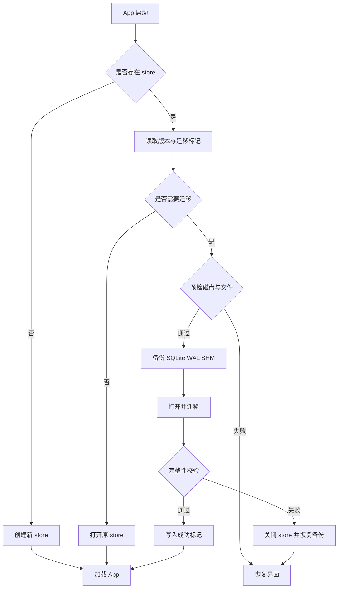
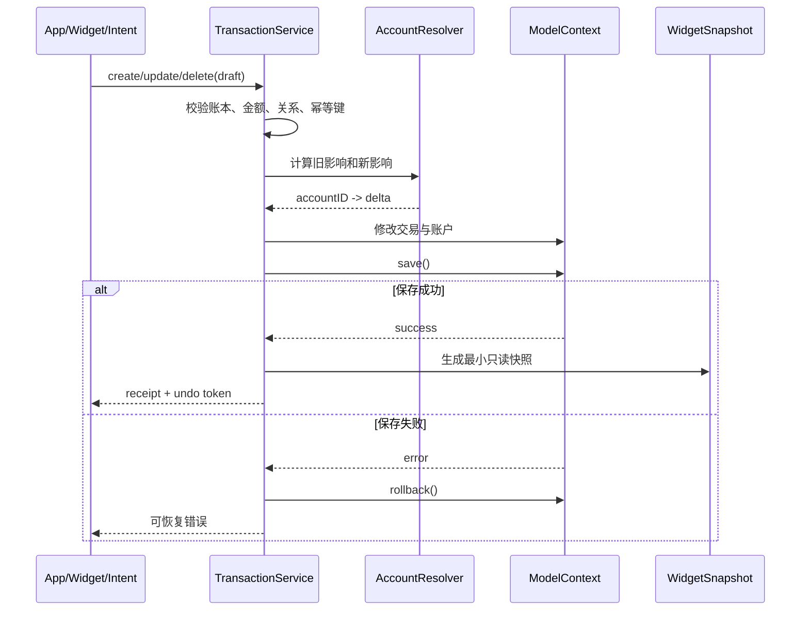
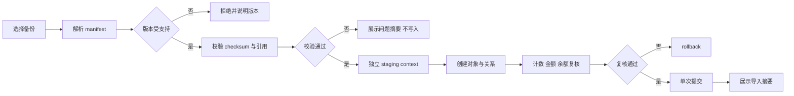
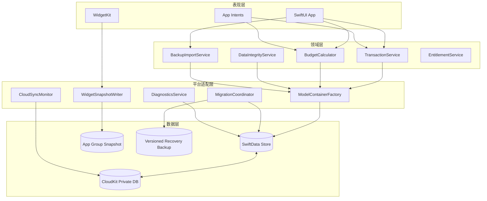

# 技术方案：简记账线上兼容升级

| 文档信息 | 内容 |
|---|---|
| 日期 | 2026-07-11 |
| 适用分支 | `codex/app-upgrade-20260711` |
| 线上基线 | `origin/main` @ `c96e38c` |
| 当前 App 版本 | `1.0.1` |
| 最低系统 | iOS/iPadOS 17.6 |
| 需求来源 | [App 升级审计与路线图](./APP_UPGRADE_AUDIT_2026-07-11.md) |
| 配套设计 | [UI/UX 升级设计规格](./APP_UI_UX_UPGRADE_SPEC_2026-07-11.md) |

## 一、背景/目标（以产品需求为准）

简记账已经上线，升级对象不是空白项目，而是包含真实账本、CloudKit 数据、Widget、Siri、订阅权益和用户使用习惯的生产应用。任何升级都必须先证明对存量数据和旧版本客户端兼容，再考虑新功能和视觉变化。

### 1.1 当前问题

- `AppState` 在部分 store 初始化失败路径删除 SQLite、WAL、SHM，错误处理可能演变为数据丢失。
- 新增、编辑、删除交易分别维护余额，收入的 `fromAccount`/`toAccount` 语义互相冲突，失败后没有统一回滚。
- `Account.balance` 是 CloudKit 同步的可变快照，多设备读改写存在最后写入覆盖风险。
- 自定义预算没有保存结束日期，预算创建可能混用不同账本的分类。
- 导入没有版本范围、引用完整性、校验和与原子提交；导出导入不能保证无损往返。
- 同步界面等待固定时间后显示“已同步”，并非真实 CloudKit 完成状态。
- 测试宿主在创建真实 `CKContainer` 时崩溃，现有测试无法形成发布门禁。
- App、Widget 版本不一致，隐私政策、付费入口与实际行为存在差异。

### 1.2 总目标

1. 存量用户从线上版本升级后，账本、账户、分类、流水、预算、标签和订阅权益完整保留。
2. 升级、同步、导入和写入失败时不删除原始数据，并提供可恢复路径。
3. App、Widget、Siri 使用同一套交易与预算领域规则。
4. 新旧 App 版本在灰度期可以同时访问 CloudKit，不依赖破坏性 schema 变化。
5. 建立可重复的旧库升级、备份往返、双设备冲突和异常中断测试。
6. 在可信基线之后逐步上线快速记账、预算复盘、iPad 和无障碍升级。

### 1.3 非目标

- 首个兼容版本不引入银行自动同步、投资行情、社区、广告或强制注册。
- 首个兼容版本不进行实体重命名、字段删除、关系改名或枚举 raw value 变更。
- 首个兼容版本不把余额模型一次性重构为完整复式记账。
- 不以静默批量改写全部历史收入交易作为修复手段。
- 不在数据基线修复中夹带大规模导航或视觉重构。

### 1.4 发布成功标准

| 维度 | 发布门槛 |
|---|---|
| 旧库升级 | 所有已收集的 `1.0.0/1.0.1` 脱敏 fixture 升级成功率 100% |
| 数据完整性 | 各实体数量、UUID、金额、关系和余额校验无非预期差异 |
| 写入原子性 | 任一步骤失败后，交易和账户余额同时回滚 |
| 备份 | 导出、清库测试环境、导入后的字段和关系误差为 0 |
| 多设备 | 两台设备离线记账后合并，交易不丢失、不重复，余额差异可检测 |
| 自动化 | 单元/集成测试全绿，关键 UI smoke 全绿，Release build 无 warning |
| 崩溃 | TestFlight 升级启动崩溃率无显著回归；迁移相关崩溃为 0 |
| 回退 | 可暂停灰度；失败设备能保留旧库并导出恢复包 |

## 二、参与人员

| 角色 | 人员 | 职责 |
|---|---|---|
| 产品负责人 | 待确认 | 免费/付费边界、发布范围、指标和用户沟通 |
| iOS 开发 | 待确认 | 数据层、领域服务、UI、Widget、App Intents |
| 测试 | 待确认 | 旧库、双设备、异常注入、无障碍和回归测试 |
| 设计 | 待确认 | UI/UX 规格、原型、可访问性验收 |
| 发布负责人 | 待确认 | CloudKit Production schema、TestFlight、灰度与停止线 |
| 隐私/法务 | 待确认 | 隐私政策、App Privacy Details、订阅文案 |

## 三、流程描述

### 3.1 分包策略

#### R1：兼容性热修复

- 保持现有 SwiftData 实体和字段，不做破坏性 schema 变化。
- 移除所有自动删库路径；失败时保留原 store。
- 注入 `ModelContainer`、CloudKit、订阅和时钟依赖，使测试不触发真实服务。
- 建立统一交易服务和账户解析器，兼容读取历史收入的 `fromAccount`。
- 修复预算账本隔离、自定义结束日期、首页预算口径和 Widget/Siri 预算算法。
- 导入增加预检、版本校验、引用校验、rollback 和结果摘要。
- 移除模拟“已同步”，只展示能够证明的同步状态。
- 统一 App/Widget 版本，修复图标、README、隐私文案和 CI。

#### R2：版本化迁移与数据健康

- 建立与线上模型完全一致的 `AppSchemaV1: VersionedSchema`。
- 用真实脱敏旧库验证 schema checksum 和 store 打开行为。
- 验证通过后引入 `SchemaMigrationPlan`；若不通过，先发布不改变 schema 的桥接版本，禁止强行迁移。
- 加入启动预检、原始 store 备份、校验、恢复包和迁移日志。
- 增加数据健康检查：孤立关系、跨账本关系、重复 UUID、无效金额、预算日期和余额异常。
- 只自动修复确定且幂等的问题；不确定问题只报告，不静默归档或删除。

#### R3：体验与增长升级

- 在 R1/R2 达到门槛后，按配套 UI/UX 文档升级首页、快速记账、预算、洞察、iPad 和无障碍。
- 新用户启用交互式首笔流程；老用户不展示强制引导。
- 使用上下文评分提示、系统入口和商店页实验提升增长，不引入隐蔽追踪。

### 3.2 启动状态机

1. 检测 store 文件、App 版本、迁移标记、剩余磁盘和 iCloud 账户状态。
2. 新安装且无 store：创建当前 schema，初始化默认账本。
3. 存量 store 且无需迁移：直接打开，不执行任何清库逻辑。
4. 存量 store 且需要迁移：先复制 SQLite/WAL/SHM 到版本化备份目录并计算 SHA-256。
5. 迁移完成后执行实体计数、关系、金额和余额校验。
6. 校验通过：写入成功标记，再启动 CloudKit 监听和 UI。
7. 迁移或校验失败：关闭 context，保留原库，恢复备份或进入恢复界面；禁止创建空白库覆盖旧库。

### 3.3 新旧版本共存规则

- CloudKit Production schema 只允许新增可选字段或带默认值字段；禁止删除、重命名和改变现有字段类型。
- `TransactionType`、`AccountType`、`BudgetPeriod`、`CategoryType` 的 raw value 永久稳定。
- R1 对历史收入使用 `toAccount ?? fromAccount` 解析；新写入在兼容窗口保留旧客户端可理解的 `fromAccount`，同时可填充 `toAccount`，余额只计算一次。
- 首个版本不使用软删除字段，因为旧客户端不会过滤软删除记录；删除采用短时延迟提交和物理删除。
- 新增备份字段必须是可选字段；现有 `1.0` 字段不可更名，未知字段允许旧客户端忽略。
- 只有当支持旧版本的最低策略明确后，才能清理兼容分支。

## 四、页面取数逻辑

### 4.1 数据来源与隔离边界

所有页面、Widget 和 App Intents 必须先确定 `ledgerID`，再查询该账本的数据。禁止查询全表后在多个页面各自实现不同口径。

| 页面/消费者 | 数据源 | 必需过滤 |
|---|---|---|
| 首页 | Transaction、Account、Budget | `ledger.id`、日期区间、归档状态 |
| 流水 | Transaction | `ledger.id`、筛选条件、分页游标 |
| 预算 | Budget、Category、Transaction | 同一 `ledger.id`、半开周期 `[startDate, endDate)` |
| 洞察 | Transaction、Account | `ledger.id`、时间范围、`excludeFromTotal` |
| Widget | App Group 中的只读快照 | 快照内固定 `ledgerID` 和生成时间 |
| App Intents | 统一领域服务 | 明确账本；没有明确账本时读取当前账本 ID |

### 4.2 交易账户规则

统一由 `TransactionAccountResolver` 和 `TransactionEffectCalculator` 处理：

| 类型 | 兼容读取 | 新写入关系 | 余额影响 |
|---|---|---|---|
| 支出 | `fromAccount` | `fromAccount = account` | account `-amount` |
| 收入 | `toAccount ?? fromAccount` | 兼容期 `fromAccount = account` 且 `toAccount = account` | account `+amount`，只执行一次 |
| 转账 | `fromAccount`、`toAccount` | 两者必须不同且同账本 | from `-amount`，to `+amount` |
| 调整 | `toAccount ?? fromAccount` | 记录调整前后值或明确 delta | account `+delta` |

编辑交易不再“先恢复再重新应用”散落在 View 中，而是计算旧影响和新影响的差：

```text
delta(account) = newEffect(account) - oldEffect(account)
```

在同一个 `ModelContext` 内更新交易和全部账户；`save()` 失败立即 `rollback()`。

### 4.3 预算统一口径

- 有效周期使用半开区间：`startDate <= transaction.date < endDate`。
- 预算和分类必须属于同一账本，否则拒绝保存。
- 父分类预算包含父分类及其直接/递归子分类交易，且每笔交易只能进入一个预算口径。
- `coveredExpense`：当前预算覆盖分类中的支出。
- `uncoveredExpense`：当前账本支出减去已覆盖支出。
- `remaining = amount + rolloverAmount - coveredExpense`。
- `safeDaily = max(remaining, 0) / max(remainingCalendarDays, 1)`。
- 年度或自定义预算不得简单除以本月天数。
- Widget、Siri、首页、预算详情共同调用 `BudgetCalculator`，不保留独立算法。

### 4.4 首页取数

- 第一优先级：本月预算余量、未纳入预算支出、安全日均。
- 第二优先级：今日支出、本月收入、本月支出。
- 第三优先级：最近 5 笔流水和可隐藏净资产。
- 首页只查询当前账本和必要时间范围；列表使用 fetch limit，不加载全部流水。
- 净资产只统计未归档且 `excludeFromTotal == false` 的账户。

### 4.5 同步状态

界面状态必须来源于可观察事实：

| 状态 | 展示条件 | 用户文案 |
|---|---|---|
| 本地可用 | store 成功打开 | 数据已保存在此设备 |
| iCloud 不可用 | 账户状态非 available | iCloud 当前不可用，仍可本地记账 |
| 自动同步 | CloudKit store 已启用但没有完成事件 | iCloud 正在自动同步 |
| 最近云端变更 | 收到可靠 import/export 事件 | 最近更新：时间 |
| 同步异常 | 收到明确错误事件 | iCloud 暂时无法同步，数据仍保存在本机 |

无法证明所有记录已上传时，不显示“已全部同步”，也不提供伪“立即同步”按钮。

## 五、判断逻辑流程图和时序图

### 5.1 启动兼容流程



### 5.2 交易原子写入时序



### 5.3 导入流程



## 六、结构图谱（Mermaid）



### 6.1 目录建议

```text
jizhang/
  App/
    AppEnvironment.swift
    ModelContainerFactory.swift
    MigrationCoordinator.swift
  Domain/
    Transactions/
    Budgets/
    DataIntegrity/
  Services/
    Backup/
    Sync/
    Entitlements/
    Diagnostics/
  Features/
    Home/
    Transactions/
    Budgets/
    Insights/
    Settings/
  Shared/
    Formatting/
    Accessibility/
    UIComponents/
```

保持单 App target，不在首个版本进行 Swift Package 拆分；先用目录和协议建立边界。

## 七、接口文档

本项目没有服务端 REST/YAPI 接口。本章节定义 App、Widget、Intent 共同依赖的内部 Swift 接口和备份文件契约。

### 【jizhang iOS】内部接口列表

#### 7.1 ModelContainerFactory

```swift
protocol ModelContainerProviding {
    func makeContainer(mode: StoreMode) throws -> ModelContainer
}

enum StoreMode {
    case production
    case testInMemory
    case uiTest(URL)
    case recovery(URL)
}
```

- 入参：store 模式和可选隔离 URL。
- 出参：已经完成配置但未隐式删除文件的 `ModelContainer`。
- 失败：返回类型化错误，由启动恢复流程处理；禁止 `fatalError` 和删库重试。

#### 7.2 TransactionService

```swift
protocol TransactionServicing {
    func create(_ draft: TransactionDraft) throws -> TransactionReceipt
    func update(id: UUID, with draft: TransactionDraft) throws -> TransactionReceipt
    func delete(id: UUID) throws -> UndoToken
    func undo(_ token: UndoToken) throws
}
```

- `TransactionDraft`：ledgerID、type、amount、date、account IDs、categoryID、tagIDs、note、idempotencyKey。
- `TransactionReceipt`：transactionID、affectedBalances、budgetImpact、createdAt。
- 所有方法必须验证跨账本关系并在保存失败时 rollback。
- Widget/Intent 使用同一接口，不直接构造 SwiftData 对象。

#### 7.3 BudgetCalculator

```swift
protocol BudgetCalculating {
    func summary(ledgerID: UUID, at date: Date) throws -> BudgetSummary
    func detail(budgetID: UUID, at date: Date) throws -> BudgetDetail
}
```

- `BudgetSummary`：total、used、remaining、coveredExpense、uncoveredExpense、safeDaily、status。
- 周期统一使用 `[startDate, endDate)`。

#### 7.4 BackupImportService

```swift
protocol BackupServicing {
    func export(ledgerID: UUID) throws -> URL
    func preflight(_ url: URL) throws -> ImportReport
    func importValidated(_ report: ImportReport) throws -> ImportResult
}
```

- `preflight` 只读，不向生产 context 写入。
- `ImportReport` 包含版本、checksum、实体计数、未知枚举、缺失引用、修复建议。
- `importValidated` 使用独立 context；失败必须 rollback。

#### 7.5 CloudSyncMonitor

```swift
protocol SyncStatusProviding {
    var status: AsyncStream<SyncStatus> { get }
    func refreshAccountStatus() async
}
```

- 不提供无法兑现的强制同步接口。
- 测试使用 fake event stream，不创建真实 `CKContainer`。

### 7.6 备份文件契约

保留现有顶层字段并向后兼容：

| 字段 | 类型 | 必需 | 说明 |
|---|---|---|---|
| `version` | String | 是 | `major.minor`，新 importer 校验支持范围 |
| `exportDate` | ISO-8601 | 是 | 导出时间 |
| `appVersion` | String | 是 | 生成文件的 App 版本 |
| `ledger` | Object | 是 | 账本元数据 |
| `accounts` | Array | 是 | 账户 |
| `categories` | Array | 是 | 分类及 `parentId` |
| `transactions` | Array | 是 | 流水及关系 ID |
| `budgets` | Array | 是 | 包含原始 `endDate` |
| `tags` | Array | 是 | 标签 |
| `manifest` | Object? | 否 | 新增：实体计数、算法、checksum、minimumReaderVersion |

R1 继续输出兼容的 1.x 结构；只有引入旧版本无法表达的数据时才提升 major 版本。

## 八、表结构

### 【jizhang iOS】SwiftData 模型

R1 不修改持久化字段。以下是必须保持兼容的线上结构。

#### Ledger（账本）

| 字段 | 类型 | 默认/约束 | 说明 |
|---|---|---|---|
| id | UUID | 默认 UUID | 跨设备稳定标识 |
| name | String | 非空默认值 | 名称 |
| currencyCode | String | CNY | ISO 4217 |
| createdAt | Date | 当前时间 | 创建时间 |
| colorHex/iconName | String | 有默认值 | 主题表现 |
| isArchived/isDefault | Bool | false | 状态 |
| sortOrder | Int | 0 | 排序 |
| ledgerDescription | String? | 可选 | 描述 |

关系：对 Account、Category、Transaction、Budget、Tag 为可选数组，当前删除规则包含 cascade。R1 不改变关系定义。

#### Account（账户）

| 字段 | 类型 | 默认/约束 | 说明 |
|---|---|---|---|
| id | UUID | 默认 UUID | 标识 |
| name/type | String/AccountType | 有默认值 | 名称和类型 |
| balance | Decimal | 0 | 当前可变余额快照 |
| creditLimit | Decimal? | 可选 | 信用额度 |
| statementDay/dueDay | Int? | 可选 | 信用卡日期 |
| cardNumberLast4 | String? | 可选 | 后四位 |
| colorHex/iconName | String | 有默认值 | 表现 |
| excludeFromTotal/isArchived | Bool | false | 统计和状态 |
| createdAt/sortOrder/note | Date/Int/String? | 有默认值 | 元数据 |

关系：`ledger`、`outgoingTransactions`、`incomingTransactions`。

#### Transaction（流水）

| 字段 | 类型 | 默认/约束 | 说明 |
|---|---|---|---|
| id | UUID | 默认 UUID | 幂等与跨设备标识 |
| amount | Decimal | 0，业务上必须 > 0 | 金额 |
| date | Date | 当前时间 | 发生时间 |
| type | TransactionType | expense | 支出/收入/转账/调整 |
| note/payee/imageURL | String? | 可选 | 附加信息 |
| createdAt/modifiedAt | Date | 当前时间 | 审计时间 |
| ledger | Ledger? | 业务上必需 | 所属账本 |
| fromAccount/toAccount | Account? | 按类型解释 | 账户关系 |
| category | Category? | 收支必需 | 分类 |
| tags | [Tag]? | 可选 | 多对多标签 |

#### Category（分类）

| 字段 | 类型 | 默认/约束 | 说明 |
|---|---|---|---|
| id/name/type | UUID/String/CategoryType | 有默认值 | 标识、名称、收支类型 |
| iconName/colorHex | String | 有默认值 | 表现 |
| sortOrder | Int | 0 | 排序 |
| isHidden/isQuickSelect | Bool | false | 展示策略 |
| createdAt | Date | 当前时间 | 创建时间 |
| ledger/parent | Ledger?/Category? | 业务校验 | 所属账本与父级 |

关系：children、transactions、budgets。父子分类必须同账本。

#### Budget（预算）

| 字段 | 类型 | 默认/约束 | 说明 |
|---|---|---|---|
| id | UUID | 默认 UUID | 标识 |
| amount | Decimal | 业务上 > 0 | 金额 |
| period | BudgetPeriod | monthly | 月/年/自定义 |
| startDate/endDate | Date | 必须 end > start | 半开周期 |
| enableRollover | Bool | false | 结转 |
| rolloverAmount | Decimal | 0 | 结转金额 |
| createdAt | Date | 当前时间 | 创建时间 |
| ledger/category | Ledger?/Category? | 业务上必需且同账本 | 关系 |

#### Tag（标签）

| 字段 | 类型 | 默认/约束 | 说明 |
|---|---|---|---|
| id/name | UUID/String | 有默认值 | 标识和名称 |
| colorHex/sortOrder | String/Int | 有默认值 | 表现和排序 |
| createdAt | Date | 当前时间 | 创建时间 |
| ledger | Ledger? | 业务上必需 | 所属账本 |

关系：transactions。标签与交易必须属于同一账本。

### 8.1 后续可选 schema 演进

`openingBalance`、revision、删除标记或分录模型只能在 R2 以后作为可选/有默认值字段新增，并先验证旧客户端行为。首个兼容版本不依赖这些字段。

## 九、风险点

- **数据丢失风险**：【jizhang iOS】迁移或 CloudKit 初始化失败时误删原 store。
  - 应对：删除所有自动清库代码；迁移前复制 store trio；失败保留恢复包。
  - 停止线：出现任一无法解释的实体数量减少，立即停止灰度。

- **旧版本共存风险**：【jizhang iOS】新版本写入旧版本无法理解的关系或字段。
  - 应对：R1 不改字段；保留收入 legacy 读取和兼容写入；CloudKit 只做 additive 变更。
  - 停止线：旧版设备出现账户为空、预算消失或重复流水，暂停发布。

- **余额覆盖风险**：【jizhang iOS & CloudKit】多设备同时修改 `Account.balance` 可能最后写入覆盖。
  - 应对：统一写入口、写后对账、双设备测试；首版报告差异而非静默重算。
  - 后续：在兼容性验证后引入 opening balance/分录模型。

- **误修复风险**：【jizhang iOS】历史收入可能同时存在多种账户语义。
  - 应对：使用 resolver 双读；不批量清空 `fromAccount`；修复前生成报告和备份。

- **CloudKit schema 风险**：【CloudKit】Development schema 未部署到 Production 或变更不可逆。
  - 应对：发布清单单独审核 schema；先 TestFlight 验证 Production 环境；保留 schema diff 截图。

- **导入污染风险**：【jizhang iOS】部分对象写入后失败，留下半个账本。
  - 应对：预检、staging context、引用完整性校验、单次提交和 rollback。

- **测试假阳性风险**：【jizhangTests】Debug 自动高级版、真实 CKContainer、UI Test 未隔离 store。
  - 应对：依赖注入；测试显式指定 entitlement；每个 UI Test 使用独立临时 URL。

- **隐私与口碑风险**：【产品】文案承诺超出实现，或为增长引入未披露追踪。
  - 应对：文案按真实能力更新；优先使用 App Store Connect 和 MetricKit；新增采集先走隐私评审。

- **性能风险**：【jizhang iOS】全表查询和 MainActor 聚合随流水增长变慢。
  - 应对：按账本和日期 predicate、fetch limit、分页；大聚合移出主线程；使用 1万/10万流水 fixture。

- **无法二进制回滚风险**：【App Store】App Store 不能让所有已升级用户自动降级。
  - 应对：数据变更始终向后兼容；异常时暂停 phased release 并发布 hotfix，而不是依赖降级。

## 十、项目周期

以下按 1 名 iOS 开发、1 名测试并行估算，具体日期由团队确认。

| 阶段 | 工作项 | 开发 | 测试/评审 | 建议时间 |
|---|---|---:|---:|---|
| R1-1 | 容器工厂、移除删库、测试依赖注入 | 2.0 人日 | 1.0 人日 | 第 1 周 |
| R1-2 | 交易服务、兼容 resolver、原子回滚 | 3.0 人日 | 2.0 人日 | 第 1-2 周 |
| R1-3 | 预算统一计算、Siri/Widget 接入 | 2.0 人日 | 1.5 人日 | 第 2 周 |
| R1-4 | 导入预检、rollback、CSV、文件打开 | 2.5 人日 | 2.0 人日 | 第 2-3 周 |
| R1-5 | 同步状态、版本/图标/隐私、CI | 2.0 人日 | 1.5 人日 | 第 3 周 |
| R2 | 旧库 fixture、VersionedSchema、恢复演练 | 4.0 人日 | 4.0 人日 | 第 4 周 |
| R3 | 快速记账、首页、预算、无障碍首批 | 7.0 人日 | 4.0 人日 | 第 5-6 周 |

R1 提测门槛：所有领域测试可运行且全绿。R2 上线门槛：真实旧库升级和双设备验证完成。R3 不得与 R1 首次发布合并。

## 十一、TODO

- [ ] 从 App Store Connect 确认当前线上 build、最低系统和付费商品真实价格。
- [ ] 收集 `1.0.0`、`1.0.1` 本地-only 与 iCloud 用户的脱敏 store fixture。
- [ ] 记录当前 CloudKit Production schema 快照。
- [ ] 确认基础 iCloud 同步和备份是否调整为免费能力。
- [ ] 实现 `ModelContainerFactory`，移除构造器内真实 CKContainer 副作用。
- [ ] 实现统一 `TransactionService` 和兼容账户解析器。
- [ ] 实现 `BudgetCalculator` 并替换 App/Widget/Intent 重复算法。
- [ ] 建立导入预检、checksum、rollback 和往返测试。
- [ ] 建立迁移状态机、版本化恢复包和恢复界面。
- [ ] 增加 StoreKit Configuration 和权益过期/退款测试。
- [ ] 增加 CI：build、unit、integration、selected UI smoke。
- [ ] 完成 VoiceOver、AX5、Reduce Motion 和 iPad 测试计划。
- [ ] 更新隐私政策、App Privacy Details、支持页和发布说明。

## 十二、上线流程

### 12.1 发布前

1. 冻结持久化 schema 和备份格式。
2. 运行旧库升级矩阵、导入往返、异常中断和双设备测试。
3. 在 CloudKit Production 环境完成 TestFlight 验证；未改 schema 时也要验证现有容器。
4. Archive Validate，确认 App/Widget 版本、签名、AppIcon、隐私清单。
5. 审核迁移日志不包含账目、备注、账户名等敏感内容。
6. 准备支持文案、恢复指引、hotfix 分支和负责人值守表。

### 12.2 灰度

- 先内部 TestFlight，再外部小范围 TestFlight，最后启用 App Store phased release。
- 每日检查启动崩溃、hang、CloudKit 错误、导入失败和支持反馈。
- 自动更新灰度期间，手动更新用户仍可能立即安装，因此所有版本必须独立安全。
- 任何迁移失败、空账本、余额突变或重复流水报告都触发暂停。

### 12.3 异常处理

1. 立即暂停 phased release。
2. 不远程触发任何清库或批量修复。
3. 引导受影响用户保留 App 和恢复包，收集不含账目正文的诊断信息。
4. 从兼容分支发布 hotfix；hotfix 必须能读取已经被新版本打开的数据。
5. 完成根因、影响范围和恢复验证后再恢复灰度。

## 十三、技术方案审批截图

待补充。审批至少需要产品负责人、iOS 负责人、测试负责人和发布负责人确认，重点审批以下内容：

- 线上版本和 CloudKit schema 基线。
- 收入账户兼容策略。
- iCloud 免费/付费策略。
- 迁移停止线与恢复流程。
- R1/R2/R3 是否严格拆包。

## 十四、开发周期

- 建议起始日期：2026-07-13（待确认）。
- R1 完成：约 3 周，11.5 开发人日、8 测试/评审人日。
- R2 完成：约 1 周，4 开发人日、4 测试/评审人日。
- R3 首批完成：约 2 周，7 开发人日、4 测试/评审人日。
- 总周期：约 6 周；不包含 App Review 等待时间和重大线上数据异常处置。
- 若无法取得真实旧库 fixture，R2 不允许进入 App Store 发布，周期顺延而不是降低验收标准。
