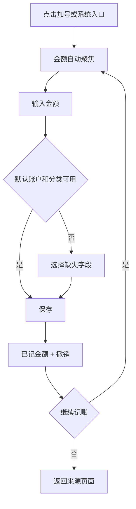

# 简记账 UI/UX 升级设计规格

| 文档信息 | 内容 |
|---|---|
| 日期 | 2026-07-11 |
| 产品状态 | 已上线，面向存量用户兼容升级 |
| 设计范围 | iPhone、iPad、Widget、App Intents、无障碍、同步与恢复状态 |
| 需求来源 | [App 升级审计与路线图](./APP_UPGRADE_AUDIT_2026-07-11.md) |
| 技术约束 | [线上兼容升级技术方案](./APP_PRODUCTION_COMPATIBILITY_TECH_DESIGN_2026-07-11.md) |

## 1. 设计目标

简记账的升级目标不是增加更多页面，而是让用户更快完成记账、更容易相信账目、更愿意每周回来复盘。

### 1.1 产品承诺

> 无广告、无追踪、Apple 原生的轻记账：几秒完成记录，每笔可撤销，账本可验证备份。

“不丢账”在完成迁移、备份和恢复验证前只作为内部质量目标，不作为绝对营销文案。

### 1.2 核心体验目标

| 任务 | 目标 |
|---|---|
| 新用户首笔 | 首次会话完成率可衡量，中位时间 < 60 秒 |
| 常规支出 | 不超过 3 次点击，中位时间 < 8 秒 |
| 修改最近一笔 | 任务成功率 >= 95% |
| 删除误操作 | 100% 提供短时撤销 |
| 预算理解 | 用户能区分预算内、未纳入预算和可安全日均 |
| VoiceOver | 新增、查看、编辑、撤销核心流程成功率 >= 95% |
| 大字体 | AX5 不截断、不遮挡、不丢失关键操作 |
| iPad | 横竖屏和多窗口使用自适应双栏，不拉伸手机单列 |

### 1.3 设计原则

1. **可信优先**：真实状态、可撤销、可恢复，不使用模拟成功。
2. **金额优先**：记账页第一焦点是金额，次要字段渐进展开。
3. **内容优先**：流水、预算和结论优先于装饰、卡片和大面积留白。
4. **熟悉优先**：沿用系统导航、Sheet、菜单、搜索和分享模式。
5. **渐进升级**：兼容版保留老用户导航肌肉记忆，体验版再调整层级。
6. **所有人可用**：Dynamic Type、VoiceOver、Voice Control、Reduced Motion 是交付条件。
7. **克制表达**：不用颜色单独表达正负/风险，不用玻璃材质覆盖财务内容。

## 2. 用户与核心任务

### 2.1 核心用户

- 想快速记下日常收支，不愿学习复杂财务系统的人。
- 重视无广告、数据归属和本地优先的 Apple 用户。
- 使用 Widget、Siri、快捷指令或 Action Button 快速记账的人。
- 需要简单预算提醒，而不是完整理财课程的人。
- 在 iPhone 与 iPad 间同步账本的人。

### 2.2 Jobs to be Done

- 当我刚完成消费时，我想几秒记下金额，以免忘记。
- 当我打开首页时，我想知道本月还能花多少，而不是先看一堆图。
- 当我记错时，我想立即撤销，不担心余额被破坏。
- 当我换设备或升级 App 时，我想确认数据仍然安全。
- 当月底复盘时，我想知道哪里变化、为什么、下一步做什么。

## 3. 当前体验诊断

### 3.1 首页

- 大号净资产、今日支出和 7 日图表占据第一屏，最近流水被压到底栏附近。
- 最近流水不可直接进入详情，查看或纠错路径过长。
- 今日支出使用全部支出，日预算只来自预算分类，反馈口径不一致。
- 大面积卡片造成信息割裂，关键内容密度偏低。

### 3.2 记账

- 已有最近账户、快速分类和建议金额底层，但建议金额未展示，分类推荐没有真正接入。
- 保存后只有触觉反馈，没有可见确认和撤销。
- 编辑、删除和新增使用不同余额逻辑，错误状态无法让用户理解是否保存成功。

### 3.3 预算与洞察

- 预算入口位于设置，用户难以建立持续使用习惯。
- 报表首屏控制器过多，先让用户选择图表，而不是先给结论。
- 图表没有可访问摘要或表格替代。

### 3.4 iPad 与无障碍

- iPad 页面把手机单列拉宽，设置和报表存在大量无效空白。
- 自定义底栏固定尺寸，缺少 size class 适配。
- 主工程没有显式 accessibility 修饰，固定字号和固定网格无法支持大字体。

## 4. 升级分期与兼容策略

### 4.1 UX-R1：可信兼容版

保持首页、流水、中心加号、报表、设置的现有位置，不强迫老用户重新学习。

- 增加保存结果和撤销反馈。
- 修复预算数字和同步状态文案。
- 数据管理增加备份提示、导入预检和恢复状态。
- 删除“模拟已同步”和可能误导的成功提示。
- 补齐核心 accessibility label、value、hint 和动态字体。
- 测试数据入口只在 Debug/内部构建显示。

### 4.2 UX-R2：效率与留存版

- 首页改为预算余量、今日状态和最近流水优先。
- 快速记账展示常用分类、账户、金额和重复上一笔。
- 首页和洞察中提供直接创建预算入口。
- 报表更名为“洞察”，先显示结论，再允许下钻图表。
- 新用户获得交互式首笔流程；老用户只显示一次可关闭的更新摘要。

### 4.3 UX-R3：平台体验版

- iPad 使用 sidebar + content + optional detail。
- iOS 26 使用系统 Liquid Glass 导航外观；iOS 17/18 保持系统材质回退。
- 支持多窗口、Spotlight、Control Center/Action Button 等系统入口。
- 完成完整无障碍验收和 App Store Accessibility Nutrition Labels。

## 5. 信息架构

### 5.1 iPhone 导航

为减少老用户迁移成本，保留四个主标签及全局记账动作：

| 位置 | 名称 | 内容 |
|---|---|---|
| Tab 1 | 首页 | 预算余量、今日状态、最近流水、轻量洞察 |
| Tab 2 | 流水 | 搜索、筛选、分组列表、详情和批量操作 |
| 全局动作 | 记一笔 | 中心加号；任何主标签下一步可达 |
| Tab 3 | 洞察 | 预算、趋势、分类、账户和月度复盘 |
| Tab 4 | 设置 | 账本、账户、分类、数据与安全、会员、帮助 |

R1 保持“报表”名称；R2 在更新摘要中说明更名为“洞察”。预算从设置中保留兼容入口，同时在首页和洞察首屏提供主入口。

### 5.2 iPad 导航

使用 `NavigationSplitView`：

- Sidebar：首页、流水、预算、洞察、账户、设置。
- Content：所选模块列表或总览。
- Detail：流水详情、预算详情、账户详情；空间不足时自动退化为双栏或单栏。
- “记一笔”是 sidebar 顶部主操作和键盘快捷键，不使用悬浮在巨大空白中的手机底栏。

### 5.3 深链

| 路由 | 目的 |
|---|---|
| `jizhang://add-transaction` | 打开记账页 |
| `jizhang://transactions/{id}` | 打开流水详情 |
| `jizhang://budgets` | 打开预算总览 |
| `jizhang://budgets/{id}` | 打开预算详情 |
| `jizhang://settings/data` | 打开数据与备份 |

备份文件通过 `onOpenURL`/document import 单独处理，不要求 `jizhang://` scheme。

## 6. 全局任务流程

### 6.1 新用户首笔


- 不展示功能轮播或长教程。
- 默认账户可以直接使用“现金”，用户可跳过自定义。
- 第一笔可以是真实记录；练习记录必须明确标记并可删除。
- iCloud、Widget、Siri 在完成首笔后按上下文出现，不阻塞记账。

### 6.2 老用户升级

- 正常升级直接进入原首页，不强制重新选择账本或币种。
- 有重要导航变化时显示一次底部更新摘要，最多 3 项，可立即关闭。
- 数据迁移成功不弹“成功”对话框；只有异常才进入恢复状态。
- 如果检测到数据健康问题，只展示问题和下一步，不自动删除或合并。

### 6.3 快速记账



### 6.4 删除与撤销

1. 用户滑动或在详情菜单选择删除。
2. 行立即从当前列表隐藏，底部显示“已删除 ¥X · 撤销”。
3. 5 秒内点击撤销则恢复，不写入删除。
4. 5 秒结束后原子提交删除和余额变更。
5. 提交失败时恢复行并显示“未能删除，账目没有变化”。

## 7. 页面规格

### 7.1 首页

#### 信息顺序

1. 账本切换与金额隐私按钮。
2. 本月预算状态：剩余、预算内支出、未纳入预算、安全日均。
3. 今日状态：今日支出和一条明确行动。
4. 最近 5 笔流水，可点击进入详情。
5. 一条可执行洞察。
6. 折叠的净资产与趋势入口。

#### 低保真结构

```text
┌ 日常账本                         眼睛 ┐
│ 本月还能花 ¥2,340                    │
│ 已用 62%  ·  安全日均 ¥126           │
│ 未纳入预算 ¥430                      │
├─────────────────────────────────────┤
│ 今天支出 ¥60      [记一笔] [重复上一笔] │
├ 最近流水 ─────────────────────── 查看全部 ┤
│ 早餐       招商储蓄卡            -¥60 │
│ 工资       招商储蓄卡         +¥8,000 │
├─────────────────────────────────────┤
│ 餐饮预算已使用 82%              查看预算 │
└─────────────────────────────────────┘
```

#### 规则

- 无预算：显示单一主动作“创建第一个预算”，不显示 0% 进度条。
- 预算异常：不计算误导百分比，显示“预算数据需要检查”。
- 隐藏金额：所有金额统一变为占位符，Widget 隐私设置保持一致。
- 净资产不再使用首屏超大字号；默认可折叠，用户偏好持久化。
- 移除首页 7 日大图，趋势放入洞察；首页只保留一句摘要或迷你趋势。

### 7.2 记账页

#### 层级

1. 顶部：取消、支出/收入/转账分段控件、保存。
2. 金额输入：自动聚焦、账本币种、支持小数和基本算式。
3. 快捷区：重复上一笔、建议金额、最近账户。
4. 分类：自适应网格，优先常用/预测分类。
5. 账户：默认账户单行展示，点击更换。
6. “更多”：日期、时间、备注、标签、商家。

#### 控件规格

- 金额字段最小高度 72pt，但字号使用 Dynamic Type 样式，不随 viewport 宽度缩放。
- 类型使用 segmented control；转账时显示转出和转入账户。
- 建议金额使用数值按钮；最长金额必须完整显示，不改变按钮宽高。
- 快捷分类使用图标 + 名称；宽度不足自动减少列数，不固定 5 列。
- 保存是明确命令按钮；无效时禁用并保留可访问原因。
- 关闭手势在有未保存修改时显示系统确认对话框。

#### 保存反馈

- 成功：底部状态条“已记 ¥38 · 撤销”，成功触觉。
- 失败：页面保持输入，“未能保存，账目没有变化”，错误触觉。
- 连续记账：保存后金额清零，保留类型和账户，分类按设置决定是否保留。

### 7.3 流水列表

- 顶部使用系统搜索；支持备注、商家、金额、账户和分类。
- 筛选器使用菜单或 filter sheet，不在首屏堆叠多个胶囊。
- 按日期分组，组头显示当日净额；正负同时使用符号、文字和颜色。
- 每行至少包含分类、备注/账户、时间、带符号金额。
- 点击进入详情；左滑提供编辑、删除，删除后可撤销。
- 支持“重复此笔”，生成草稿而非直接保存。
- 10,000 笔以上使用分页和稳定行高；加载状态不改变列表宽度。

### 7.4 流水详情与编辑

- 详情使用标准 `Form`/section 或 unframed key-value layout，不使用卡片套卡片。
- 顶部显示金额、类型和状态；下面显示账户、分类、日期、备注、标签。
- 编辑入口使用铅笔图标，删除放入更多菜单并标为 destructive。
- 修改账户或金额后，在保存前预览受影响账户余额。
- 保存失败时所有字段仍保留，明确说明原账目未改变。

### 7.5 预算总览

#### 首屏

- 本月剩余金额和安全日均。
- 预算内支出与未纳入预算支出并列展示。
- 分类预算列表按风险排序：超支、接近上限、正常。
- 添加预算使用加号图标按钮；无预算时显示一个明确主动作。

#### 预算行

- 分类图标、名称、已用/总额、剩余金额、状态文字。
- 进度条只是辅助，必须同时显示数值和“正常/注意/超支”。
- 进度可超过 100%，视觉长度封顶但数值不截断。

#### 创建/编辑

- 只显示当前账本分类。
- 周期使用月度/年度/自定义 segmented control。
- 自定义周期必须选择结束日期，且 `endDate > startDate`。
- 结转使用 Toggle；下方仅说明对金额的影响，不写营销文案。
- 保存前检测重叠预算并给出冲突分类和周期。

### 7.6 洞察

洞察首屏先回答问题，不先要求用户选择四组控制器。

#### 首屏内容

1. 本月一句总结，例如“支出比上月增加 12%，主要来自餐饮”。
2. 一条可执行建议，例如“餐饮预算剩余 18%，本月安全日均 ¥42”。
3. 收入、支出、结余三个紧凑指标。
4. 分类变化和异常大额流水。
5. 趋势图和账户分析作为下钻。

#### 图表

- 每张图只回答一个问题，标题直接陈述指标。
- 默认标注单位、时间范围和数据更新时间。
- 提供 `accessibilityChartDescriptor`/Audio Graph，另有数据表视图。
- 不只用红绿区分，使用箭头、正负号、线型和状态文字。
- 图表空数据时解释缺少什么，并提供记账或调整范围动作。

### 7.7 设置与数据安全

建议分组：

1. 账本：账本、账户、分类。
2. 数据与同步：iCloud 状态、备份、导入、导出、数据健康。
3. 隐私与安全：金额隐私、App 锁、Widget 隐私、诊断分享。
4. 体验：币种、地区、提醒、外观。
5. 支持：帮助、反馈、隐私政策、服务条款、版本。
6. 会员：当前权益和购买管理；不占据设置第一行的整宽推广位。

生产构建隐藏“填充测试数据”。删除和重置放在“数据与同步 > 高级”底部，进入后先自动备份并二次确认。

### 7.8 同步与备份

#### 同步页

- 显示 iCloud 账户状态、自动同步是否可用、最近可靠事件时间。
- 离线时显示“仍可在本机记账”，避免制造数据已丢失的恐慌。
- 不显示无法兑现的“立即同步”和“已全部同步”。
- 错误提供“重试账户检查”和“查看数据安全”，不提供“重置数据库”。

#### 备份页

- 显示最近备份时间、账本、流水数和文件版本。
- “导出备份”与“验证备份”是两个明确命令。
- 导入先展示预检：来源版本、实体数量、警告和将创建的新账本名称。
- 导入完成展示导入/跳过/修复数量，不只显示“成功”。

### 7.9 启动恢复界面

仅在原 store 无法安全打开时出现：

- 标题：“账本暂时无法打开”。
- 说明：“原始数据仍保留在此设备，我们没有创建空白账本覆盖它。”
- 主操作：重试。
- 次操作：导出恢复包、查看诊断信息、联系支持。
- 禁止在此界面提供无备份的“清空并继续”。

## 8. iPad 与响应式布局

### 8.1 布局模式

| 可用宽度 | 模式 | 行为 |
|---|---|---|
| < 600pt | 单栏 | iPhone 结构，Sheet 全屏或 large detent |
| 600-899pt | 双栏 | Sidebar + content，详情 push 或 overlay |
| >= 900pt | 三栏可选 | Sidebar + list/summary + detail |

不依据具体设备型号判断，使用 size class 和实际可用宽度。

### 8.2 iPad 首页

```text
┌ Sidebar ─────┬ 主内容 ───────────────────┬ 辅助内容 ─────────┐
│ 记一笔       │ 本月预算余量               │ 最近流水详情/洞察  │
│ 首页         │ 今日状态                   │                   │
│ 流水         │ 最近流水                   │                   │
│ 预算         │                            │                   │
│ 洞察         │                            │                   │
│ 设置         │                            │                   │
└──────────────┴────────────────────────────┴───────────────────┘
```

- 主内容设置合理 `maxWidth`，不把手机卡片拉伸到 1366pt。
- 流水行和详情同时可见，减少来回导航。
- 支持键盘快捷键：`Command-N` 记一笔、`Command-F` 搜索、`Command-Z` 撤销。
- 多窗口分别保存当前账本、选中模块和详情路径。

## 9. 视觉系统

### 9.1 色彩

- 使用系统背景、标签和 separator 语义色，支持深色模式和高对比度。
- 品牌强调色用于主操作和选中状态，不让整页被单一蓝色主导。
- 支出/收入可使用红/绿辅助，但必须同时使用 `-`/`+`、箭头和文字。
- 警告使用 systemOrange，错误使用 systemRed；普通金额不默认使用警告色。
- 不使用装饰性渐变、光球或模糊色块作为页面背景。

### 9.2 字体

| 内容 | Text Style | 规则 |
|---|---|---|
| 页面标题 | `.title2` / `.headline` | 使用系统导航层级 |
| 主要金额 | `.largeTitle` 或 `.title` | 等宽数字，允许换行或缩小到可读下限 |
| 行标题 | `.body` | 不固定像素字号 |
| 辅助信息 | `.subheadline`/`.caption` | 高对比度下仍可读 |
| 按钮 | `.headline`/`.body` | 最长文案不截断 |

禁止按 viewport 宽度缩放字体。金额使用 `monospacedDigit()`，但不使用负 letter spacing。

### 9.3 间距与形状

- 基础间距：4、8、12、16、24、32pt。
- 点击区域至少 44x44pt。
- 单个重复项目或工具容器圆角不超过 8pt；页面 section 使用分隔线和留白，不做漂浮卡片。
- 不允许 card 内再放 card。
- 图表、列表、工具栏使用稳定高度或 aspect ratio，加载和选中状态不引发布局跳动。

### 9.4 图标

- iOS 使用 SF Symbols，保持系统一致性。
- 熟悉的操作只显示图标：添加、搜索、编辑、分享、更多、撤销。
- 图标按钮必须有 accessibility label；不熟悉图标通过系统 tooltip/help 说明。
- 分类图标可保留现有图标映射，但 Widget、App 和 Intent 必须一致。

## 10. 组件规格

| 组件 | 规格 |
|---|---|
| Primary action | 单一高优先级命令，最小高度 50pt，solid accent，不使用渐变 |
| Icon button | 44x44pt 稳定区域，图标 18-24pt，按下不改变布局 |
| Segmented control | 用于互斥模式，不超过 3-4 项 |
| Toggle | 只用于二元设置，如结转、金额隐私 |
| Menu | 用于排序、更多操作和低频选项 |
| Filter chips | 仅显示已启用筛选，不作为页面主导航 |
| Transaction row | 稳定行高、金额右对齐、Dynamic Type 时允许两行 |
| Snackbar | 保存/删除结果和撤销，VoiceOver 自动播报但不抢焦点 |
| Progress | 同时提供数值、状态文字和可访问 value |
| Empty state | 一个原因、一个主动作；不展示功能说明列表 |
| Error state | 说明是否影响数据、可执行恢复动作、错误编号 |

## 11. 状态与反馈

### 11.1 全局状态矩阵

| 场景 | 页面行为 | 文案原则 |
|---|---|---|
| 首次加载 | 保持结构 skeleton 或 ProgressView | 不改变最终布局尺寸 |
| 无流水 | 显示“记第一笔” | 不展示空图表 |
| 无预算 | 显示“创建第一个预算” | 不显示 0% 或超支 |
| 保存失败 | 保留输入并 rollback | 明确“账目没有变化” |
| 删除失败 | 恢复行 | 明确“未删除” |
| iCloud 离线 | 本地功能可用 | 明确“仍可本地记账” |
| 导入警告 | 停留在预检 | 列出将跳过/修复内容 |
| 迁移失败 | 进入恢复页 | 明确原始数据仍保留 |

### 11.2 触觉

- 选择：light selection feedback。
- 保存成功：success notification。
- 验证失败：warning/error notification。
- 删除提交：warning；撤销：light。
- Reduced Motion 不影响触觉开关，用户可在设置中关闭额外触觉。

### 11.3 动效

- 普通过渡 0.2-0.3 秒，使用系统默认 curve。
- 保存后状态条从安全区出现，不推动页面主要内容。
- Reduced Motion 下取消缩放、弹簧和大范围位移动画，使用淡入淡出。
- 金额变化不使用持续滚动或循环动画。

## 12. 内容设计

### 12.1 语气

- 简短、事实化、不过度承诺。
- 错误先说明数据是否安全，再给下一步。
- 避免“完美同步”“绝对安全”“永不丢失”等绝对表达。

### 12.2 推荐文案

| 场景 | 文案 |
|---|---|
| 保存成功 | 已记 ¥38 |
| 保存失败 | 未能保存，账目没有变化 |
| 删除待提交 | 已删除 ¥38 · 撤销 |
| 同步自动进行 | iCloud 正在自动同步 |
| iCloud 不可用 | iCloud 当前不可用，仍可在本机记账 |
| 导入预检通过 | 将创建“日常账本 (1)”，包含 326 笔流水 |
| 恢复状态 | 原始数据仍保留在此设备 |
| 无预算 | 创建第一个预算 |

### 12.3 禁止文案

- 没有真实事件时的“已同步”。
- 没有实现 App 锁时的“Face ID 已保护账本”。
- 没有经过验证时的“端到端加密”。
- 将终身购买写成“立即订阅”。
- 用长段落解释按钮怎么使用。

## 13. 无障碍规格

### 13.1 VoiceOver

- 交易行组合朗读：“早餐，支出 60 元，招商储蓄卡，今天 08:30”。
- 预算进度朗读：“餐饮预算，已用 82%，剩余 180 元，状态注意”。
- 隐藏金额按钮提供 label 和当前 value：“金额可见/金额已隐藏”。
- 图标按钮全部提供 label；装饰图片 `accessibilityHidden(true)`。
- 保存结果和错误使用 live announcement，但不把焦点强制移出输入区域。

### 13.2 Dynamic Type

- AX5 下金额可以单独成行，操作按钮不与金额并排挤压。
- 快捷分类网格根据宽度减少列数，名称最多两行。
- Tab 标签、筛选器和 segmented control 不使用固定 11/12pt 字号。
- 文本截断只允许备注等非关键补充；金额、状态和按钮不得截断。

### 13.3 其他

- Voice Control：可见名称与 accessibility label 一致。
- 色彩：正文对比度至少 4.5:1；大文字至少 3:1。
- Reduce Transparency：玻璃区域回退为不透明系统背景。
- Differentiate Without Color：所有状态提供图标/文字。
- Switch Control：焦点顺序与视觉顺序一致。
- 图表：Audio Graph/ChartDescriptor + 数据表替代。

## 14. 隐私、安全与付费体验

### 14.1 隐私

- 默认不显示账目内容到锁屏 Widget，除非用户显式开启。
- 金额隐私在 App 和 Widget 分别可控，默认设置清楚可见。
- 诊断分享先展示包含内容，默认排除金额、备注、账户名和分类名。
- 不为了漏斗统计静默引入第三方 SDK。

### 14.2 App 锁

- 若实现，使用 LocalAuthentication；失败时允许系统密码回退由产品决定。
- App 切后台立即覆盖敏感快照。
- App 锁不等于数据端到端加密，文案必须区分。

### 14.3 付费墙

- 免费核心账本、基础备份/导出和破坏性操作保护长期可用。
- 推荐把基础 iCloud 同步作为免费安全能力。
- 付费墙只在用户主动进入高级洞察、无限预算或持续服务时出现。
- 先展示触发场景的真实价值，再展示方案；不首启全屏拦截。
- 使用 StoreKit `displayPrice`，折扣和月均价动态计算。
- CTA 区分“订阅”和“购买终身版”，提供恢复购买和管理订阅。

## 15. 衡量与实验

### 15.1 指标

| 阶段 | 核心指标 |
|---|---|
| 激活 | 首次会话记账率、首笔中位时间 |
| 效率 | 记一笔中位时间、点击数、保存失败率、分类修改率 |
| 留存 | 每周有效记账天数、预算创建率、D7/D30 留存 |
| 信任 | 撤销率、导入成功率、恢复请求、余额差异、同步错误 |
| 增长 | 产品页转化、评分率、自然搜索、付费转化、退款率 |
| 可访问性 | VoiceOver 任务成功率、AX5 截断缺陷、无障碍崩溃 |

### 15.2 数据边界

- 第一阶段使用 App Store Connect、Xcode Organizer/MetricKit、TestFlight 访谈和支持反馈。
- 自定义事件采集必须先定义目的、字段、保留期和隐私披露。
- 不采集交易金额、备注、商家、账户、分类名称等财务正文。

### 15.3 实验

- App Store Product Page Optimization：测试“快速记账”和“无广告可信”两组首屏素材。
- App 内只做低风险界面排序实验，不对迁移、余额、同步、备份和删除逻辑做 A/B。
- 评分提示只在第 7 笔成功记录或首次月度复盘等自然停顿点触发。

## 16. 交付与验收

### 16.1 设计交付物

- iPhone：Home、Add、Transactions、Budget、Insights、Data & Sync 全状态稿。
- iPad：compact、双栏、三栏和多窗口状态稿。
- 深色模式、高对比度、Reduce Transparency。
- Dynamic Type：默认、XXXL、AX5。
- VoiceOver 标注和焦点顺序。
- 加载、空、错误、离线、导入预检、迁移恢复状态。
- App Store 前三张截图和 30 秒预览脚本。

### 16.2 视觉验收设备

- iPhone SE 等窄屏设备。
- 主流 6.1/6.3 英寸 iPhone。
- 大屏 iPhone。
- iPad mini、11 英寸、13 英寸。
- iPad Split View 1/3、1/2、2/3 宽度。

### 16.3 功能验收清单

- [ ] 老用户升级后导航入口仍可识别，当前账本不被改变。
- [ ] 新用户可以在 60 秒内完成首笔。
- [ ] 常规支出可以在 3 次点击内完成。
- [ ] 保存、编辑、删除失败均明确说明账目是否变化。
- [ ] 最近流水可以查看、编辑、重复和撤销删除。
- [ ] 首页与预算详情的金额口径一致。
- [ ] 年度和自定义预算不会按本月天数错误平摊。
- [ ] 同步页面不显示无法证明的成功状态。
- [ ] iPad 不出现全宽手机卡片和固定手机底栏。
- [ ] VoiceOver、AX5、Reduce Motion 核心流程通过。
- [ ] 所有按钮文字和金额在目标设备上无重叠、遮挡和不可读截断。
- [ ] 锁屏、App 切后台和 Widget 隐私符合用户设置。

### 16.4 发布顺序

1. 先交付 UX-R1 可信兼容版。
2. 观察一个完整灰度周期和支持反馈。
3. 再交付 UX-R2 首页、快速记账和预算闭环。
4. 最后交付 UX-R3 iPad、系统入口和完整平台体验。

任何数据正确性或迁移问题优先级都高于视觉缺陷；出现账目丢失、重复或余额突变时，体验版本停止发布。
