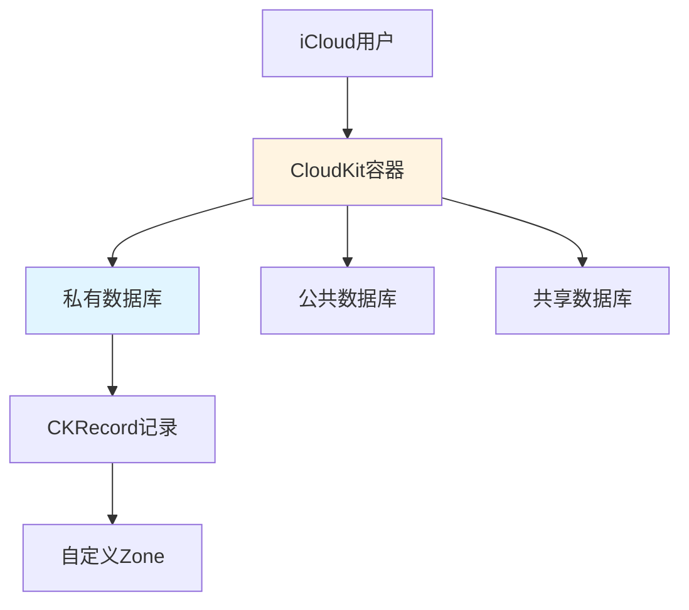
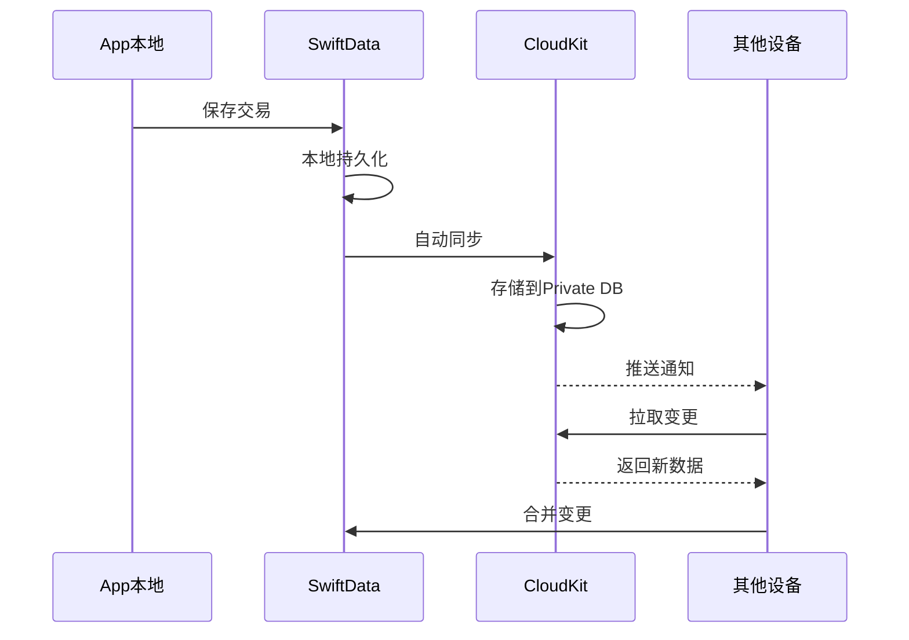
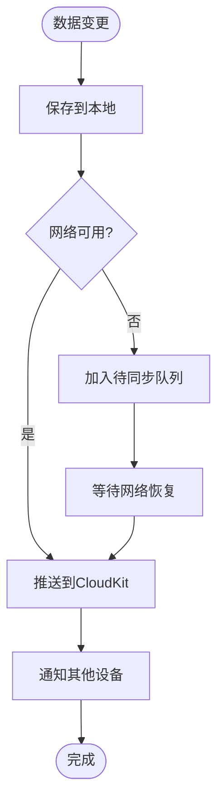

# CloudKit同步方案文档

## 文档信息

- **项目名称**: Lumina记账App
- **同步框架**: CloudKit + SwiftData
- **版本**: v1.0
- **创建日期**: 2026-01-24

---

## 目录

1. [CloudKit概述](#1-cloudkit概述)
2. [同步架构设计](#2-同步架构设计)
3. [SwiftData+CloudKit集成](#3-swiftdatacloudkit集成)
4. [冲突解决策略](#4-冲突解决策略)
5. [隐私与安全](#5-隐私与安全)
6. [错误处理](#6-错误处理)
7. [性能优化](#7-性能优化)
8. [测试与调试](#8-测试与调试)

---

## 1. CloudKit概述

### 1.1 为什么选择CloudKit？

| 对比项 | CloudKit | Firebase | 自建服务器 |
|-------|---------|---------|-----------|
| **隐私** | ✅ 端到端加密 | ⚠️ Google可访问 | ✅ 完全控制 |
| **成本** | ✅ 免费（大额度） | ⚠️ 按量付费 | ❌ 高昂 |
| **集成难度** | ✅ 原生简单 | ⚠️ 需第三方SDK | ❌ 复杂 |
| **用户信任** | ✅ Apple品牌 | ⚠️ 较低 | ⚠️ 取决于品牌 |
| **离线支持** | ✅ 原生 | ✅ 原生 | ❌ 需自己实现 |

**结论**：CloudKit是iOS记账App的最佳选择。

### 1.2 CloudKit核心概念



**核心组件**：
- **Container（容器）**：应用的CloudKit命名空间
- **Database（数据库）**：
  - Private：用户私有数据（本App使用）
  - Public：所有人可见（不使用）
  - Shared：多用户协作（未来功能）
- **Record（记录）**：数据单元，类似数据库行
- **Zone（区域）**：记录分组，支持原子性操作

---

## 2. 同步架构设计

### 2.1 整体架构



### 2.2 同步模式

采用**推拉结合**模式：

1. **推（Push）**：
   - 本地数据变更后，SwiftData自动推送到CloudKit
   - 实时性高，但需要网络

2. **拉（Pull）**：
   - App启动时拉取远程变更
   - 定期轮询（后台刷新）
   - 收到远程通知时拉取

3. **离线支持**：
   - 本地优先，离线可用
   - 联网后自动同步

---

## 3. SwiftData+CloudKit集成

### 3.1 ModelConfiguration配置

```swift
// AppState.swift
import SwiftData
import CloudKit

@MainActor
class AppState: ObservableObject {
    let modelContainer: ModelContainer
    @Published var cloudSyncEnabled: Bool = true
    
    init() {
        let schema = Schema([
            Ledger.self,
            Account.self,
            Category.self,
            Transaction.self,
            Budget.self,
            Tag.self
        ])
        
        // CloudKit配置
        let cloudKitConfig = ModelConfiguration(
            "LuminaCloud",
            schema: schema,
            isStoredInMemoryOnly: false,
            allowsSave: true,
            cloudKitDatabase: .automatic  // 自动使用Private Database
        )
        
        do {
            modelContainer = try ModelContainer(
                for: schema,
                configurations: [cloudKitConfig]
            )
            
            // 监听同步状态
            observeCloudKitStatus()
        } catch {
            fatalError("无法创建ModelContainer: \(error)")
        }
    }
    
    private func observeCloudKitStatus() {
        // SwiftData会自动处理同步，这里只监听状态
        NotificationCenter.default.addObserver(
            forName: NSNotification.Name("NSPersistentStoreRemoteChange"),
            object: nil,
            queue: .main
        ) { notification in
            print("CloudKit远程变更通知")
            self.handleRemoteChange(notification)
        }
    }
    
    private func handleRemoteChange(_ notification: Notification) {
        // 远程数据已变更，UI会自动更新（SwiftData的@Query会响应式刷新）
        print("检测到远程数据变更")
        
        // 可选：显示"数据已同步"提示
        showSyncNotification()
    }
    
    private func showSyncNotification() {
        // 实现同步提示UI
    }
}
```

### 3.2 iCloud能力配置

#### Xcode配置步骤：

1. **Target → Signing & Capabilities → + Capability → iCloud**
2. **勾选 CloudKit**
3. **选择或创建Container**: `iCloud.com.yourcompany.jizhang`
4. **勾选 Background Modes → Remote notifications**

#### Info.plist配置：

```xml
<key>UIBackgroundModes</key>
<array>
    <string>remote-notification</string>
</array>
```

---

## 4. 冲突解决策略

### 4.1 冲突场景

#### 场景1：同一设备编辑同一记录

```
时间线：
T1: iPhone创建交易A（金额100）
T2: iPhone离线，修改A金额为120
T3: Mac联网，修改A金额为150
T4: iPhone联网，与Mac冲突
```

#### 场景2：多设备同时创建

```
时间线：
T1: iPhone创建交易B
T2: iPad创建交易C
T3: 两者同时同步到CloudKit
```

### 4.2 SwiftData默认策略

SwiftData使用**Last Write Wins（最后写入胜出）**策略：

```swift
// SwiftData自动处理冲突，无需手动编码
// 基于modificationDate字段，最新的版本胜出
```

**优点**：
- 简单，无需开发者介入
- 适用于大多数场景

**缺点**：
- 可能丢失数据（被覆盖的版本）
- 不适合需要合并的场景（如多人协作编辑）

### 4.3 自定义冲突处理（高级）

对于**金额字段**等关键数据，可以实现自定义合并：

```swift
import CloudKit

class ConflictResolver {
    /// 处理Transaction冲突
    func resolveTransactionConflict(
        local: Transaction,
        remote: Transaction
    ) -> Transaction {
        // 策略：永远保留本地版本（用户当前操作优先）
        print("⚠️ 冲突检测：Transaction \(local.id)")
        print("  本地版本：\(local.amount) at \(local.modifiedAt)")
        print("  远程版本：\(remote.amount) at \(remote.modifiedAt)")
        
        // 保留本地版本
        return local
    }
    
    /// 处理Account余额冲突
    func resolveAccountBalanceConflict(
        local: Account,
        remote: Account
    ) -> Decimal {
        // 策略：重新计算余额（通过交易历史）
        print("⚠️ 账户余额冲突：\(local.name)")
        
        // 不直接使用local或remote的余额，而是通过交易重新计算
        let recalculatedBalance = calculateBalanceFromTransactions(account: local)
        
        print("  重新计算余额：\(recalculatedBalance)")
        return recalculatedBalance
    }
    
    private func calculateBalanceFromTransactions(account: Account) -> Decimal {
        // 遍历所有交易，重新计算余额
        var balance: Decimal = 0
        
        let allTransactions = (account.outgoingTransactions + account.incomingTransactions)
            .sorted { $0.date < $1.date }
        
        for transaction in allTransactions {
            switch transaction.type {
            case .expense:
                if transaction.fromAccount == account {
                    balance -= transaction.amount
                }
            case .income:
                if transaction.toAccount == account {
                    balance += transaction.amount
                }
            case .transfer:
                if transaction.fromAccount == account {
                    balance -= transaction.amount
                }
                if transaction.toAccount == account {
                    balance += transaction.amount
                }
            case .adjustment:
                if transaction.toAccount == account {
                    balance = transaction.amount
                }
            }
        }
        
        return balance
    }
}
```

### 4.4 冲突预防策略

#### 1. 乐观锁

```swift
extension Transaction {
    /// 版本号，每次修改+1
    var version: Int = 1
    
    func incrementVersion() {
        version += 1
        modifiedAt = Date()
    }
}

// 保存前检查版本
func saveTransaction(_ transaction: Transaction) throws {
    transaction.incrementVersion()
    try modelContext.save()
}
```

#### 2. 限制同时编辑

```swift
class EditLockService {
    private var lockedTransactions: Set<UUID> = []
    
    func lockForEdit(_ transactionId: UUID) -> Bool {
        if lockedTransactions.contains(transactionId) {
            return false  // 已被锁定
        }
        lockedTransactions.insert(transactionId)
        return true
    }
    
    func unlock(_ transactionId: UUID) {
        lockedTransactions.remove(transactionId)
    }
}
```

---

## 5. 隐私与安全

### 5.1 CloudKit隐私特性

#### 端到端加密

```swift
// CloudKit Private Database默认端到端加密
// 即使Apple也无法查看数据内容
// 无需额外配置
```

**加密特性**：
- ✅ 传输加密（TLS）
- ✅ 存储加密（AES-256）
- ✅ 只有用户自己的iCloud账号可以解密
- ✅ 开发者无法访问

### 5.2 数据最小化原则

```swift
// 只同步必要数据，敏感字段不同步
@Model
final class Transaction {
    // ... 其他字段
    
    // 敏感字段：不同步到CloudKit
    @Transient var internalNotes: String?  // 使用@Transient标记
}
```

### 5.3 用户隐私控制

```swift
// SettingsView.swift
struct CloudSyncSettingsView: View {
    @AppStorage("cloudSyncEnabled") private var syncEnabled = true
    @State private var showDeleteConfirmation = false
    
    var body: some View {
        Form {
            Section {
                Toggle("iCloud同步", isOn: $syncEnabled)
                    .onChange(of: syncEnabled) { _, newValue in
                        if newValue {
                            CloudSyncService.shared.enableSync()
                        } else {
                            CloudSyncService.shared.disableSync()
                        }
                    }
                
                if syncEnabled {
                    HStack {
                        Text("上次同步")
                        Spacer()
                        Text(lastSyncTime)
                            .foregroundColor(.secondary)
                    }
                }
            } footer: {
                Text("启用后，您的数据将通过iCloud在所有设备间同步。数据端到端加密，Apple无法访问。")
            }
            
            Section {
                Button("从iCloud删除所有数据", role: .destructive) {
                    showDeleteConfirmation = true
                }
            } footer: {
                Text("此操作将从iCloud删除所有同步数据，本地数据不受影响。")
            }
        }
        .alert("确认删除", isPresented: $showDeleteConfirmation) {
            Button("取消", role: .cancel) { }
            Button("删除", role: .destructive) {
                Task {
                    await CloudSyncService.shared.deleteAllCloudData()
                }
            }
        } message: {
            Text("确定要从iCloud删除所有同步数据吗？此操作不可撤销。")
        }
    }
    
    private var lastSyncTime: String {
        // 实现最后同步时间显示
        "2分钟前"
    }
}
```

---

## 6. 错误处理

### 6.1 常见错误类型

```swift
enum CloudKitError: LocalizedError {
    case notSignedIn           // 未登录iCloud
    case networkUnavailable     // 网络不可用
    case quotaExceeded         // 配额超限
    case authenticationFailed   // 认证失败
    case serverError           // 服务器错误
    
    var errorDescription: String? {
        switch self {
        case .notSignedIn:
            return "请在"设置"中登录iCloud账号以启用同步"
        case .networkUnavailable:
            return "网络不可用，数据将在联网后自动同步"
        case .quotaExceeded:
            return "iCloud存储空间不足，请清理空间或升级套餐"
        case .authenticationFailed:
            return "iCloud认证失败，请检查账号设置"
        case .serverError:
            return "iCloud服务暂时不可用，稍后将自动重试"
        }
    }
}
```

### 6.2 错误处理服务

```swift
@MainActor
class CloudSyncService: ObservableObject {
    static let shared = CloudSyncService()
    
    @Published var syncStatus: SyncStatus = .idle
    @Published var lastError: Error?
    
    enum SyncStatus {
        case idle            // 空闲
        case syncing         // 同步中
        case success         // 成功
        case error(Error)    // 错误
    }
    
    /// 检查iCloud账号状态
    func checkAccountStatus() async -> Bool {
        let container = CKContainer.default()
        
        do {
            let status = try await container.accountStatus()
            
            switch status {
            case .available:
                print("✅ iCloud账号可用")
                return true
                
            case .noAccount:
                await showError(.notSignedIn)
                return false
                
            case .restricted:
                await showError(.authenticationFailed)
                return false
                
            case .couldNotDetermine:
                print("⚠️ 无法确定iCloud状态")
                return false
                
            case .temporarilyUnavailable:
                print("⚠️ iCloud暂时不可用")
                return false
                
            @unknown default:
                return false
            }
        } catch {
            print("❌ 检查iCloud状态失败: \(error)")
            return false
        }
    }
    
    /// 手动触发同步
    func manualSync() async {
        syncStatus = .syncing
        
        do {
            // SwiftData会自动同步，这里只是触发
            // 实际上是触发一个空的保存操作来强制同步
            try await forceSyncTrigger()
            
            syncStatus = .success
            print("✅ 同步成功")
        } catch {
            syncStatus = .error(error)
            lastError = error
            print("❌ 同步失败: \(error)")
        }
    }
    
    private func forceSyncTrigger() async throws {
        // 触发同步的技巧：创建并立即删除一个临时记录
        // SwiftData会尝试同步这个变更，从而触发整体同步
    }
    
    private func showError(_ error: CloudKitError) async {
        lastError = error
        
        // 显示用户友好的错误提示
        await MainActor.run {
            // 使用系统Alert或自定义Banner显示错误
            NotificationService.shared.showError(error.errorDescription ?? "未知错误")
        }
    }
}
```

### 6.3 网络状态监听

```swift
import Network

class NetworkMonitor: ObservableObject {
    static let shared = NetworkMonitor()
    
    private let monitor = NWPathMonitor()
    private let queue = DispatchQueue(label: "NetworkMonitor")
    
    @Published var isConnected = true
    @Published var connectionType: NWInterface.InterfaceType?
    
    init() {
        monitor.pathUpdateHandler = { [weak self] path in
            DispatchQueue.main.async {
                self?.isConnected = path.status == .satisfied
                self?.connectionType = path.availableInterfaces.first?.type
                
                if path.status == .satisfied {
                    print("✅ 网络已连接")
                    // 触发同步
                    Task {
                        await CloudSyncService.shared.manualSync()
                    }
                } else {
                    print("❌ 网络已断开")
                }
            }
        }
        
        monitor.start(queue: queue)
    }
}
```

---

## 7. 性能优化

### 7.1 批量操作

```swift
// 批量导入时，使用单个事务
func importTransactions(_ transactions: [Transaction]) async throws {
    let context = modelContainer.mainContext
    
    // 开始批量插入
    context.performBatch { batchContext in
        for transaction in transactions {
            batchContext.insert(transaction)
        }
    }
    
    // 单次保存，减少同步次数
    try context.save()
}
```

### 7.2 延迟同步

```swift
class SyncThrottler {
    private var syncTimer: Timer?
    
    /// 延迟同步：多次快速修改只触发一次同步
    func scheduleSync(delay: TimeInterval = 3.0) {
        syncTimer?.invalidate()
        
        syncTimer = Timer.scheduledTimer(withTimeInterval: delay, repeats: false) { _ in
            Task {
                await CloudSyncService.shared.manualSync()
            }
        }
    }
}
```

### 7.3 增量同步

```swift
// SwiftData自动处理增量同步
// 只同步变更的记录，而非全量同步
// 无需手动实现，但可以监控同步量

class SyncMonitor {
    func logSyncActivity() {
        NotificationCenter.default.addObserver(
            forName: NSNotification.Name.NSPersistentStoreRemoteChange,
            object: nil,
            queue: .main
        ) { notification in
            if let changeToken = notification.userInfo?["changeToken"] {
                print("📊 同步Token: \(changeToken)")
            }
        }
    }
}
```

---

## 8. 测试与调试

### 8.1 CloudKit Dashboard

访问：https://icloud.developer.apple.com/dashboard

**功能**：
- 查看Record记录
- 手动添加/删除数据
- 查看Schema结构
- 监控API使用量
- 查看错误日志

### 8.2 模拟器测试

```bash
# 模拟器默认不登录iCloud，需要手动配置

# 方法1：在模拟器的"设置"中登录iCloud账号（推荐）

# 方法2：使用开发环境
# 在Xcode中：Product → Scheme → Edit Scheme → Run → Options
# → iCloud Container Environment → Development
```

### 8.3 调试技巧

#### 1. 打印同步日志

```swift
// 启用CoreData/SwiftData调试日志
// Edit Scheme → Run → Arguments → Arguments Passed On Launch
// 添加：
-com.apple.CoreData.CloudKitDebug 1
-com.apple.CoreData.Logging.oslog 1
```

#### 2. 监控同步状态

```swift
class SyncDebugView: View {
    @StateObject private var monitor = SyncStatusMonitor()
    
    var body: some View {
        VStack {
            Text("同步状态: \(monitor.status)")
            Text("最后同步: \(monitor.lastSyncTime)")
            Text("待同步记录: \(monitor.pendingChanges)")
            
            Button("强制同步") {
                Task {
                    await CloudSyncService.shared.manualSync()
                }
            }
        }
    }
}

class SyncStatusMonitor: ObservableObject {
    @Published var status = "Idle"
    @Published var lastSyncTime = Date()
    @Published var pendingChanges = 0
    
    // 实现监控逻辑
}
```

#### 3. 清除CloudKit数据

```swift
// ⚠️ 仅用于开发测试
extension CloudSyncService {
    func deleteAllCloudData() async {
        let container = CKContainer.default()
        let privateDB = container.privateCloudDatabase
        
        // 查询所有Record Type
        let recordTypes = ["Transaction", "Account", "Category", "Ledger", "Budget", "Tag"]
        
        for recordType in recordTypes {
            let query = CKQuery(recordType: recordType, predicate: NSPredicate(value: true))
            
            do {
                let results = try await privateDB.records(matching: query)
                let recordIds = results.matchResults.compactMap { try? $0.1.get().recordID }
                
                if !recordIds.isEmpty {
                    let _ = try await privateDB.modifyRecords(saving: [], deleting: recordIds)
                    print("✅ 已删除\(recordIds.count)条\(recordType)记录")
                }
            } catch {
                print("❌ 删除\(recordType)失败: \(error)")
            }
        }
    }
}
```

---

## 9. 最佳实践

### 9.1 Dos & Don'ts

#### ✅ 应该做的

1. **本地优先**：始终保证本地可用，同步是增值功能
2. **静默同步**：后台自动同步，不打扰用户
3. **错误提示**：网络/账号问题时给出清晰指引
4. **数据验证**：同步前验证数据完整性
5. **增量同步**：只同步变更，节省流量

#### ❌ 不应该做的

1. **阻塞UI**：不要让同步阻塞用户操作
2. **强制登录**：不要强制要求登录iCloud
3. **频繁同步**：不要每次修改都立即同步
4. **忽略错误**：不要吞掉同步错误
5. **同步敏感数据**：不要同步不必要的隐私数据

### 9.2 用户沟通

```swift
struct SyncStatusBanner: View {
    let status: CloudSyncService.SyncStatus
    
    var body: some View {
        HStack {
            Image(systemName: icon)
            Text(message)
            Spacer()
        }
        .padding()
        .background(backgroundColor)
        .foregroundColor(.white)
        .cornerRadius(12)
    }
    
    private var icon: String {
        switch status {
        case .idle: return "checkmark.icloud"
        case .syncing: return "arrow.triangle.2.circlepath.icloud"
        case .success: return "checkmark.icloud.fill"
        case .error: return "exclamationmark.icloud"
        }
    }
    
    private var message: String {
        switch status {
        case .idle: return "已连接iCloud"
        case .syncing: return "正在同步..."
        case .success: return "同步成功"
        case .error(let error): return error.localizedDescription
        }
    }
    
    private var backgroundColor: Color {
        switch status {
        case .error: return .red
        case .success: return .green
        default: return .blue
        }
    }
}
```

---

## 附录：快速参考

### CloudKit容器标识符

```
iCloud.com.yourcompany.jizhang
```

### App Group标识符

```
group.com.yourcompany.jizhang
```

### 关键类清单

| 类名 | 职责 |
|-----|------|
| `AppState` | ModelContainer配置 |
| `CloudSyncService` | 同步状态管理 |
| `ConflictResolver` | 冲突解决 |
| `NetworkMonitor` | 网络监听 |
| `SyncThrottler` | 同步节流 |

### 同步流程图



---

**文档维护**: 随CloudKit功能优化持续更新  
**最后更新**: 2026-01-24
