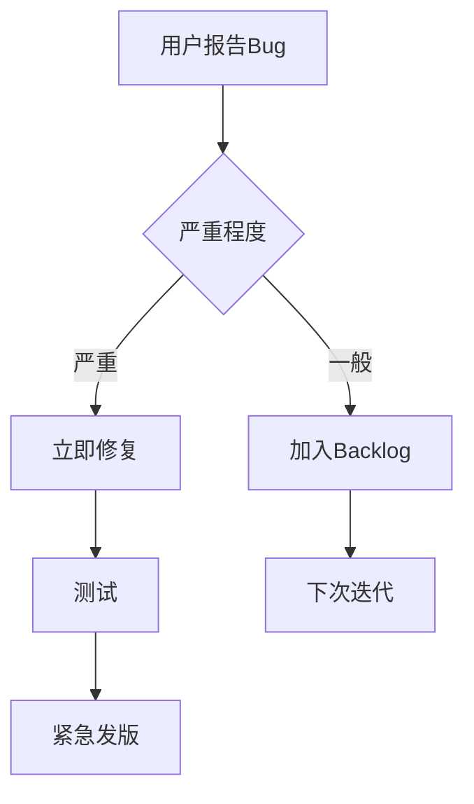

# 开发实施手册

## 文档信息

- **项目名称**: Lumina记账App
- **版本**: v1.0
- **创建日期**: 2026-01-24

---

## 目录

1. [开发环境准备](#1-开发环境准备)
2. [分阶段开发计划](#2-分阶段开发计划)
3. [代码规范](#3-代码规范)
4. [Git工作流](#4-git工作流)
5. [测试策略](#5-测试策略)
6. [发布流程](#6-发布流程)
7. [维护指南](#7-维护指南)

---

## 1. 开发环境准备

### 1.1 必需工具

| 工具 | 最低版本 | 下载地址 | 说明 |
|-----|---------|---------|------|
| **Xcode** | 15.0+ | App Store | 必需 |
| **macOS** | Sonoma 14.0+ | - | 必需 |
| **iOS设备** | iOS 17.0+ | - | 真机测试用 |
| **Apple Developer账号** | - | developer.apple.com | TestFlight/发布用 |

### 1.2 可选工具

| 工具 | 用途 | 下载地址 |
|-----|------|---------|
| **SF Symbols** | 图标浏览 | developer.apple.com |
| **SwiftLint** | 代码规范检查 | github.com/realm/SwiftLint |
| **SwiftFormat** | 代码格式化 | github.com/nicklockwood/SwiftFormat |
| **Instruments** | 性能分析 | Xcode自带 |

### 1.3 初始项目设置

#### 步骤1：创建Xcode项目

```bash
# 命令行创建（可选）
cd /Users/xuxiaolong/OpenSource/jizhang_ios
xcodebuild -create-workspace -name jizhang

# 或直接在Xcode中：
# File → New → Project → iOS → App
# - Product Name: jizhang
# - Interface: SwiftUI
# - Language: Swift
# - Storage: SwiftData
```

#### 步骤2：配置Bundle Identifier

```
com.yourcompany.jizhang
```

#### 步骤3：配置Capabilities

1. **Signing & Capabilities**
   - ✅ iCloud (CloudKit)
   - ✅ App Groups (`group.com.yourcompany.jizhang`)
   - ✅ Push Notifications

2. **Info.plist添加**
   ```xml
   <key>UIBackgroundModes</key>
   <array>
       <string>remote-notification</string>
   </array>
   ```

#### 步骤4：添加SwiftLint（可选）

```bash
# 安装SwiftLint
brew install swiftlint

# 在项目根目录创建 .swiftlint.yml
cat > .swiftlint.yml << EOF
disabled_rules:
  - trailing_whitespace
  - line_length
opt_in_rules:
  - empty_count
excluded:
  - Pods
  - build
line_length: 120
EOF

# 在Xcode Build Phases添加Run Script：
if which swiftlint >/dev/null; then
  swiftlint
else
  echo "warning: SwiftLint not installed"
fi
```

---

## 2. 分阶段开发计划

### 2.1 阶段1：基础架构（预计2周）

#### 里程碑1.1：项目框架搭建（3天）

**任务清单**：

- [ ] 创建Xcode项目
- [ ] 配置文件结构（按架构文档）
- [ ] 设置SwiftData模型
- [ ] 配置CloudKit容器
- [ ] 创建基础UI导航结构（TabBar）

**可交付物**：
- 可运行的空白App
- TabBar导航框架
- SwiftData初始化成功

**验证标准**：
```swift
// 测试代码：创建测试数据
let ledger = Ledger(name: "测试账本")
modelContext.insert(ledger)
try? modelContext.save()

// 验证：能成功保存并读取
```

#### 里程碑1.2：数据模型实现（4天）

**任务清单**：

- [ ] 实现`Ledger`模型及方法
- [ ] 实现`Account`模型及枚举
- [ ] 实现`Category`模型及层级关系
- [ ] 实现`Transaction`模型及余额更新逻辑
- [ ] 实现`Budget`模型及计算逻辑
- [ ] 实现`Tag`模型
- [ ] 编写单元测试（至少80%覆盖率）

**可交付物**：
- 完整的SwiftData模型层
- 通过的单元测试

**验证标准**：
```swift
// 测试：创建交易并验证余额更新
let transaction = Transaction(...)
try transactionService.createTransaction(...)
assert(account.balance == expectedBalance)
```

#### 里程碑1.3：首页UI实现（5天）

**任务清单**：

- [ ] 实现`HomeView`布局
- [ ] 实现净资产卡片组件
- [ ] 实现今日支出卡片组件
- [ ] 实现流水列表组件
- [ ] 实现浮动添加按钮
- [ ] 集成动画效果

**可交付物**：
- 完整的首页UI
- 流畅的动画效果

**验证标准**：
- 60fps流畅滚动
- 动画符合设计规范

### 2.2 阶段2：核心功能（预计3周）

#### 里程碑2.1：记账功能（5天）

**任务清单**：

- [ ] 实现`AddTransactionSheet`
- [ ] 实现计算器键盘组件
- [ ] 实现分类选择器
- [ ] 实现账户选择器
- [ ] 实现智能推荐逻辑
- [ ] 实现数据保存与验证
- [ ] 编写UI测试

**可交付物**：
- 完整的记账流程
- 通过的UI测试

**验证标准**：
```
用户测试场景：
1. 点击+按钮 → Sheet弹出
2. 输入金额123.45 → 显示正确
3. 选择分类"餐饮-午餐" → 已选中
4. 点击确认 → 交易保存成功
5. 返回首页 → 新交易显示在列表顶部
```

#### 里程碑2.2：账户管理（4天）

**任务清单**：

- [ ] 实现`AccountManagementView`
- [ ] 实现创建/编辑账户表单
- [ ] 实现信用卡特殊字段
- [ ] 实现账户列表
- [ ] 实现余额调整功能
- [ ] 实现账户删除（带验证）

**可交付物**：
- 完整的账户管理功能

#### 里程碑2.3：分类管理（3天）

**任务清单**：

- [ ] 实现`CategoryManagementView`
- [ ] 实现分类树状结构
- [ ] 实现拖拽排序
- [ ] 实现创建/编辑分类
- [ ] 实现分类合并功能
- [ ] 初始化默认分类

**可交付物**：
- 完整的分类管理功能

#### 里程碑2.4：流水列表与筛选（5天）

**任务清单**：

- [ ] 实现`TransactionListView`
- [ ] 实现按日期分组
- [ ] 实现筛选器（多维度）
- [ ] 实现搜索功能
- [ ] 实现左滑删除
- [ ] 实现长按菜单
- [ ] 实现交易详情页
- [ ] 优化列表性能（分页加载）

**可交付物**：
- 完整的流水查看功能
- 高性能列表（60fps）

### 2.3 阶段3：高级功能（预计3周）

#### 里程碑3.1：预算系统（5天）

**任务清单**：

- [ ] 实现`BudgetView`
- [ ] 实现预算创建表单
- [ ] 实现预算卡片组件
- [ ] 实现预算进度条
- [ ] 实现预算预警逻辑
- [ ] 实现预算结转功能
- [ ] 集成通知推送

**可交付物**：
- 完整的预算管理系统
- 预算预警通知

#### 里程碑3.2：报表统计（5天）

**任务清单**：

- [ ] 实现`ReportView`
- [ ] 实现收支柱状图（Swift Charts）
- [ ] 实现分类饼图（可交互）
- [ ] 实现净资产趋势图
- [ ] 实现Top排行榜
- [ ] 实现数据导出（CSV/PDF）

**可交付物**：
- 完整的报表系统
- 数据导出功能

#### 里程碑3.3：多账本与CloudKit（5天）

**任务清单**：

- [ ] 实现账本切换功能
- [ ] 实现账本管理界面
- [ ] 配置CloudKit同步
- [ ] 实现同步状态UI
- [ ] 实现冲突解决
- [ ] 测试多设备同步

**可交付物**：
- 多账本功能
- CloudKit自动同步

**验证标准**：
```
同步测试：
1. iPhone创建交易 → iPad自动显示（30秒内）
2. 离线创建交易 → 联网后自动同步
3. 冲突测试 → 正确解决冲突
```

### 2.4 阶段4：极致体验（预计2周）

#### 里程碑4.1：Widget开发（4天）

**任务清单**：

- [ ] 创建Widget Extension
- [ ] 实现Small Widget
- [ ] 实现Medium Widget
- [ ] 实现Large Widget（带交互按钮）
- [ ] 实现TimelineProvider
- [ ] 配置App Group数据共享
- [ ] 测试Widget刷新

**可交付物**：
- 3种尺寸的Widget
- 数据实时更新

#### 里程碑4.2：Live Activities（3天）

**任务清单**：

- [ ] 实现购物模式Live Activity
- [ ] 实现灵动岛UI
- [ ] 实现锁屏UI
- [ ] 集成到主App
- [ ] 测试实时更新

**可交付物**：
- 购物模式Live Activity
- 灵动岛集成

#### 里程碑4.3：性能优化与测试（5天）

**任务清单**：

- [ ] 使用Instruments分析性能
- [ ] 优化启动时间（<1秒）
- [ ] 优化列表滚动性能（120fps）
- [ ] 优化内存占用（<100MB）
- [ ] 修复所有Linter警告
- [ ] 完成UI测试覆盖
- [ ] 完成单元测试覆盖（80%+）
- [ ] Beta测试（TestFlight）

**可交付物**：
- 性能达标的App
- 通过的所有测试

---

## 3. 代码规范

### 3.1 Swift代码风格

#### 命名约定

```swift
// ✅ 类名：大驼峰（PascalCase）
class TransactionService { }
struct WidgetData { }
enum AccountType { }

// ✅ 变量名：小驼峰（camelCase）
var totalExpense: Decimal
let currentLedger: Ledger

// ✅ 常量：小驼峰
let maxTransactionAmount: Decimal = 999999

// ✅ 枚举case：小驼峰
enum TransactionType {
    case expense
    case income
    case transfer
}

// ❌ 避免：
var total_expense: Decimal  // 不用下划线
let MAX_AMOUNT = 100        // 常量不用全大写
```

#### 缩进与空格

```swift
// ✅ 4个空格缩进（不用Tab）
func saveTransaction(_ transaction: Transaction) {
    if transaction.amount > 0 {
        modelContext.insert(transaction)
    }
}

// ✅ 运算符前后加空格
let sum = a + b
let result = (x + y) * z

// ✅ 逗号后加空格
func calculate(a: Int, b: Int, c: Int) { }

// ❌ 避免：
let sum=a+b              // 无空格
func test(a:Int,b:Int)   // 逗号后无空格
```

#### 括号与换行

```swift
// ✅ 左括号不换行
if condition {
    // 代码
}

// ✅ 长参数换行
func createTransaction(
    ledger: Ledger,
    amount: Decimal,
    date: Date,
    type: TransactionType
) -> Transaction {
    // 代码
}

// ✅ 链式调用换行
let filtered = transactions
    .filter { $0.type == .expense }
    .sorted { $0.date > $1.date }
    .prefix(10)
```

### 3.2 SwiftUI代码风格

```swift
// ✅ 组件嵌套不超过3层
struct TransactionRow: View {
    var body: some View {
        HStack {           // 1层
            VStack {       // 2层
                Text("")   // 3层
            }
        }
    }
}

// ✅ 复杂视图拆分为子组件
struct ComplexView: View {
    var body: some View {
        VStack {
            HeaderSection()    // 子组件
            ContentSection()   // 子组件
            FooterSection()    // 子组件
        }
    }
}

// ✅ ViewBuilder使用
@ViewBuilder
func makeContent() -> some View {
    if isLoading {
        ProgressView()
    } else {
        ContentView()
    }
}
```

### 3.3 注释规范

```swift
// ✅ 函数注释（使用Xcode标准格式）
/// 创建一笔新交易
///
/// - Parameters:
///   - ledger: 所属账本
///   - amount: 交易金额
///   - type: 交易类型
/// - Returns: 创建的交易实体
/// - Throws: `TransactionError` 如果数据验证失败
func createTransaction(
    ledger: Ledger,
    amount: Decimal,
    type: TransactionType
) throws -> Transaction {
    // 实现
}

// ✅ MARK分组
class TransactionService {
    // MARK: - Properties
    
    private let modelContext: ModelContext
    
    // MARK: - Lifecycle
    
    init(modelContext: ModelContext) {
        self.modelContext = modelContext
    }
    
    // MARK: - Public Methods
    
    func createTransaction() { }
    
    // MARK: - Private Methods
    
    private func validateAmount() { }
}

// ✅ TODO/FIXME标记
// TODO: 实现预算结转逻辑
// FIXME: 修复信用卡余额计算bug
// MARK: - 待优化
```

### 3.4 错误处理

```swift
// ✅ 使用具体的错误类型
enum TransactionError: LocalizedError {
    case invalidAmount
    case missingAccount
    
    var errorDescription: String? {
        switch self {
        case .invalidAmount: return "金额无效"
        case .missingAccount: return "账户缺失"
        }
    }
}

// ✅ 优雅的错误处理
func saveTransaction() {
    do {
        try transactionService.create(...)
    } catch TransactionError.invalidAmount {
        showAlert("金额无效")
    } catch {
        showAlert("未知错误: \(error.localizedDescription)")
    }
}

// ❌ 避免：吞掉错误
try? transactionService.create(...)  // 不要用try?忽略错误
```

---

## 4. Git工作流

### 4.1 分支策略

```
main (生产分支)
  ├── develop (开发分支)
  │    ├── feature/add-transaction-ui
  │    ├── feature/budget-system
  │    └── feature/cloudkit-sync
  └── hotfix/fix-crash-on-startup
```

**分支说明**：
- `main`：生产代码，只接受merge
- `develop`：开发主分支
- `feature/*`：功能开发分支
- `hotfix/*`：紧急修复分支

### 4.2 提交规范

```bash
# 提交格式：<type>: <subject>

# Type类型：
# feat: 新功能
# fix: 修复bug
# docs: 文档变更
# style: 代码格式（不影响功能）
# refactor: 重构
# test: 测试相关
# chore: 构建/工具变更

# 示例：
git commit -m "feat: 实现快速记账Sheet"
git commit -m "fix: 修复信用卡余额计算错误"
git commit -m "docs: 更新API文档"
git commit -m "refactor: 优化Transaction模型结构"
```

### 4.3 工作流程

```bash
# 1. 从develop创建功能分支
git checkout develop
git pull
git checkout -b feature/add-transaction-ui

# 2. 开发并提交
git add .
git commit -m "feat: 实现记账Sheet基础UI"
git commit -m "feat: 添加计算器键盘"

# 3. 推送到远程
git push origin feature/add-transaction-ui

# 4. 创建Pull Request
# 在GitHub/GitLab上创建PR: feature/xxx -> develop

# 5. Code Review通过后合并
git checkout develop
git pull
git merge feature/add-transaction-ui
git push

# 6. 删除feature分支
git branch -d feature/add-transaction-ui
git push origin --delete feature/add-transaction-ui
```

### 4.4 .gitignore配置

```gitignore
# Xcode
*.xcodeproj/*
!*.xcodeproj/project.pbxproj
!*.xcodeproj/xcshareddata/
*.xcworkspace/*
!*.xcworkspace/contents.xcworkspacedata
*.xcuserstate

# SwiftPM
.swiftpm/
.build/

# CocoaPods（如果使用）
Pods/

# macOS
.DS_Store

# 构建产物
build/
DerivedData/

# 其他
*.hmap
*.ipa
*.dSYM.zip
*.dSYM
```

---

## 5. 测试策略

### 5.1 单元测试

```swift
// jizhangTests/TransactionServiceTests.swift
import XCTest
@testable import jizhang

final class TransactionServiceTests: XCTestCase {
    var sut: TransactionService!
    var modelContext: ModelContext!
    
    override func setUp() {
        super.setUp()
        
        // 使用内存数据库测试
        let config = ModelConfiguration(isStoredInMemoryOnly: true)
        let container = try! ModelContainer(for: schema, configurations: [config])
        modelContext = container.mainContext
        sut = TransactionService(modelContext: modelContext)
    }
    
    func testCreateExpense() throws {
        // Given
        let ledger = Ledger(name: "测试账本")
        let account = Account(ledger: ledger, name: "现金", type: .cash, balance: 1000)
        let category = Category(ledger: ledger, name: "餐饮", type: .expense)
        
        // When
        let transaction = try sut.createTransaction(
            ledger: ledger,
            type: .expense,
            amount: 100,
            date: Date(),
            fromAccount: account,
            category: category
        )
        
        // Then
        XCTAssertEqual(transaction.amount, 100)
        XCTAssertEqual(account.balance, 900)  // 1000 - 100
    }
    
    func testRefundLogic() throws {
        // 测试退款逻辑
    }
}
```

**测试覆盖目标**：
- Model层：100%
- Service层：95%
- ViewModel层：90%

### 5.2 UI测试

```swift
// jizhangUITests/AddTransactionUITests.swift
import XCTest

final class AddTransactionUITests: XCTestCase {
    var app: XCUIApplication!
    
    override func setUp() {
        continueAfterFailure = false
        app = XCUIApplication()
        app.launch()
    }
    
    func testAddExpenseFlow() {
        // 1. 点击添加按钮
        app.buttons["fab_add"].tap()
        
        // 2. 输入金额
        app.buttons["key_1"].tap()
        app.buttons["key_0"].tap()
        app.buttons["key_0"].tap()
        
        // 3. 选择分类
        app.buttons["category_selector"].tap()
        app.buttons["category_dining"].tap()
        
        // 4. 确认
        app.buttons["confirm"].tap()
        
        // 5. 验证：新交易显示在列表
        XCTAssertTrue(app.staticTexts["餐饮"].exists)
        XCTAssertTrue(app.staticTexts["100.00"].exists)
    }
}
```

### 5.3 性能测试

```swift
func testListScrollPerformance() {
    measure {
        // 测试列表滚动性能
        let table = app.tables["transaction_list"]
        table.swipeUp(velocity: .fast)
    }
}
```

---

## 6. 发布流程

### 6.1 TestFlight Beta测试

```bash
# 1. 更新版本号
# Version: 1.0.0
# Build: 1

# 2. Archive
# Xcode → Product → Archive

# 3. 上传到App Store Connect
# Organizer → Distribute App → App Store Connect

# 4. 在App Store Connect中
# - 添加测试人员
# - 填写测试说明
# - 提交审核

# 5. 收集反馈
# - 查看崩溃日志
# - 收集用户反馈
# - 修复问题
```

### 6.2 App Store发布

**提交前检查清单**：

- [ ] 所有功能正常工作
- [ ] 无崩溃、无严重bug
- [ ] 通过所有测试
- [ ] 性能达标
- [ ] 隐私政策完善
- [ ] App图标和截图准备完毕
- [ ] App描述撰写完成
- [ ] 版本更新说明准备

**提交步骤**：

1. **Archive并上传**
2. **填写App信息**
   - App名称：Lumina
   - 副标题：极简优雅的记账工具
   - 分类：财务
   - 价格：免费（内购）
3. **准备截图**（iPhone 6.7"和iPad Pro 12.9"）
4. **填写隐私信息**
5. **提交审核**

### 6.3 版本发布周期

```
v1.0.0 (MVP)
  ├── 2周后 → v1.0.1 (Bug修复)
  ├── 4周后 → v1.1.0 (新功能：分期付款)
  ├── 8周后 → v1.2.0 (新功能：数据分析)
  └── 12周后 → v2.0.0 (大版本：iPad适配)
```

---

## 7. 维护指南

### 7.1 Bug处理流程



**Bug优先级**：
- P0（严重）：崩溃、数据丢失 → 24小时内修复
- P1（重要）：功能不可用 → 1周内修复
- P2（一般）：体验问题 → 1个月内修复
- P3（轻微）：小瑕疵 → 有空再修

### 7.2 监控与日志

```swift
// 使用OSLog记录日志
import OSLog

extension Logger {
    static let app = Logger(subsystem: "com.yourcompany.jizhang", category: "app")
    static let sync = Logger(subsystem: "com.yourcompany.jizhang", category: "sync")
    static let transaction = Logger(subsystem: "com.yourcompany.jizhang", category: "transaction")
}

// 使用
Logger.transaction.info("创建交易: \(transaction.id)")
Logger.sync.error("同步失败: \(error.localizedDescription)")
```

### 7.3 崩溃分析

```bash
# 1. 在Xcode Organizer查看崩溃日志
# Window → Organizer → Crashes

# 2. 分析崩溃堆栈
# 3. 定位代码位置
# 4. 修复问题
# 5. 发布更新
```

---

## 附录：快速参考

### 常用命令

```bash
# 编译
xcodebuild -scheme jizhang -destination 'platform=iOS Simulator,name=iPhone 15 Pro' build

# 运行测试
xcodebuild test -scheme jizhang -destination 'platform=iOS Simulator,name=iPhone 15 Pro'

# 代码格式化
swiftformat .

# 代码检查
swiftlint

# 清理缓存
rm -rf ~/Library/Developer/Xcode/DerivedData
```

### 项目目录结构速查

```
jizhang/
├── App/                  # 应用入口
├── Models/               # 数据模型
├── ViewModels/           # 视图模型
├── Views/                # 视图层
│   ├── Home/
│   ├── Transaction/
│   ├── Report/
│   ├── Budget/
│   ├── Settings/
│   └── Components/
├── Services/             # 业务服务
├── Utilities/            # 工具类
└── Resources/            # 资源文件
```

### 开发检查清单

**每日开发**：
- [ ] 拉取最新代码
- [ ] 运行测试
- [ ] 提交代码
- [ ] 代码Review

**功能完成**：
- [ ] 功能测试通过
- [ ] 单元测试通过
- [ ] UI测试通过
- [ ] 代码Review通过
- [ ] 文档更新

**发版前**：
- [ ] 完整测试
- [ ] 性能检查
- [ ] 截图准备
- [ ] 版本号更新
- [ ] Changelog更新

---

**文档维护**: 随项目进展持续更新  
**最后更新**: 2026-01-24
