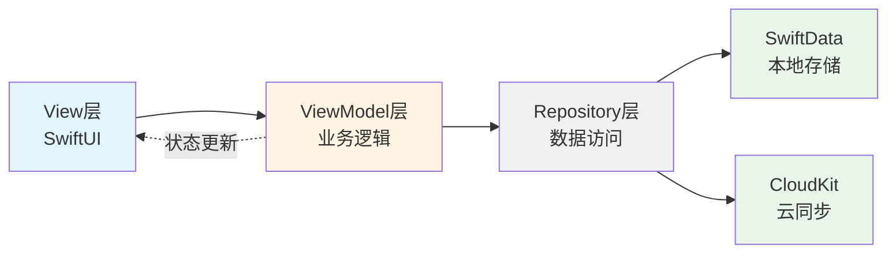
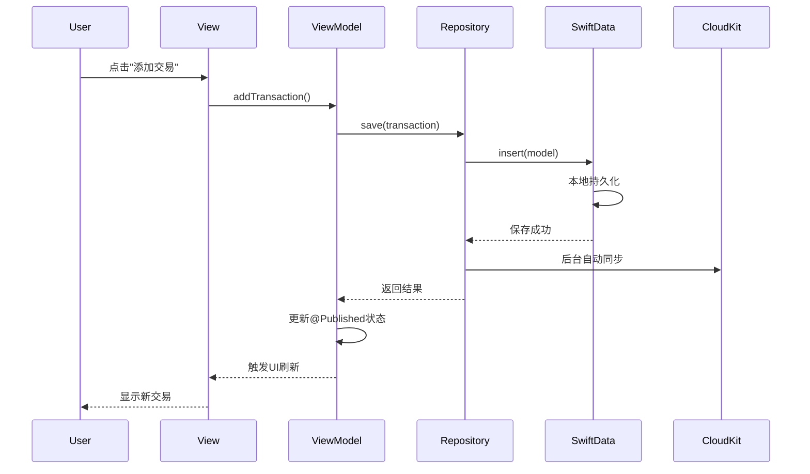
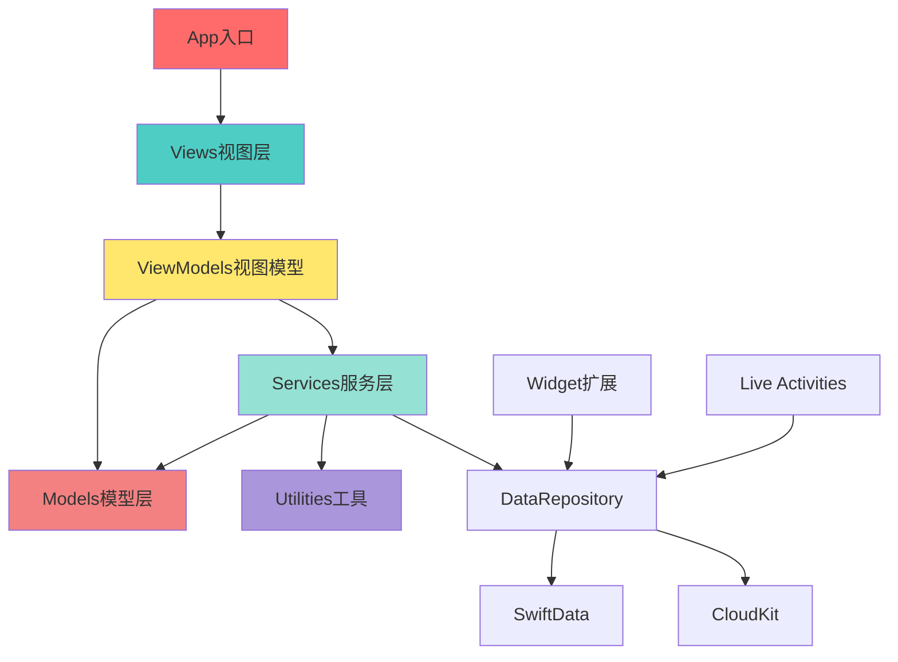

# iOS记账应用技术架构设计文档

## 文档信息

- **项目名称**: Lumina (记账App)
- **版本**: v1.0
- **最低支持**: iOS 17.0+
- **架构模式**: MVVM + Repository Pattern
- **创建日期**: 2026-01-24

---

## 1. 技术栈选型

### 1.1 核心技术栈

| 技术领域 | 选型 | 版本要求 | 选择理由 |
|---------|------|---------|---------|
| **UI框架** | SwiftUI | iOS 17.0+ | 1. 原生性能最优<br>2. 声明式UI开发效率高<br>3. 完美支持iOS最新特性<br>4. 自动适配Dark Mode |
| **数据持久化** | SwiftData | iOS 17.0+ | 1. Apple最新推荐方案<br>2. 与SwiftUI深度集成<br>3. 简化数据模型定义<br>4. 自动iCloud同步支持 |
| **云同步** | CloudKit | - | 1. 用户数据完全隐私<br>2. 免费额度充足<br>3. 自动处理冲突<br>4. 无需自建后端 |
| **图表库** | Swift Charts | iOS 16.0+ | 1. Apple原生图表框架<br>2. 性能优异<br>3. 自动适配系统主题<br>4. 无第三方依赖 |
| **并发处理** | Swift Concurrency | Swift 5.5+ | 1. async/await简化异步代码<br>2. Actor保证线程安全<br>3. TaskGroup处理并发任务 |

### 1.2 为什么选择纯SwiftUI？

**对比分析**：

| 方案 | 优势 | 劣势 | 适用场景 |
|-----|------|------|---------|
| **纯SwiftUI** | • 开发效率最高<br>• 代码量少30-40%<br>• 完美支持新特性 | • 需iOS 17+<br>• 部分组件需自定义 | ✅ 新项目<br>✅ 快速迭代 |
| SwiftUI+UIKit | • 兼容老版本<br>• 复用现有UIKit | • 代码复杂度增加<br>• 维护成本高 | ❌ 本项目不需要 |
| UIKit | • 成熟稳定<br>• 兼容性强 | • 开发效率低<br>• 无法使用新特性 | ❌ 过时方案 |

**结论**: 本项目为全新开发，目标用户为iOS高版本用户，纯SwiftUI是最佳选择。

---

## 2. 架构模式设计

### 2.1 MVVM架构



### 2.2 层级职责划分

#### **View层** (视图层)
- **职责**: 
  - 仅负责UI渲染
  - 响应用户交互
  - 绑定ViewModel状态
- **技术**: SwiftUI
- **示例文件**: `HomeView.swift`, `AddTransactionView.swift`

```swift
// 示例：View层代码结构
struct HomeView: View {
    @StateObject private var viewModel = HomeViewModel()
    
    var body: some View {
        // 纯UI代码，无业务逻辑
        ScrollView {
            NetAssetCard(amount: viewModel.totalAssets)
            TransactionList(transactions: viewModel.transactions)
        }
        .onAppear { viewModel.loadData() }
    }
}
```

#### **ViewModel层** (视图模型层)
- **职责**:
  - 处理业务逻辑
  - 管理UI状态
  - 调用Repository获取数据
  - 数据转换与格式化
- **技术**: ObservableObject + @Published
- **示例文件**: `HomeViewModel.swift`, `TransactionViewModel.swift`

```swift
// 示例：ViewModel层代码结构
@MainActor
class HomeViewModel: ObservableObject {
    @Published var totalAssets: Decimal = 0
    @Published var transactions: [Transaction] = []
    @Published var isLoading = false
    
    private let repository: DataRepository
    
    init(repository: DataRepository = .shared) {
        self.repository = repository
    }
    
    func loadData() async {
        isLoading = true
        defer { isLoading = false }
        
        // 从Repository获取数据
        totalAssets = await repository.calculateTotalAssets()
        transactions = await repository.getRecentTransactions()
    }
}
```

#### **Repository层** (数据访问层)
- **职责**:
  - 封装数据访问逻辑
  - 统一本地和云端数据
  - 处理数据缓存
  - 提供统一API给ViewModel
- **技术**: Actor (线程安全)
- **示例文件**: `DataRepository.swift`

```swift
// 示例：Repository层代码结构
actor DataRepository {
    static let shared = DataRepository()
    
    private let modelContext: ModelContext
    
    func getRecentTransactions(limit: Int = 50) async -> [Transaction] {
        // 从SwiftData获取数据
    }
    
    func saveTransaction(_ transaction: Transaction) async throws {
        // 保存到SwiftData，自动同步到CloudKit
    }
}
```

### 2.3 数据流向



---

## 3. 项目文件结构

### 3.1 完整目录树

```
jizhang/
├── jizhang/                                    # 主App Target
│   ├── App/                                    # 应用入口
│   │   ├── jizhangApp.swift                   # App生命周期
│   │   ├── AppState.swift                     # 全局状态管理
│   │   └── AppDelegate.swift                  # 传统AppDelegate（通知等）
│   │
│   ├── Models/                                 # SwiftData模型层
│   │   ├── Core/
│   │   │   ├── Ledger.swift                   # 账本实体
│   │   │   ├── Account.swift                  # 账户实体
│   │   │   ├── Category.swift                 # 分类实体
│   │   │   ├── Transaction.swift              # 流水实体
│   │   │   ├── Budget.swift                   # 预算实体
│   │   │   └── Tag.swift                      # 标签实体
│   │   ├── Enums/
│   │   │   ├── AccountType.swift              # 账户类型枚举
│   │   │   ├── TransactionType.swift          # 交易类型枚举
│   │   │   └── BudgetPeriod.swift             # 预算周期枚举
│   │   └── ValueTypes/
│   │       ├── Money.swift                    # 金额值类型
│   │       └── DateRange.swift                # 日期范围
│   │
│   ├── ViewModels/                             # 视图模型层
│   │   ├── Home/
│   │   │   └── HomeViewModel.swift
│   │   ├── Transaction/
│   │   │   ├── TransactionListViewModel.swift
│   │   │   └── AddTransactionViewModel.swift
│   │   ├── Report/
│   │   │   └── ReportViewModel.swift
│   │   ├── Budget/
│   │   │   └── BudgetViewModel.swift
│   │   └── Settings/
│   │       ├── LedgerViewModel.swift
│   │       └── AccountViewModel.swift
│   │
│   ├── Views/                                  # 视图层
│   │   ├── Root/
│   │   │   └── MainTabView.swift              # 根TabView
│   │   │
│   │   ├── Home/
│   │   │   ├── HomeView.swift                 # 首页
│   │   │   ├── NetAssetCard.swift             # 净资产卡片
│   │   │   └── TodayBudgetBar.swift           # 今日预算条
│   │   │
│   │   ├── Transaction/
│   │   │   ├── TransactionListView.swift      # 流水列表
│   │   │   ├── TransactionRow.swift           # 流水行
│   │   │   ├── AddTransactionSheet.swift      # 添加交易Sheet
│   │   │   ├── CalculatorKeyboard.swift       # 计算器键盘
│   │   │   ├── CategoryPicker.swift           # 分类选择器
│   │   │   └── AccountPicker.swift            # 账户选择器
│   │   │
│   │   ├── Report/
│   │   │   ├── ReportView.swift               # 报表主页
│   │   │   ├── Charts/
│   │   │   │   ├── ExpenseBarChart.swift      # 支出柱状图
│   │   │   │   ├── CategoryPieChart.swift     # 分类饼图
│   │   │   │   └── NetWorthLineChart.swift    # 净资产趋势
│   │   │   └── CategoryRankingList.swift      # 分类排行
│   │   │
│   │   ├── Budget/
│   │   │   ├── BudgetView.swift               # 预算主页
│   │   │   ├── BudgetCard.swift               # 预算卡片
│   │   │   ├── CreateBudgetSheet.swift        # 创建预算
│   │   │   └── BudgetProgressBar.swift        # 预算进度条
│   │   │
│   │   ├── Settings/
│   │   │   ├── SettingsView.swift             # 设置主页
│   │   │   ├── LedgerManagementView.swift     # 账本管理
│   │   │   ├── AccountManagementView.swift    # 账户管理
│   │   │   ├── CategoryManagementView.swift   # 分类管理
│   │   │   ├── CloudSyncView.swift            # 云同步
│   │   │   └── ExportDataView.swift           # 数据导出
│   │   │
│   │   └── Components/                         # 通用组件
│   │       ├── Buttons/
│   │       │   ├── PrimaryButton.swift
│   │       │   └── FloatingActionButton.swift
│   │       ├── Cards/
│   │       │   └── CardView.swift
│   │       ├── Inputs/
│   │       │   └── AmountTextField.swift
│   │       └── Loading/
│   │           └── LoadingView.swift
│   │
│   ├── Services/                               # 业务服务层
│   │   ├── Data/
│   │   │   ├── DataRepository.swift           # 数据仓库
│   │   │   └── DataService.swift              # 数据服务
│   │   ├── Cloud/
│   │   │   ├── CloudSyncService.swift         # CloudKit同步
│   │   │   └── ConflictResolver.swift         # 冲突解决
│   │   ├── Export/
│   │   │   ├── ExportService.swift            # 导出服务
│   │   │   ├── CSVExporter.swift              # CSV导出器
│   │   │   └── PDFExporter.swift              # PDF导出器
│   │   ├── Notification/
│   │   │   └── NotificationService.swift      # 通知服务
│   │   └── Analytics/
│   │       └── AnalyticsService.swift         # 统计服务
│   │
│   ├── Utilities/                              # 工具类
│   │   ├── Extensions/
│   │   │   ├── Date+Extensions.swift
│   │   │   ├── Decimal+Extensions.swift
│   │   │   ├── Color+Extensions.swift
│   │   │   └── View+Extensions.swift
│   │   ├── Helpers/
│   │   │   ├── CurrencyFormatter.swift        # 货币格式化
│   │   │   ├── DateHelper.swift               # 日期辅助
│   │   │   └── ValidationHelper.swift         # 验证辅助
│   │   ├── Constants/
│   │   │   ├── AppConstants.swift             # 应用常量
│   │   │   ├── DesignSystem.swift             # 设计系统常量
│   │   │   └── DefaultData.swift              # 默认数据
│   │   └── Managers/
│   │       └── HapticManager.swift            # 触觉反馈管理
│   │
│   └── Resources/                              # 资源文件
│       ├── Assets.xcassets/
│       ├── Localizable.xcstrings              # 本地化字符串
│       └── Info.plist
│
├── jizhangWidget/                              # Widget扩展
│   ├── TodayExpenseWidget.swift               # 今日支出Widget
│   ├── BudgetWidget.swift                     # 预算Widget
│   ├── Providers/
│   │   └── WidgetTimelineProvider.swift       # Timeline提供者
│   └── Views/
│       ├── SmallWidgetView.swift
│       ├── MediumWidgetView.swift
│       └── LargeWidgetView.swift
│
├── LiveActivity/                               # Live Activities扩展
│   ├── ShoppingModeLiveActivity.swift         # 购物模式
│   ├── TravelModeLiveActivity.swift           # 旅行模式
│   └── LiveActivityAttributes.swift           # 属性定义
│
├── jizhangTests/                               # 单元测试
│   ├── ModelTests/
│   ├── ViewModelTests/
│   └── ServiceTests/
│
└── jizhangUITests/                             # UI测试
    ├── TransactionFlowTests.swift
    └── ReportInteractionTests.swift
```

### 3.2 模块依赖关系



---

## 4. 核心组件设计

### 4.1 App入口设计

```swift
// jizhangApp.swift
import SwiftUI
import SwiftData

@main
struct jizhangApp: App {
    @StateObject private var appState = AppState()
    
    var body: some Scene {
        WindowGroup {
            MainTabView()
                .environmentObject(appState)
                .modelContainer(appState.modelContainer)
        }
    }
}

// AppState.swift
@MainActor
class AppState: ObservableObject {
    // 全局状态
    @Published var currentLedger: Ledger?
    @Published var isCloudSyncEnabled = true
    
    // SwiftData容器
    let modelContainer: ModelContainer
    
    init() {
        do {
            // 配置SwiftData
            let schema = Schema([
                Ledger.self,
                Account.self,
                Category.self,
                Transaction.self,
                Budget.self,
                Tag.self
            ])
            
            let modelConfiguration = ModelConfiguration(
                schema: schema,
                isStoredInMemoryOnly: false,
                cloudKitDatabase: .automatic // 启用CloudKit
            )
            
            modelContainer = try ModelContainer(
                for: schema,
                configurations: [modelConfiguration]
            )
            
            // 加载当前账本
            loadCurrentLedger()
        } catch {
            fatalError("无法初始化ModelContainer: \(error)")
        }
    }
    
    private func loadCurrentLedger() {
        // 从UserDefaults加载上次使用的账本
        // 如果没有，创建默认账本
    }
}
```

### 4.2 Repository模式实现

```swift
// DataRepository.swift
actor DataRepository {
    static let shared = DataRepository()
    
    private let modelContext: ModelContext
    
    private init() {
        // 从AppState获取ModelContext
        self.modelContext = AppState.shared.modelContainer.mainContext
    }
    
    // MARK: - Transaction Operations
    
    func fetchTransactions(
        ledger: Ledger,
        startDate: Date? = nil,
        endDate: Date? = nil,
        limit: Int = 50
    ) async -> [Transaction] {
        var descriptor = FetchDescriptor<Transaction>(
            predicate: #Predicate { transaction in
                transaction.ledger == ledger
            },
            sortBy: [SortDescriptor(\.date, order: .reverse)]
        )
        descriptor.fetchLimit = limit
        
        do {
            return try modelContext.fetch(descriptor)
        } catch {
            print("获取交易失败: \(error)")
            return []
        }
    }
    
    func saveTransaction(_ transaction: Transaction) async throws {
        modelContext.insert(transaction)
        try modelContext.save()
        
        // 更新账户余额
        await updateAccountBalance(for: transaction)
    }
    
    // MARK: - Account Operations
    
    func fetchAccounts(for ledger: Ledger) async -> [Account] {
        let descriptor = FetchDescriptor<Account>(
            predicate: #Predicate { $0.ledger == ledger }
        )
        return (try? modelContext.fetch(descriptor)) ?? []
    }
    
    func calculateTotalAssets(for ledger: Ledger) async -> Decimal {
        let accounts = await fetchAccounts(for: ledger)
        return accounts
            .filter { !$0.excludeFromTotal }
            .reduce(0) { $0 + $1.balance }
    }
    
    // MARK: - Private Helpers
    
    private func updateAccountBalance(for transaction: Transaction) async {
        switch transaction.type {
        case .expense:
            transaction.fromAccount?.balance -= transaction.amount
        case .income:
            transaction.toAccount?.balance += transaction.amount
        case .transfer:
            transaction.fromAccount?.balance -= transaction.amount
            transaction.toAccount?.balance += transaction.amount
        case .adjustment:
            transaction.toAccount?.balance = transaction.amount
        }
        
        try? modelContext.save()
    }
}
```

---

## 5. 依赖管理

### 5.1 第三方依赖

本项目**不使用任何第三方依赖**，100%使用Apple原生框架：

| 功能 | 使用框架 | 说明 |
|-----|---------|------|
| UI | SwiftUI | 官方UI框架 |
| 数据 | SwiftData | 官方数据框架 |
| 云同步 | CloudKit | 官方云服务 |
| 图表 | Swift Charts | 官方图表框架 |
| 网络 | URLSession | 官方网络框架（汇率等） |
| 并发 | Swift Concurrency | 原生并发 |

**优势**：
- ✅ 零依赖，无供应链风险
- ✅ 性能最优
- ✅ 包体积最小
- ✅ 长期维护性最佳

### 5.2 系统框架引用

```swift
// 主要使用的系统框架
import SwiftUI           // UI框架
import SwiftData         // 数据持久化
import CloudKit          // 云同步
import Charts            // 图表
import WidgetKit         // Widget
import ActivityKit       // Live Activities
import UserNotifications // 通知
import StoreKit          // 内购（Pro版本）
```

---

## 6. 性能优化策略

### 6.1 启动性能

**目标**: 冷启动 < 1秒

**策略**:
1. **延迟加载**: 非首页模块按需加载
2. **预加载关键数据**: 启动时只加载30天内数据
3. **异步初始化**: 使用`Task`异步初始化服务

```swift
// 示例：首页延迟加载
struct HomeView: View {
    @StateObject private var viewModel = HomeViewModel()
    
    var body: some View {
        ScrollView {
            NetAssetCard(amount: viewModel.totalAssets)
            
            // 延迟加载非关键组件
            LazyVStack {
                TransactionList(transactions: viewModel.transactions)
            }
        }
        .task {
            await viewModel.loadData()
        }
    }
}
```

### 6.2 列表性能

**目标**: 60fps/120fps 流畅滚动

**策略**:
1. **LazyVStack**: 延迟渲染
2. **分页加载**: 每次加载50条
3. **缓存计算结果**: 日汇总、月汇总缓存

```swift
// 示例：高性能列表
struct TransactionList: View {
    let transactions: [Transaction]
    
    var body: some View {
        LazyVStack(spacing: 0, pinnedViews: [.sectionHeaders]) {
            ForEach(groupedTransactions, id: \.date) { group in
                Section {
                    ForEach(group.transactions) { transaction in
                        TransactionRow(transaction: transaction)
                            .id(transaction.id)
                    }
                } header: {
                    DateSectionHeader(date: group.date, total: group.total)
                }
            }
        }
    }
    
    // 按日期分组（缓存结果）
    private var groupedTransactions: [TransactionGroup] {
        // 使用@State缓存计算结果
    }
}
```

### 6.3 内存优化

**策略**:
1. **及时释放**: 使用`weak`/`unowned`避免循环引用
2. **图片压缩**: 发票照片自动压缩
3. **批量操作**: 使用`ModelContext.processPendingChanges()`批量保存

---

## 7. 安全性设计

### 7.1 数据安全

| 安全措施 | 实现方式 | 说明 |
|---------|---------|------|
| **本地加密** | Data Protection API | iOS自动加密设备存储 |
| **云端加密** | CloudKit端到端加密 | 开发者无法查看用户数据 |
| **传输加密** | HTTPS | 所有网络请求使用TLS |
| **生物认证** | LocalAuthentication | Face ID/Touch ID保护（可选） |

```swift
// 示例：启用生物认证
import LocalAuthentication

class SecurityService {
    func enableBiometricAuth() async -> Bool {
        let context = LAContext()
        var error: NSError?
        
        guard context.canEvaluatePolicy(.deviceOwnerAuthenticationWithBiometrics, error: &error) else {
            return false
        }
        
        do {
            let success = try await context.evaluatePolicy(
                .deviceOwnerAuthenticationWithBiometrics,
                localizedReason: "验证身份以查看账本"
            )
            return success
        } catch {
            return false
        }
    }
}
```

### 7.2 隐私保护

**遵循原则**:
- ✅ 数据最小化：只收集必要数据
- ✅ 本地优先：数据优先存本地
- ✅ 用户掌控：支持导出/删除所有数据
- ✅ 透明化：清晰说明数据用途

---

## 8. 可扩展性设计

### 8.1 模块化设计

所有模块松耦合，便于：
- 添加新账户类型（如虚拟货币）
- 添加新报表类型（如现金流瀑布图）
- 添加新导出格式（如Excel）

### 8.2 插件化架构（未来）

预留扩展点：
```swift
// 示例：导出器协议
protocol Exporter {
    func export(transactions: [Transaction]) async throws -> Data
}

class CSVExporter: Exporter {
    func export(transactions: [Transaction]) async throws -> Data {
        // CSV导出实现
    }
}

// 未来可添加：
// class ExcelExporter: Exporter { }
// class JSONExporter: Exporter { }
```

---

## 9. 测试策略

### 9.1 测试金字塔

```
         /\
        /UI\         10% - UI测试（关键流程）
       /____\
      /      \
     /集成测试\       20% - 集成测试（组件协作）
    /__________\
   /            \
  /  单元测试    \    70% - 单元测试（业务逻辑）
 /________________\
```

### 9.2 测试覆盖目标

| 层级 | 覆盖率目标 | 重点测试内容 |
|-----|-----------|------------|
| Model | 100% | 数据模型逻辑 |
| ViewModel | 90% | 业务逻辑、状态管理 |
| Service | 95% | 转账、退款、预算计算 |
| View | 关键流程 | 添加交易、切换账本 |

---

## 10. 开发工具链

### 10.1 必需工具

| 工具 | 版本 | 用途 |
|-----|------|------|
| Xcode | 15.0+ | IDE |
| iOS Simulator | 17.0+ | 测试 |
| SF Symbols | 5.0+ | 图标资源 |
| Git | 2.x | 版本控制 |

### 10.2 推荐工具

- **SwiftLint**: 代码规范检查
- **SwiftFormat**: 代码格式化
- **Instruments**: 性能分析
- **TestFlight**: Beta测试

---

## 11. 技术风险与应对

| 风险点 | 风险等级 | 应对措施 |
|-------|---------|---------|
| SwiftData新框架不稳定 | 中 | 充分测试，保留CoreData迁移方案 |
| CloudKit同步冲突 | 中 | 实现完善的冲突解决策略 |
| iOS版本碎片化 | 低 | 明确iOS 17+，不向下兼容 |
| 性能瓶颈 | 低 | 预加载+缓存+分页 |

---

## 12. 架构演进路线

### 第一版 (v1.0)
- ✅ 核心MVVM架构
- ✅ SwiftData本地存储
- ✅ 基础CloudKit同步

### 第二版 (v2.0)
- 🔲 多设备实时同步优化
- 🔲 Widget交互增强
- 🔲 Siri快捷指令

### 第三版 (v3.0)
- 🔲 iPad适配
- 🔲 Apple Watch版本
- 🔲 Mac Catalyst版本

---

## 附录A: 关键技术决策记录

### 为什么选择SwiftData而非CoreData？

**决策**: SwiftData
**日期**: 2026-01-24
**理由**:
1. SwiftData是Apple未来主推方案
2. 代码量减少50%
3. 与SwiftUI集成更紧密
4. 自动支持CloudKit同步
5. 项目为新开发，无历史包袱

### 为什么不使用Firebase？

**决策**: 不使用
**理由**:
1. 隐私优先：CloudKit数据端到端加密
2. 成本：CloudKit对开发者免费
3. 原生性：CloudKit与iOS深度集成
4. 信任：用户更信任Apple

---

## 附录B: 参考资料

- [SwiftUI官方文档](https://developer.apple.com/documentation/swiftui/)
- [SwiftData官方文档](https://developer.apple.com/documentation/swiftdata)
- [CloudKit官方文档](https://developer.apple.com/documentation/cloudkit)
- [Swift Charts文档](https://developer.apple.com/documentation/charts)
- [Human Interface Guidelines](https://developer.apple.com/design/human-interface-guidelines/)

---

**文档维护**: 本文档随架构演进持续更新
**最后更新**: 2026-01-24
