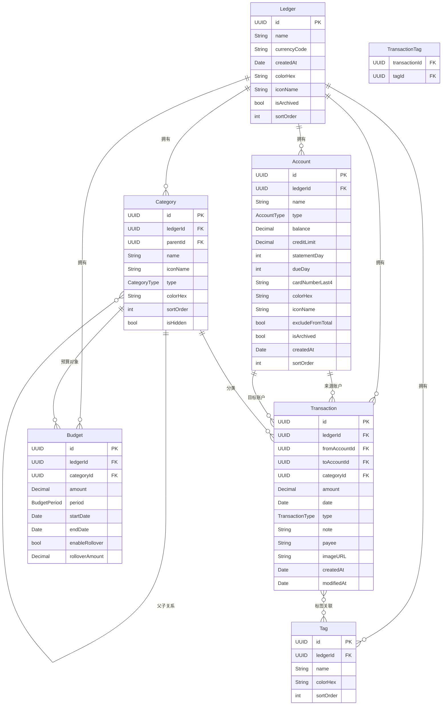

# SwiftData数据模型详细设计文档

## 文档信息

- **项目名称**: Lumina记账App
- **数据框架**: SwiftData (iOS 17.0+)
- **版本**: v1.0
- **创建日期**: 2026-01-24

---

## 1. 数据模型概览

### 1.1 实体关系图 (ER Diagram)



### 1.2 核心实体列表

| 实体名 | 用途 | 关键字段 | 关系数量 |
|-------|------|---------|---------|
| **Ledger** | 账本 | name, currencyCode | 5个关系 |
| **Account** | 账户 | name, type, balance | 3个关系 |
| **Category** | 分类 | name, type, parent | 3个关系 |
| **Transaction** | 流水 | amount, date, type | 5个关系 |
| **Budget** | 预算 | amount, period | 2个关系 |
| **Tag** | 标签 | name, color | 2个关系 |

---

## 2. 详细模型实现

### 2.1 Ledger（账本）

#### 2.1.1 模型定义

```swift
import Foundation
import SwiftData

@Model
final class Ledger {
    // MARK: - Properties
    
    /// 唯一标识符
    @Attribute(.unique) var id: UUID
    
    /// 账本名称
    var name: String
    
    /// 本位币代码 (ISO 4217)
    var currencyCode: String
    
    /// 创建时间
    var createdAt: Date
    
    /// 主题颜色 (Hex)
    var colorHex: String
    
    /// 图标名称 (SF Symbols)
    var iconName: String
    
    /// 是否归档
    var isArchived: Bool
    
    /// 排序顺序
    var sortOrder: Int
    
    /// 描述信息（可选）
    var ledgerDescription: String?
    
    // MARK: - Relationships
    
    /// 关联的账户
    @Relationship(deleteRule: .cascade, inverse: \Account.ledger)
    var accounts: [Account]
    
    /// 关联的分类
    @Relationship(deleteRule: .cascade, inverse: \Category.ledger)
    var categories: [Category]
    
    /// 关联的流水
    @Relationship(deleteRule: .cascade, inverse: \Transaction.ledger)
    var transactions: [Transaction]
    
    /// 关联的预算
    @Relationship(deleteRule: .cascade, inverse: \Budget.ledger)
    var budgets: [Budget]
    
    /// 关联的标签
    @Relationship(deleteRule: .cascade, inverse: \Tag.ledger)
    var tags: [Tag]
    
    // MARK: - Initialization
    
    init(
        name: String,
        currencyCode: String = "CNY",
        colorHex: String = "#007AFF",
        iconName: String = "book.fill",
        sortOrder: Int = 0
    ) {
        self.id = UUID()
        self.name = name
        self.currencyCode = currencyCode
        self.createdAt = Date()
        self.colorHex = colorHex
        self.iconName = iconName
        self.isArchived = false
        self.sortOrder = sortOrder
        self.accounts = []
        self.categories = []
        self.transactions = []
        self.budgets = []
        self.tags = []
    }
}

// MARK: - Computed Properties

extension Ledger {
    /// 计算总资产
    var totalAssets: Decimal {
        accounts
            .filter { !$0.excludeFromTotal && !$0.isArchived }
            .reduce(0) { $0 + $1.balance }
    }
    
    /// 活跃账户数量
    var activeAccountsCount: Int {
        accounts.filter { !$0.isArchived }.count
    }
    
    /// 本月交易数量
    var thisMonthTransactionCount: Int {
        let calendar = Calendar.current
        let now = Date()
        return transactions.filter { transaction in
            calendar.isDate(transaction.date, equalTo: now, toGranularity: .month)
        }.count
    }
}

// MARK: - Business Logic

extension Ledger {
    /// 创建默认分类
    func createDefaultCategories() {
        // 支出分类
        let expenseCategories: [(String, String, [String])] = [
            ("餐饮", "fork.knife", ["早餐", "午餐", "晚餐", "零食", "咖啡", "请客"]),
            ("交通", "car.fill", ["地铁", "公交", "打车", "加油", "停车"]),
            ("购物", "cart.fill", ["日用品", "服饰", "电子产品", "图书"]),
            ("居住", "house.fill", ["房租", "水电", "物业", "维修"]),
            ("娱乐", "gamecontroller.fill", ["电影", "游戏", "运动", "旅游"]),
            ("医疗", "cross.case.fill", ["药品", "就医", "保健"]),
            ("教育", "book.fill", ["学费", "培训", "书籍"]),
            ("通讯", "phone.fill", ["话费", "宽带", "会员"])
        ]
        
        for (parentName, icon, children) in expenseCategories {
            let parent = Category(
                ledger: self,
                name: parentName,
                type: .expense,
                iconName: icon
            )
            categories.append(parent)
            
            for (index, childName) in children.enumerated() {
                let child = Category(
                    ledger: self,
                    name: childName,
                    type: .expense,
                    parent: parent,
                    sortOrder: index
                )
                categories.append(child)
            }
        }
        
        // 收入分类
        let incomeCategories: [(String, String, [String])] = [
            ("工资", "banknote.fill", ["基本工资", "奖金", "补贴"]),
            ("投资", "chart.line.uptrend.xyaxis", ["股票", "基金", "利息"]),
            ("其他", "ellipsis.circle.fill", ["礼金", "报销", "兼职"])
        ]
        
        for (parentName, icon, children) in incomeCategories {
            let parent = Category(
                ledger: self,
                name: parentName,
                type: .income,
                iconName: icon
            )
            categories.append(parent)
            
            for (index, childName) in children.enumerated() {
                let child = Category(
                    ledger: self,
                    name: childName,
                    type: .income,
                    parent: parent,
                    sortOrder: index
                )
                categories.append(child)
            }
        }
    }
    
    /// 创建默认账户
    func createDefaultAccounts() {
        let cash = Account(
            ledger: self,
            name: "现金",
            type: .cash,
            iconName: "banknote.fill"
        )
        accounts.append(cash)
    }
}
```

---

### 2.2 Account（账户）

#### 2.2.1 账户类型枚举

```swift
import Foundation

/// 账户类型
enum AccountType: String, Codable, CaseIterable {
    case cash = "cash"                      // 现金
    case checking = "checking"              // 借记卡/储蓄卡
    case creditCard = "credit_card"         // 信用卡
    case eWallet = "e_wallet"              // 电子钱包
    case investment = "investment"          // 投资账户
    case liability = "liability"            // 负债账户
    case receivable = "receivable"          // 应收账户
    
    var displayName: String {
        switch self {
        case .cash: return "现金"
        case .checking: return "储蓄卡"
        case .creditCard: return "信用卡"
        case .eWallet: return "电子钱包"
        case .investment: return "投资"
        case .liability: return "负债"
        case .receivable: return "应收"
        }
    }
    
    var defaultIcon: String {
        switch self {
        case .cash: return "banknote.fill"
        case .checking: return "creditcard.fill"
        case .creditCard: return "creditcard.circle.fill"
        case .eWallet: return "iphone"
        case .investment: return "chart.line.uptrend.xyaxis"
        case .liability: return "arrow.down.circle.fill"
        case .receivable: return "arrow.up.circle.fill"
        }
    }
    
    /// 是否为资产账户
    var isAsset: Bool {
        switch self {
        case .cash, .checking, .eWallet, .investment, .receivable:
            return true
        case .creditCard, .liability:
            return false
        }
    }
    
    /// 是否支持信用额度
    var supportsCreditLimit: Bool {
        self == .creditCard
    }
}
```

#### 2.2.2 模型定义

```swift
import Foundation
import SwiftData

@Model
final class Account {
    // MARK: - Properties
    
    @Attribute(.unique) var id: UUID
    
    /// 账户名称
    var name: String
    
    /// 账户类型
    var type: AccountType
    
    /// 当前余额
    var balance: Decimal
    
    /// 信用额度（仅信用卡）
    var creditLimit: Decimal?
    
    /// 账单日（仅信用卡，1-31）
    var statementDay: Int?
    
    /// 还款日（仅信用卡，1-31）
    var dueDay: Int?
    
    /// 卡号后四位（可选）
    var cardNumberLast4: String?
    
    /// 主题颜色
    var colorHex: String
    
    /// 图标名称
    var iconName: String
    
    /// 是否排除在总资产统计外
    var excludeFromTotal: Bool
    
    /// 是否归档
    var isArchived: Bool
    
    /// 创建时间
    var createdAt: Date
    
    /// 排序顺序
    var sortOrder: Int
    
    /// 备注
    var note: String?
    
    // MARK: - Relationships
    
    /// 所属账本
    var ledger: Ledger?
    
    /// 作为来源账户的交易
    @Relationship(inverse: \Transaction.fromAccount)
    var outgoingTransactions: [Transaction]
    
    /// 作为目标账户的交易
    @Relationship(inverse: \Transaction.toAccount)
    var incomingTransactions: [Transaction]
    
    // MARK: - Initialization
    
    init(
        ledger: Ledger,
        name: String,
        type: AccountType,
        balance: Decimal = 0,
        iconName: String? = nil,
        colorHex: String = "#007AFF",
        sortOrder: Int = 0
    ) {
        self.id = UUID()
        self.name = name
        self.type = type
        self.balance = balance
        self.iconName = iconName ?? type.defaultIcon
        self.colorHex = colorHex
        self.excludeFromTotal = false
        self.isArchived = false
        self.createdAt = Date()
        self.sortOrder = sortOrder
        self.ledger = ledger
        self.outgoingTransactions = []
        self.incomingTransactions = []
    }
}

// MARK: - Computed Properties

extension Account {
    /// 可用余额（信用卡为剩余额度）
    var availableBalance: Decimal {
        if type == .creditCard, let limit = creditLimit {
            return limit + balance // balance为负数
        }
        return balance
    }
    
    /// 信用卡额度使用率
    var creditUtilization: Double {
        guard type == .creditCard, let limit = creditLimit, limit > 0 else {
            return 0
        }
        return Double(truncating: abs(balance) / limit as NSNumber)
    }
    
    /// 距离下次账单日天数
    var daysUntilNextStatement: Int? {
        guard let statementDay = statementDay else { return nil }
        
        let calendar = Calendar.current
        let today = Date()
        
        guard let nextStatement = calendar.nextDate(
            after: today,
            matching: DateComponents(day: statementDay),
            matchingPolicy: .nextTime
        ) else {
            return nil
        }
        
        return calendar.dateComponents([.day], from: today, to: nextStatement).day
    }
    
    /// 本月交易笔数
    var thisMonthTransactionCount: Int {
        let calendar = Calendar.current
        let now = Date()
        let allTransactions = outgoingTransactions + incomingTransactions
        
        return allTransactions.filter { transaction in
            calendar.isDate(transaction.date, equalTo: now, toGranularity: .month)
        }.count
    }
}

// MARK: - Business Logic

extension Account {
    /// 调整余额（用于对账）
    func adjustBalance(to newBalance: Decimal, note: String = "余额调整") -> Transaction {
        let difference = newBalance - balance
        
        let transaction = Transaction(
            ledger: ledger!,
            amount: abs(difference),
            date: Date(),
            type: .adjustment,
            toAccount: self,
            note: note
        )
        
        self.balance = newBalance
        return transaction
    }
    
    /// 验证信用卡配置
    func validateCreditCardSettings() -> Bool {
        guard type == .creditCard else { return true }
        
        guard let limit = creditLimit, limit > 0 else { return false }
        guard let statement = statementDay, (1...31).contains(statement) else { return false }
        guard let due = dueDay, (1...31).contains(due) else { return false }
        
        return true
    }
}
```

---

### 2.3 Category（分类）

#### 2.3.1 分类类型枚举

```swift
import Foundation

/// 分类类型
enum CategoryType: String, Codable {
    case expense = "expense"    // 支出
    case income = "income"      // 收入
    
    var displayName: String {
        switch self {
        case .expense: return "支出"
        case .income: return "收入"
        }
    }
    
    var color: String {
        switch self {
        case .expense: return "#FF3B30" // 红色
        case .income: return "#34C759"  // 绿色
        }
    }
}
```

#### 2.3.2 模型定义

```swift
import Foundation
import SwiftData

@Model
final class Category {
    // MARK: - Properties
    
    @Attribute(.unique) var id: UUID
    
    /// 分类名称
    var name: String
    
    /// 图标名称
    var iconName: String
    
    /// 分类类型
    var type: CategoryType
    
    /// 颜色
    var colorHex: String
    
    /// 排序顺序
    var sortOrder: Int
    
    /// 是否隐藏
    var isHidden: Bool
    
    /// 创建时间
    var createdAt: Date
    
    // MARK: - Relationships
    
    /// 所属账本
    var ledger: Ledger?
    
    /// 父分类
    var parent: Category?
    
    /// 子分类
    @Relationship(deleteRule: .cascade, inverse: \Category.parent)
    var children: [Category]
    
    /// 关联的交易
    @Relationship(inverse: \Transaction.category)
    var transactions: [Transaction]
    
    /// 关联的预算
    @Relationship(deleteRule: .cascade, inverse: \Budget.category)
    var budgets: [Budget]
    
    // MARK: - Initialization
    
    init(
        ledger: Ledger,
        name: String,
        type: CategoryType,
        iconName: String = "folder.fill",
        parent: Category? = nil,
        colorHex: String? = nil,
        sortOrder: Int = 0
    ) {
        self.id = UUID()
        self.name = name
        self.type = type
        self.iconName = iconName
        self.parent = parent
        self.colorHex = colorHex ?? type.color
        self.sortOrder = sortOrder
        self.isHidden = false
        self.createdAt = Date()
        self.ledger = ledger
        self.children = []
        self.transactions = []
        self.budgets = []
    }
}

// MARK: - Computed Properties

extension Category {
    /// 是否为一级分类
    var isParentCategory: Bool {
        parent == nil
    }
    
    /// 是否为二级分类
    var isChildCategory: Bool {
        parent != nil
    }
    
    /// 完整路径名（如：餐饮 > 早餐）
    var fullPath: String {
        if let parent = parent {
            return "\(parent.name) > \(name)"
        }
        return name
    }
    
    /// 所有子分类的交易（包括自己）
    var allTransactions: [Transaction] {
        var all = transactions
        for child in children {
            all.append(contentsOf: child.transactions)
        }
        return all
    }
    
    /// 本月支出总额
    func totalExpenseThisMonth() -> Decimal {
        let calendar = Calendar.current
        let now = Date()
        
        return allTransactions
            .filter { calendar.isDate($0.date, equalTo: now, toGranularity: .month) }
            .filter { $0.type == .expense }
            .reduce(0) { $0 + $1.amount }
    }
}
```

---

### 2.4 Transaction（交易流水）

#### 2.4.1 交易类型枚举

```swift
import Foundation

/// 交易类型
enum TransactionType: String, Codable {
    case expense = "expense"        // 支出
    case income = "income"          // 收入
    case transfer = "transfer"      // 转账
    case adjustment = "adjustment"  // 余额调整
    
    var displayName: String {
        switch self {
        case .expense: return "支出"
        case .income: return "收入"
        case .transfer: return "转账"
        case .adjustment: return "调整"
        }
    }
    
    var icon: String {
        switch self {
        case .expense: return "arrow.down.circle.fill"
        case .income: return "arrow.up.circle.fill"
        case .transfer: return "arrow.left.arrow.right.circle.fill"
        case .adjustment: return "slider.horizontal.3"
        }
    }
}
```

#### 2.4.2 模型定义

```swift
import Foundation
import SwiftData

@Model
final class Transaction {
    // MARK: - Properties
    
    @Attribute(.unique) var id: UUID
    
    /// 交易金额（绝对值）
    var amount: Decimal
    
    /// 交易日期
    var date: Date
    
    /// 交易类型
    var type: TransactionType
    
    /// 备注
    var note: String?
    
    /// 商家/收款方
    var payee: String?
    
    /// 发票/凭证图片URL
    var imageURL: String?
    
    /// 创建时间
    var createdAt: Date
    
    /// 最后修改时间
    var modifiedAt: Date
    
    /// 是否已对账
    var isReconciled: Bool
    
    // MARK: - Relationships
    
    /// 所属账本
    var ledger: Ledger?
    
    /// 来源账户（支出、转账时使用）
    var fromAccount: Account?
    
    /// 目标账户（收入、转账时使用）
    var toAccount: Account?
    
    /// 分类（支出、收入时使用）
    var category: Category?
    
    /// 标签
    @Relationship(inverse: \Tag.transactions)
    var tags: [Tag]
    
    // MARK: - Initialization
    
    init(
        ledger: Ledger,
        amount: Decimal,
        date: Date,
        type: TransactionType,
        fromAccount: Account? = nil,
        toAccount: Account? = nil,
        category: Category? = nil,
        note: String? = nil,
        payee: String? = nil
    ) {
        self.id = UUID()
        self.amount = amount
        self.date = date
        self.type = type
        self.note = note
        self.payee = payee
        self.createdAt = Date()
        self.modifiedAt = Date()
        self.isReconciled = false
        
        self.ledger = ledger
        self.fromAccount = fromAccount
        self.toAccount = toAccount
        self.category = category
        self.tags = []
        
        // 自动更新账户余额
        updateAccountBalances()
    }
}

// MARK: - Computed Properties

extension Transaction {
    /// 显示用金额（带正负号）
    var signedAmount: Decimal {
        switch type {
        case .expense:
            return -amount
        case .income, .adjustment:
            return amount
        case .transfer:
            return 0 // 转账不影响总资产
        }
    }
    
    /// 主账户（用于显示）
    var primaryAccount: Account? {
        switch type {
        case .expense, .transfer:
            return fromAccount
        case .income, .adjustment:
            return toAccount
        }
    }
    
    /// 是否为退款（负数支出）
    var isRefund: Bool {
        type == .expense && amount < 0
    }
}

// MARK: - Business Logic

extension Transaction {
    /// 更新账户余额
    private func updateAccountBalances() {
        switch type {
        case .expense:
            fromAccount?.balance -= amount
            
        case .income:
            toAccount?.balance += amount
            
        case .transfer:
            fromAccount?.balance -= amount
            toAccount?.balance += amount
            
        case .adjustment:
            // 调整类型直接设置余额，不累加
            if let account = toAccount {
                account.balance = amount
            }
        }
    }
    
    /// 撤销交易（恢复账户余额）
    func revertBalanceChanges() {
        switch type {
        case .expense:
            fromAccount?.balance += amount
            
        case .income:
            toAccount?.balance -= amount
            
        case .transfer:
            fromAccount?.balance += amount
            toAccount?.balance -= amount
            
        case .adjustment:
            // 调整类型无法简单撤销
            break
        }
    }
    
    /// 验证交易有效性
    func validate() -> Bool {
        // 金额必须大于0（除非是退款）
        guard amount >= 0 else { return false }
        
        switch type {
        case .expense:
            return fromAccount != nil && category != nil
            
        case .income:
            return toAccount != nil && category != nil
            
        case .transfer:
            return fromAccount != nil && toAccount != nil && fromAccount != toAccount
            
        case .adjustment:
            return toAccount != nil
        }
    }
}
```

---

### 2.5 Budget（预算）

#### 2.5.1 预算周期枚举

```swift
import Foundation

/// 预算周期
enum BudgetPeriod: String, Codable, CaseIterable {
    case daily = "daily"        // 每日
    case weekly = "weekly"      // 每周
    case monthly = "monthly"    // 每月
    case quarterly = "quarterly" // 每季度
    case yearly = "yearly"      // 每年
    case custom = "custom"      // 自定义
    
    var displayName: String {
        switch self {
        case .daily: return "每日"
        case .weekly: return "每周"
        case .monthly: return "每月"
        case .quarterly: return "每季度"
        case .yearly: return "每年"
        case .custom: return "自定义"
        }
    }
    
    /// 计算周期内的天数
    func daysInPeriod(from startDate: Date) -> Int {
        let calendar = Calendar.current
        
        switch self {
        case .daily:
            return 1
        case .weekly:
            return 7
        case .monthly:
            let range = calendar.range(of: .day, in: .month, for: startDate)
            return range?.count ?? 30
        case .quarterly:
            return 90
        case .yearly:
            return calendar.range(of: .day, in: .year, for: startDate)?.count ?? 365
        case .custom:
            return 30 // 默认30天
        }
    }
}
```

#### 2.5.2 模型定义

```swift
import Foundation
import SwiftData

@Model
final class Budget {
    // MARK: - Properties
    
    @Attribute(.unique) var id: UUID
    
    /// 预算金额
    var amount: Decimal
    
    /// 预算周期
    var period: BudgetPeriod
    
    /// 开始日期
    var startDate: Date
    
    /// 结束日期（可选，用于自定义周期）
    var endDate: Date?
    
    /// 是否启用结转
    var enableRollover: Bool
    
    /// 结转金额（上期剩余）
    var rolloverAmount: Decimal
    
    /// 创建时间
    var createdAt: Date
    
    /// 是否启用
    var isEnabled: Bool
    
    // MARK: - Relationships
    
    /// 所属账本
    var ledger: Ledger?
    
    /// 关联分类
    var category: Category?
    
    // MARK: - Initialization
    
    init(
        ledger: Ledger,
        category: Category,
        amount: Decimal,
        period: BudgetPeriod = .monthly,
        startDate: Date = Date(),
        enableRollover: Bool = false
    ) {
        self.id = UUID()
        self.amount = amount
        self.period = period
        self.startDate = startDate
        self.enableRollover = enableRollover
        self.rolloverAmount = 0
        self.createdAt = Date()
        self.isEnabled = true
        
        self.ledger = ledger
        self.category = category
        
        // 计算结束日期
        self.endDate = calculateEndDate()
    }
}

// MARK: - Computed Properties

extension Budget {
    /// 当前周期的实际预算（基础预算 + 结转）
    var effectiveBudget: Decimal {
        if enableRollover {
            return amount + rolloverAmount
        }
        return amount
    }
    
    /// 当前周期已使用金额
    var usedAmount: Decimal {
        guard let category = category,
              let ledger = ledger else {
            return 0
        }
        
        let calendar = Calendar.current
        let transactions = category.allTransactions.filter { transaction in
            transaction.type == .expense &&
            transaction.date >= startDate &&
            (endDate == nil || transaction.date <= endDate!)
        }
        
        return transactions.reduce(0) { $0 + $1.amount }
    }
    
    /// 剩余预算
    var remainingBudget: Decimal {
        effectiveBudget - usedAmount
    }
    
    /// 使用百分比
    var usagePercentage: Double {
        guard effectiveBudget > 0 else { return 0 }
        return Double(truncating: (usedAmount / effectiveBudget) as NSNumber)
    }
    
    /// 预算状态
    var status: BudgetStatus {
        let percentage = usagePercentage
        
        if percentage >= 1.0 {
            return .overBudget
        } else if percentage >= 0.9 {
            return .nearLimit
        } else if percentage >= 0.8 {
            return .warning
        } else {
            return .safe
        }
    }
    
    /// 周期内剩余天数
    var daysRemaining: Int {
        guard let endDate = endDate else { return 0 }
        let calendar = Calendar.current
        return calendar.dateComponents([.day], from: Date(), to: endDate).day ?? 0
    }
    
    /// 日均可用预算
    var dailyAvailable: Decimal {
        let days = max(daysRemaining, 1)
        return remainingBudget / Decimal(days)
    }
}

// MARK: - Business Logic

extension Budget {
    /// 计算结束日期
    private func calculateEndDate() -> Date? {
        let calendar = Calendar.current
        
        switch period {
        case .daily:
            return calendar.date(byAdding: .day, value: 1, to: startDate)
            
        case .weekly:
            return calendar.date(byAdding: .weekOfYear, value: 1, to: startDate)
            
        case .monthly:
            return calendar.date(byAdding: .month, value: 1, to: startDate)
            
        case .quarterly:
            return calendar.date(byAdding: .month, value: 3, to: startDate)
            
        case .yearly:
            return calendar.date(byAdding: .year, value: 1, to: startDate)
            
        case .custom:
            return endDate
        }
    }
    
    /// 进入下一周期
    func rolloverToNextPeriod() {
        let remaining = remainingBudget
        
        // 更新开始日期为下一周期
        startDate = endDate ?? Date()
        endDate = calculateEndDate()
        
        // 处理结转
        if enableRollover {
            rolloverAmount = remaining
        } else {
            rolloverAmount = 0
        }
    }
}

/// 预算状态
enum BudgetStatus: String {
    case safe = "safe"              // 安全（< 80%）
    case warning = "warning"        // 警告（80-89%）
    case nearLimit = "near_limit"   // 接近限额（90-99%）
    case overBudget = "over"        // 超支（≥ 100%）
    
    var color: String {
        switch self {
        case .safe: return "#34C759"        // 绿色
        case .warning: return "#FF9500"     // 橙色
        case .nearLimit: return "#FF9500"   // 橙色
        case .overBudget: return "#FF3B30"  // 红色
        }
    }
    
    var displayName: String {
        switch self {
        case .safe: return "安全"
        case .warning: return "警告"
        case .nearLimit: return "接近超支"
        case .overBudget: return "已超支"
        }
    }
}
```

---

### 2.6 Tag（标签）

```swift
import Foundation
import SwiftData

@Model
final class Tag {
    // MARK: - Properties
    
    @Attribute(.unique) var id: UUID
    
    /// 标签名称
    var name: String
    
    /// 标签颜色
    var colorHex: String
    
    /// 排序顺序
    var sortOrder: Int
    
    /// 创建时间
    var createdAt: Date
    
    // MARK: - Relationships
    
    /// 所属账本
    var ledger: Ledger?
    
    /// 关联的交易
    var transactions: [Transaction]
    
    // MARK: - Initialization
    
    init(
        ledger: Ledger,
        name: String,
        colorHex: String = "#007AFF",
        sortOrder: Int = 0
    ) {
        self.id = UUID()
        self.name = name
        self.colorHex = colorHex
        self.sortOrder = sortOrder
        self.createdAt = Date()
        self.ledger = ledger
        self.transactions = []
    }
}

// MARK: - Computed Properties

extension Tag {
    /// 本月交易数
    var thisMonthTransactionCount: Int {
        let calendar = Calendar.current
        let now = Date()
        
        return transactions.filter { transaction in
            calendar.isDate(transaction.date, equalTo: now, toGranularity: .month)
        }.count
    }
    
    /// 本月总金额
    var thisMonthTotal: Decimal {
        let calendar = Calendar.current
        let now = Date()
        
        return transactions
            .filter { calendar.isDate($0.date, equalTo: now, toGranularity: .month) }
            .reduce(0) { $0 + $1.amount }
    }
}
```

---

## 3. 数据迁移策略

### 3.1 版本迁移计划

```swift
import SwiftData

enum SchemaVersion: Int {
    case v1_0 = 1
    case v1_1 = 2
    case v2_0 = 3
    
    static var current: SchemaVersion { .v1_0 }
}

// 未来版本迁移示例
struct MigrationPlan {
    static func migrate(from oldVersion: SchemaVersion, to newVersion: SchemaVersion) {
        switch (oldVersion, newVersion) {
        case (.v1_0, .v1_1):
            // 添加新字段的迁移逻辑
            migrateV1_0ToV1_1()
            
        case (.v1_1, .v2_0):
            // 重大结构变更的迁移逻辑
            migrateV1_1ToV2_0()
            
        default:
            break
        }
    }
    
    private static func migrateV1_0ToV1_1() {
        // 示例：为所有账户添加默认图标
        // 在实际SwiftData中，这会自动处理，提供默认值即可
    }
    
    private static func migrateV1_1ToV2_0() {
        // 示例：重命名字段或重构关系
    }
}
```

### 3.2 数据备份策略

```swift
import Foundation

class DataBackupService {
    /// 导出所有数据为JSON
    func exportAllData(ledger: Ledger) async throws -> Data {
        let backup = LedgerBackup(
            ledger: ledger,
            accounts: ledger.accounts,
            categories: ledger.categories,
            transactions: ledger.transactions,
            budgets: ledger.budgets,
            tags: ledger.tags
        )
        
        let encoder = JSONEncoder()
        encoder.dateEncodingStrategy = .iso8601
        encoder.outputFormatting = [.prettyPrinted, .sortedKeys]
        
        return try encoder.encode(backup)
    }
    
    /// 从JSON恢复数据
    func importData(from jsonData: Data) async throws -> Ledger {
        let decoder = JSONDecoder()
        decoder.dateDecodingStrategy = .iso8601
        
        let backup = try decoder.decode(LedgerBackup.self, from: jsonData)
        
        // 重建模型关系
        // ...
        
        return backup.ledger
    }
}

struct LedgerBackup: Codable {
    let ledger: Ledger
    let accounts: [Account]
    let categories: [Category]
    let transactions: [Transaction]
    let budgets: [Budget]
    let tags: [Tag]
    let exportDate: Date = Date()
    let appVersion: String = "1.0.0"
}
```

---

## 4. 查询优化

### 4.1 常用查询示例

```swift
import SwiftData

class QueryExamples {
    let modelContext: ModelContext
    
    init(modelContext: ModelContext) {
        self.modelContext = modelContext
    }
    
    /// 查询本月支出交易
    func fetchThisMonthExpenses(ledger: Ledger) throws -> [Transaction] {
        let calendar = Calendar.current
        let now = Date()
        let startOfMonth = calendar.date(from: calendar.dateComponents([.year, .month], from: now))!
        let endOfMonth = calendar.date(byAdding: DateComponents(month: 1, day: -1), to: startOfMonth)!
        
        let descriptor = FetchDescriptor<Transaction>(
            predicate: #Predicate { transaction in
                transaction.ledger == ledger &&
                transaction.type == .expense &&
                transaction.date >= startOfMonth &&
                transaction.date <= endOfMonth
            },
            sortBy: [SortDescriptor(\.date, order: .reverse)]
        )
        
        return try modelContext.fetch(descriptor)
    }
    
    /// 查询某分类的预算使用情况
    func fetchBudgetUsage(category: Category, period: DateInterval) throws -> Decimal {
        let descriptor = FetchDescriptor<Transaction>(
            predicate: #Predicate { transaction in
                transaction.category == category &&
                transaction.type == .expense &&
                transaction.date >= period.start &&
                transaction.date <= period.end
            }
        )
        
        let transactions = try modelContext.fetch(descriptor)
        return transactions.reduce(0) { $0 + $1.amount }
    }
    
    /// 查询Top N分类
    func fetchTopCategories(ledger: Ledger, limit: Int = 5) throws -> [(Category, Decimal)] {
        let descriptor = FetchDescriptor<Category>(
            predicate: #Predicate { $0.ledger == ledger && $0.type == .expense }
        )
        
        let categories = try modelContext.fetch(descriptor)
        
        let categoriesWithTotal = categories.map { category in
            (category, category.totalExpenseThisMonth())
        }
        
        return categoriesWithTotal
            .sorted { $0.1 > $1.1 }
            .prefix(limit)
            .map { $0 }
    }
}
```

### 4.2 索引优化建议

```swift
// SwiftData自动为@Attribute(.unique)创建索引
// 对于频繁查询的字段，考虑添加索引

@Model
final class Transaction {
    @Attribute(.unique) var id: UUID
    
    // 对日期字段建议添加索引（SwiftData会自动优化）
    var date: Date
    
    // 对类型字段建议添加索引
    var type: TransactionType
}
```

---

## 5. 最佳实践

### 5.1 命名约定

- **模型名**: 使用单数名词，首字母大写（如 `Transaction` 而非 `Transactions`）
- **属性名**: 使用驼峰命名（如 `createdAt` 而非 `created_at`）
- **关系名**: 使用复数形式（如 `transactions` 而非 `transaction`）
- **枚举**: 使用单数名词 + Type/Status/Kind 后缀

### 5.2 性能建议

1. **批量操作**: 使用 `modelContext.insert(contentsOf:)` 批量插入
2. **延迟加载**: 关系属性默认延迟加载，按需访问
3. **分页查询**: 使用 `fetchLimit` 限制结果数量
4. **后台处理**: 大量数据操作使用后台Context

```swift
// 示例：后台批量导入
func importTransactions(_ csvData: [CSVRow]) async throws {
    let container = AppState.shared.modelContainer
    
    await container.performBackgroundTask { context in
        for row in csvData {
            let transaction = Transaction(/* ... */)
            context.insert(transaction)
        }
        
        try context.save()
    }
}
```

### 5.3 数据一致性

1. **使用级联删除**: 通过 `@Relationship(deleteRule: .cascade)` 保证数据完整性
2. **验证约束**: 在模型的 `validate()` 方法中检查数据有效性
3. **事务处理**: 使用 `modelContext.save()` 原子性提交

---

## 6. 测试数据生成

```swift
import Foundation

class MockDataGenerator {
    /// 生成测试账本
    static func generateSampleLedger() -> Ledger {
        let ledger = Ledger(name: "我的账本", currencyCode: "CNY")
        
        // 创建默认分类
        ledger.createDefaultCategories()
        
        // 创建账户
        let cash = Account(ledger: ledger, name: "现金", type: .cash, balance: 1000)
        let checking = Account(ledger: ledger, name: "工行储蓄卡", type: .checking, balance: 50000)
        let creditCard = Account(ledger: ledger, name: "招行信用卡", type: .creditCard, balance: -3200)
        creditCard.creditLimit = 10000
        creditCard.statementDay = 5
        creditCard.dueDay = 23
        
        ledger.accounts = [cash, checking, creditCard]
        
        // 生成交易
        let calendar = Calendar.current
        for i in 0..<30 {
            let date = calendar.date(byAdding: .day, value: -i, to: Date())!
            
            // 随机支出
            if i % 2 == 0 {
                let expenseCategories = ledger.categories.filter { $0.type == .expense && $0.isChildCategory }
                if let category = expenseCategories.randomElement() {
                    let transaction = Transaction(
                        ledger: ledger,
                        amount: Decimal(arc4random_uniform(100) + 10),
                        date: date,
                        type: .expense,
                        fromAccount: checking,
                        category: category,
                        note: "测试支出 \(i)"
                    )
                    ledger.transactions.append(transaction)
                }
            }
            
            // 随机收入
            if i % 5 == 0 {
                let incomeCategories = ledger.categories.filter { $0.type == .income && $0.isChildCategory }
                if let category = incomeCategories.randomElement() {
                    let transaction = Transaction(
                        ledger: ledger,
                        amount: Decimal(arc4random_uniform(5000) + 1000),
                        date: date,
                        type: .income,
                        toAccount: checking,
                        category: category,
                        note: "测试收入 \(i)"
                    )
                    ledger.transactions.append(transaction)
                }
            }
        }
        
        return ledger
    }
}
```

---

## 附录：字段速查表

### Ledger字段

| 字段名 | 类型 | 必填 | 说明 |
|-------|------|------|------|
| id | UUID | ✓ | 主键 |
| name | String | ✓ | 账本名称 |
| currencyCode | String | ✓ | 货币代码 |
| createdAt | Date | ✓ | 创建时间 |
| colorHex | String | ✓ | 主题色 |
| iconName | String | ✓ | 图标名 |
| isArchived | Bool | ✓ | 是否归档 |

### Account字段

| 字段名 | 类型 | 必填 | 说明 |
|-------|------|------|------|
| id | UUID | ✓ | 主键 |
| name | String | ✓ | 账户名 |
| type | AccountType | ✓ | 账户类型 |
| balance | Decimal | ✓ | 余额 |
| creditLimit | Decimal? | - | 信用额度 |
| statementDay | Int? | - | 账单日 |
| dueDay | Int? | - | 还款日 |

### Transaction字段

| 字段名 | 类型 | 必填 | 说明 |
|-------|------|------|------|
| id | UUID | ✓ | 主键 |
| amount | Decimal | ✓ | 金额 |
| date | Date | ✓ | 日期 |
| type | TransactionType | ✓ | 类型 |
| note | String? | - | 备注 |
| payee | String? | - | 商家 |

---

**文档维护**: 随数据模型演进持续更新  
**最后更新**: 2026-01-24
