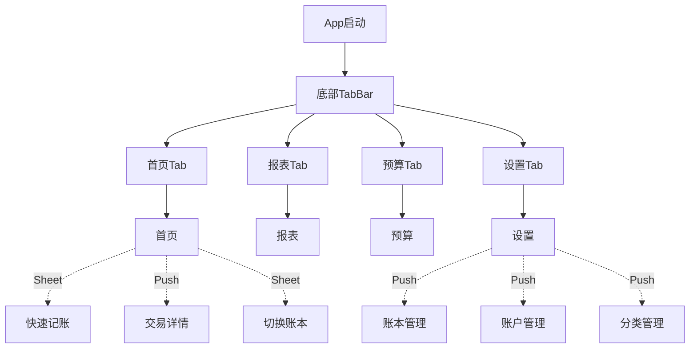
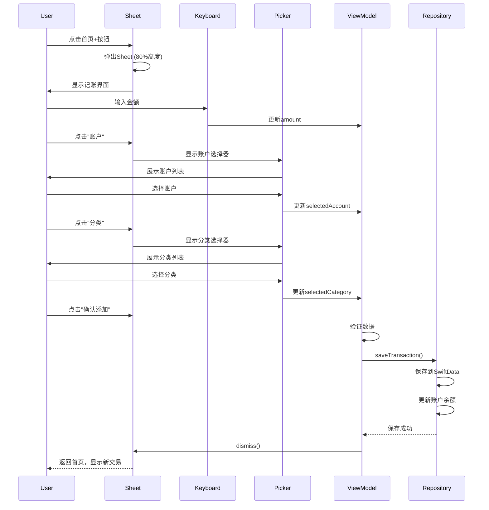
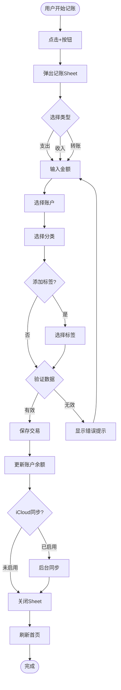
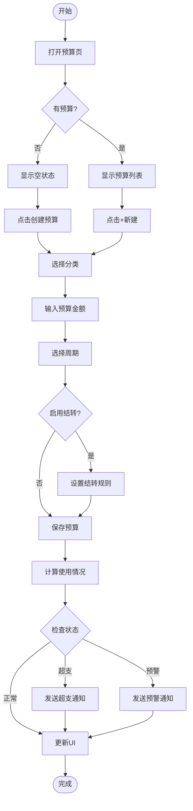

# 详细页面设计文档

## 文档信息

- **项目名称**: Lumina记账App
- **UI框架**: SwiftUI
- **设计版本**: v1.0
- **创建日期**: 2026-01-24

---

## 目录

1. [应用架构](#1-应用架构)
2. [首页设计](#2-首页设计-homeview)
3. [快速记账设计](#3-快速记账设计-addtransactionsheet)
4. [流水列表设计](#4-流水列表设计-transactionlistview)
5. [报表页设计](#5-报表页设计-reportview)
6. [预算页设计](#6-预算页设计-budgetview)
7. [设置页设计](#7-设置页设计-settingsview)
8. [账户管理设计](#8-账户管理设计-accountmanagementview)
9. [分类管理设计](#9-分类管理设计-categorymanagementview)
10. [交互流程图](#10-核心交互流程图)

---

## 1. 应用架构

### 1.1 导航结构



### 1.2 主TabBar

```swift
struct MainTabView: View {
    @State private var selectedTab = 0
    
    var body: some View {
        TabView(selection: $selectedTab) {
            HomeView()
                .tabItem {
                    Label("首页", systemImage: "house.fill")
                }
                .tag(0)
            
            ReportView()
                .tabItem {
                    Label("报表", systemImage: "chart.bar.fill")
                }
                .tag(1)
            
            BudgetView()
                .tabItem {
                    Label("预算", systemImage: "chart.pie.fill")
                }
                .tag(2)
            
            SettingsView()
                .tabItem {
                    Label("设置", systemImage: "gearshape.fill")
                }
                .tag(3)
        }
        .tint(.primaryBlue)
    }
}
```

**设计说明**:
- 采用标准iOS底部TabBar
- 4个主Tab，覆盖核心功能
- 图标使用SF Symbols，语义清晰
- 选中态使用主色调蓝色

---

## 2. 首页设计 (HomeView)

### 2.1 页面结构

```
┌─────────────────────────────────────┐
│ ← [日常账本 ▼]              ⚙️     │ <- 导航栏
├─────────────────────────────────────┤
│                                     │
│   ┌───────────────────────────┐   │
│   │    净资产卡片               │   │
│   │                             │   │
│   │    ¥ 123,456.78            │   │ <- 大卡片
│   │                             │   │    毛玻璃背景
│   │  本月 ↓¥12,345  ↑¥8,900   │   │
│   └───────────────────────────┘   │
│                                     │
│   ┌───────────────────────────┐   │
│   │ 今日支出  ¥256.00          │   │ <- 今日概览
│   │ ████████░░░░  65%          │   │    预算进度
│   │ 剩余预算 ¥1,234            │   │
│   └───────────────────────────┘   │
│                                     │
│   流水列表                          │
│   ┌──────────────────────────┐   │
│   │ 今天 1月24日 周六          │   │
│   │                            │   │
│   │ 🍜 午餐        -45.00     │   │
│   │ 招商银行 | 14:23           │   │
│   │                            │   │
│   │ ☕ 咖啡        -32.00     │   │
│   │ 现金 | 10:15               │   │
│   │                            │   │
│   │ 支出: ¥77.00              │   │ <- 日汇总
│   ├──────────────────────────┤   │
│   │ 昨天 1月23日 周五          │   │
│   │                            │   │
│   │ 🚇 地铁        -6.00      │   │
│   │ 工行储蓄卡 | 17:30         │   │
│   └──────────────────────────┘   │
│                                     │
│                [+]                  │ <- 浮动按钮
└─────────────────────────────────────┘
```

### 2.2 详细实现

#### 导航栏

```swift
struct HomeNavigationBar: View {
    @Binding var currentLedger: Ledger
    @State private var showLedgerPicker = false
    
    var body: some View {
        HStack {
            Button {
                showLedgerPicker = true
            } label: {
                HStack(spacing: 4) {
                    Text(currentLedger.name)
                        .font(.headline)
                        .foregroundColor(.primary)
                    
                    Image(systemName: "chevron.down")
                        .font(.caption)
                        .foregroundColor(.gray2)
                }
            }
            
            Spacer()
            
            NavigationLink(destination: SettingsView()) {
                Image(systemName: "gearshape")
                    .font(.system(size: 20))
                    .foregroundColor(.gray2)
            }
        }
        .padding(.horizontal, Spacing.m)
        .sheet(isPresented: $showLedgerPicker) {
            LedgerPickerSheet(selectedLedger: $currentLedger)
        }
    }
}
```

**交互**:
- 点击账本名称：弹出账本切换Sheet
- 点击设置图标：进入设置页面
- 导航栏背景透明，滚动时变模糊

#### 净资产卡片

```swift
struct NetAssetCard: View {
    let totalAssets: Decimal
    let monthlyIncome: Decimal
    let monthlyExpense: Decimal
    
    var body: some View {
        VStack(spacing: Spacing.m) {
            // 标题
            HStack {
                Text("净资产")
                    .font(.subheadline)
                    .foregroundColor(.gray2)
                
                Spacer()
                
                Image(systemName: "eye.slash")
                    .font(.caption)
                    .foregroundColor(.gray3)
            }
            
            // 大金额
            AnimatedNumber(value: totalAssets)
                .font(.system(size: 48, weight: .bold, design: .rounded))
                .foregroundColor(.primary)
                .monospacedDigit()
            
            // 本月收支
            HStack(spacing: Spacing.l) {
                MonthlyStatItem(
                    title: "支出",
                    amount: monthlyExpense,
                    color: .expenseRed,
                    icon: "arrow.down"
                )
                
                MonthlyStatItem(
                    title: "收入",
                    amount: monthlyIncome,
                    color: .incomeGreen,
                    icon: "arrow.up"
                )
            }
        }
        .padding(Spacing.l)
        .background(
            RoundedRectangle(cornerRadius: CornerRadius.l)
                .fill(.ultraThinMaterial)
                .overlay(
                    RoundedRectangle(cornerRadius: CornerRadius.l)
                        .stroke(Color.gray4.opacity(0.3), lineWidth: 0.5)
                )
        )
        .padding(.horizontal, Spacing.m)
        .cardShadow()
    }
}

struct MonthlyStatItem: View {
    let title: String
    let amount: Decimal
    let color: Color
    let icon: String
    
    var body: some View {
        VStack(spacing: Spacing.xs) {
            HStack(spacing: 4) {
                Image(systemName: icon)
                    .font(.caption2)
                Text(title)
                    .font(.caption)
            }
            .foregroundColor(.gray2)
            
            Text(amount.formatted())
                .font(.system(size: 20, weight: .semibold, design: .rounded))
                .foregroundColor(color)
                .monospacedDigit()
        }
        .frame(maxWidth: .infinity)
    }
}
```

**设计细节**:
- 使用毛玻璃材质（`.ultraThinMaterial`）
- 金额使用等宽数字，避免跳动
- 数字滚动动画增强视觉效果
- 眼睛图标支持隐藏金额（长按触发）

#### 今日支出卡片

```swift
struct TodayExpenseCard: View {
    let todayExpense: Decimal
    let budget: Budget?
    
    private var progress: Double {
        guard let budget = budget, budget.effectiveBudget > 0 else { return 0 }
        return Double(truncating: (todayExpense / budget.effectiveBudget) as NSNumber)
    }
    
    var body: some View {
        VStack(spacing: Spacing.s) {
            HStack {
                Text("今日支出")
                    .font(.subheadline)
                    .foregroundColor(.gray2)
                
                Spacer()
                
                Text(todayExpense.formatted())
                    .font(.system(size: 20, weight: .semibold, design: .rounded))
                    .foregroundColor(.expenseRed)
                    .monospacedDigit()
            }
            
            if let budget = budget {
                VStack(spacing: Spacing.xs) {
                    BudgetProgressBar(progress: progress)
                    
                    HStack {
                        Text("\(Int(progress * 100))%")
                            .font(.caption)
                            .foregroundColor(.gray3)
                        
                        Spacer()
                        
                        Text("剩余 \(budget.remainingBudget.formatted())")
                            .font(.caption)
                            .foregroundColor(.gray2)
                    }
                }
            }
        }
        .padding(Spacing.m)
        .background(
            RoundedRectangle(cornerRadius: CornerRadius.m)
                .fill(Color.backgroundSecondary)
        )
        .padding(.horizontal, Spacing.m)
    }
}
```

#### 流水列表

```swift
struct TransactionListSection: View {
    let transactions: [Transaction]
    
    // 按日期分组
    private var groupedTransactions: [(date: Date, transactions: [Transaction])] {
        // 实现分组逻辑
    }
    
    var body: some View {
        LazyVStack(spacing: 0, pinnedViews: [.sectionHeaders]) {
            ForEach(groupedTransactions, id: \.date) { group in
                Section {
                    ForEach(group.transactions) { transaction in
                        TransactionRow(transaction: transaction)
                            .contentShape(Rectangle())
                            .onTapGesture {
                                // 进入交易详情
                            }
                            .contextMenu {
                                TransactionContextMenu(transaction: transaction)
                            }
                    }
                } header: {
                    TransactionSectionHeader(
                        date: group.date,
                        totalExpense: calculateTotal(group.transactions)
                    )
                }
            }
        }
    }
}

struct TransactionRow: View {
    let transaction: Transaction
    
    var body: some View {
        HStack(spacing: Spacing.m) {
            // 图标
            CategoryIcon(
                iconName: transaction.category?.iconName ?? "questionmark",
                color: Color(hex: transaction.category?.colorHex ?? "#007AFF")
            )
            
            // 信息
            VStack(alignment: .leading, spacing: 4) {
                Text(transaction.category?.name ?? "未分类")
                    .font(.body)
                    .foregroundColor(.primary)
                
                HStack(spacing: 4) {
                    Text(transaction.primaryAccount?.name ?? "")
                        .font(.caption)
                        .foregroundColor(.gray3)
                    
                    Text("•")
                        .font(.caption)
                        .foregroundColor(.gray4)
                    
                    Text(transaction.date.formatted(date: .omitted, time: .shortened))
                        .font(.caption)
                        .foregroundColor(.gray3)
                }
            }
            
            Spacer()
            
            // 金额
            Text(transaction.signedAmount.formatted())
                .font(.system(size: 17, weight: .medium, design: .default))
                .foregroundColor(transaction.type == .expense ? .expenseRed : .incomeGreen)
                .monospacedDigit()
        }
        .padding(.horizontal, Spacing.m)
        .padding(.vertical, Spacing.s)
        .background(Color.backgroundPrimary)
    }
}

struct CategoryIcon: View {
    let iconName: String
    let color: Color
    let size: CGFloat = 40
    
    var body: some View {
        ZStack {
            RoundedRectangle(cornerRadius: 10)
                .fill(color.opacity(0.15))
                .frame(width: size, height: size)
            
            Image(systemName: iconName)
                .font(.system(size: size * 0.5))
                .foregroundColor(color)
        }
    }
}

struct TransactionSectionHeader: View {
    let date: Date
    let totalExpense: Decimal
    
    private var dateText: String {
        let calendar = Calendar.current
        if calendar.isDateInToday(date) {
            return "今天"
        } else if calendar.isDateInYesterday(date) {
            return "昨天"
        } else {
            return date.formatted(date: .abbreviated, time: .omitted)
        }
    }
    
    var body: some View {
        HStack {
            Text(dateText)
                .font(.subheadline)
                .fontWeight(.semibold)
                .foregroundColor(.gray2)
            
            Text(date.formatted(.dateTime.month().day().weekday(.abbreviated)))
                .font(.caption)
                .foregroundColor(.gray3)
            
            Spacer()
            
            if totalExpense > 0 {
                Text("支出: \(totalExpense.formatted())")
                    .font(.caption)
                    .foregroundColor(.gray2)
            }
        }
        .padding(.horizontal, Spacing.m)
        .padding(.vertical, Spacing.s)
        .background(Color.backgroundPrimary.opacity(0.95))
    }
}
```

**交互说明**:
- **点击**: 进入交易详情
- **长按**: 弹出上下文菜单（编辑/删除/复制）
- **左滑**: 快捷删除按钮
- **下拉**: 刷新数据（触发iCloud同步）

#### 浮动按钮

```swift
struct FloatingActionButton: View {
    let action: () -> Void
    
    var body: some View {
        Button(action: {
            HapticFeedback.light.trigger()
            action()
        }) {
            Image(systemName: "plus")
                .font(.system(size: 24, weight: .semibold))
                .foregroundColor(.white)
                .frame(width: 60, height: 60)
                .background(
                    Circle()
                        .fill(
                            LinearGradient(
                                colors: [.primaryBlue, .primaryBlue.opacity(0.8)],
                                startPoint: .topLeading,
                                endPoint: .bottomTrailing
                            )
                        )
                        .shadow(
                            color: .primaryBlue.opacity(0.4),
                            radius: 20,
                            x: 0,
                            y: 10
                        )
                )
        }
        .buttonStyle(ScaleButtonStyle())
    }
}
```

---

## 3. 快速记账设计 (AddTransactionSheet)

### 3.1 页面结构

```
┌─────────────────────────────────────┐
│  取消                        完成   │ <- Sheet导航
├─────────────────────────────────────┤
│  [支出] [收入] [转账]              │ <- Segmented
├─────────────────────────────────────┤
│                                     │
│          ¥ 0                        │ <- 金额显示
│                                     │
├─────────────────────────────────────┤
│  ┌─────────────────────────────┐  │
│  │  [1] [2] [3]  [ 今天▼]      │  │
│  │  [4] [5] [6]  [📝备注]      │  │ <- 计算器
│  │  [7] [8] [9]  [ + ]          │  │    + 快捷键
│  │  [.] [0] [⌫]  [ - ]          │  │
│  └─────────────────────────────┘  │
├─────────────────────────────────────┤
│  账户  [💳 招商银行 ▼]             │ <- 选择区
│  分类  [🍜 餐饮-午餐 ▼]            │
│  标签  [+ 添加标签]                │
├─────────────────────────────────────┤
│          [确认添加]                 │ <- 主按钮
└─────────────────────────────────────┘
```

### 3.2 详细实现

#### Sheet容器

```swift
struct AddTransactionSheet: View {
    @Environment(\.dismiss) private var dismiss
    @StateObject private var viewModel = AddTransactionViewModel()
    
    var body: some View {
        NavigationStack {
            VStack(spacing: 0) {
                // 类型切换
                TransactionTypeSegment(selectedType: $viewModel.type)
                    .padding(.top, Spacing.m)
                
                // 金额显示
                AmountDisplay(amount: $viewModel.amount)
                    .padding(.vertical, Spacing.xl)
                
                // 计算器键盘
                CalculatorKeyboard(
                    amount: $viewModel.amount,
                    onDateTap: { viewModel.showDatePicker = true },
                    onNoteTap: { viewModel.showNotePicker = true }
                )
                
                Divider()
                
                // 选择区域
                SelectionArea(viewModel: viewModel)
                    .padding(.vertical, Spacing.m)
                
                Spacer()
                
                // 确认按钮
                PrimaryButton(title: "确认添加") {
                    Task {
                        await viewModel.saveTransaction()
                        dismiss()
                    }
                }
                .padding(Spacing.m)
                .disabled(!viewModel.isValid)
            }
            .navigationTitle("记一笔")
            .navigationBarTitleDisplayMode(.inline)
            .toolbar {
                ToolbarItem(placement: .cancellationAction) {
                    Button("取消") { dismiss() }
                }
            }
        }
        .presentationDetents([.large])
        .presentationDragIndicator(.visible)
    }
}
```

#### 类型切换

```swift
struct TransactionTypeSegment: View {
    @Binding var selectedType: TransactionType
    
    var body: some View {
        Picker("类型", selection: $selectedType) {
            Text("支出").tag(TransactionType.expense)
            Text("收入").tag(TransactionType.income)
            Text("转账").tag(TransactionType.transfer)
        }
        .pickerStyle(.segmented)
        .padding(.horizontal, Spacing.m)
    }
}
```

#### 金额显示

```swift
struct AmountDisplay: View {
    @Binding var amount: Decimal
    
    var body: some View {
        HStack(spacing: 4) {
            Text("¥")
                .font(.system(size: 28, weight: .regular))
                .foregroundColor(.gray2)
            
            Text(amount == 0 ? "0" : amount.description)
                .font(.system(size: 56, weight: .bold, design: .rounded))
                .foregroundColor(.primary)
                .monospacedDigit()
                .minimumScaleFactor(0.5)
                .lineLimit(1)
        }
        .frame(maxWidth: .infinity)
    }
}
```

#### 计算器键盘

```swift
struct CalculatorKeyboard: View {
    @Binding var amount: Decimal
    let onDateTap: () -> Void
    let onNoteTap: () -> Void
    
    private let buttons: [[CalculatorButton]] = [
        [.number(1), .number(2), .number(3), .date],
        [.number(4), .number(5), .number(6), .note],
        [.number(7), .number(8), .number(9), .add],
        [.decimal, .number(0), .delete, .subtract]
    ]
    
    var body: some View {
        VStack(spacing: Spacing.s) {
            ForEach(buttons, id: \.self) { row in
                HStack(spacing: Spacing.s) {
                    ForEach(row, id: \.self) { button in
                        CalculatorButtonView(
                            button: button,
                            amount: $amount,
                            onDateTap: onDateTap,
                            onNoteTap: onNoteTap
                        )
                    }
                }
            }
        }
        .padding(Spacing.m)
    }
}

enum CalculatorButton: Hashable {
    case number(Int)
    case decimal
    case delete
    case add
    case subtract
    case date
    case note
    
    var title: String {
        switch self {
        case .number(let n): return "\(n)"
        case .decimal: return "."
        case .delete: return "⌫"
        case .add: return "+"
        case .subtract: return "-"
        case .date: return "今天"
        case .note: return "备注"
        }
    }
    
    var icon: String? {
        switch self {
        case .delete: return "delete.left"
        case .add: return "plus"
        case .subtract: return "minus"
        case .date: return "calendar"
        case .note: return "note.text"
        default: return nil
        }
    }
}

struct CalculatorButtonView: View {
    let button: CalculatorButton
    @Binding var amount: Decimal
    let onDateTap: () -> Void
    let onNoteTap: () -> Void
    
    @State private var isPressed = false
    
    var body: some View {
        Button {
            HapticFeedback.light.trigger()
            handleTap()
        } label: {
            Group {
                if let icon = button.icon {
                    Label(button.title, systemImage: icon)
                        .labelStyle(.iconOnly)
                        .font(.system(size: 20))
                } else {
                    Text(button.title)
                        .font(.system(size: 24, weight: .medium))
                }
            }
            .frame(maxWidth: .infinity)
            .frame(height: 56)
            .background(
                RoundedRectangle(cornerRadius: CornerRadius.m)
                    .fill(buttonBackground)
            )
            .foregroundColor(buttonForeground)
        }
        .buttonStyle(ScaleButtonStyle())
    }
    
    private var buttonBackground: Color {
        switch button {
        case .date, .note:
            return Color.backgroundTertiary
        default:
            return Color.backgroundSecondary
        }
    }
    
    private var buttonForeground: Color {
        switch button {
        case .add, .subtract:
            return .primaryBlue
        default:
            return .primary
        }
    }
    
    private func handleTap() {
        switch button {
        case .number(let n):
            appendNumber(n)
        case .decimal:
            appendDecimal()
        case .delete:
            deleteLastDigit()
        case .add, .subtract:
            // 处理加减运算
            break
        case .date:
            onDateTap()
        case .note:
            onNoteTap()
        }
    }
    
    private func appendNumber(_ n: Int) {
        let newAmount = amount * 10 + Decimal(n)
        if newAmount < 9999999 {  // 限制最大金额
            amount = newAmount
        }
    }
    
    private func appendDecimal() {
        // 处理小数点逻辑
    }
    
    private func deleteLastDigit() {
        amount = (amount / 10).rounded(.towardZero)
    }
}
```

#### 选择区域

```swift
struct SelectionArea: View {
    @ObservedObject var viewModel: AddTransactionViewModel
    
    var body: some View {
        VStack(spacing: Spacing.s) {
            // 账户选择
            SelectionRow(
                icon: "creditcard.fill",
                title: "账户",
                value: viewModel.selectedAccount?.name ?? "请选择"
            ) {
                viewModel.showAccountPicker = true
            }
            
            Divider()
                .padding(.leading, 56)
            
            // 分类选择
            SelectionRow(
                icon: viewModel.selectedCategory?.iconName ?? "folder.fill",
                title: "分类",
                value: viewModel.selectedCategory?.fullPath ?? "请选择"
            ) {
                viewModel.showCategoryPicker = true
            }
            
            Divider()
                .padding(.leading, 56)
            
            // 标签
            TagSelectionRow(selectedTags: $viewModel.selectedTags) {
                viewModel.showTagPicker = true
            }
        }
        .padding(.horizontal, Spacing.m)
        .sheet(isPresented: $viewModel.showAccountPicker) {
            AccountPickerSheet(selectedAccount: $viewModel.selectedAccount)
        }
        .sheet(isPresented: $viewModel.showCategoryPicker) {
            CategoryPickerSheet(
                type: viewModel.type,
                selectedCategory: $viewModel.selectedCategory
            )
        }
    }
}

struct SelectionRow: View {
    let icon: String
    let title: String
    let value: String
    let action: () -> Void
    
    var body: some View {
        Button(action: action) {
            HStack(spacing: Spacing.m) {
                Image(systemName: icon)
                    .font(.system(size: 20))
                    .foregroundColor(.gray2)
                    .frame(width: 32)
                
                Text(title)
                    .font(.body)
                    .foregroundColor(.gray2)
                    .frame(width: 60, alignment: .leading)
                
                Text(value)
                    .font(.body)
                    .foregroundColor(.primary)
                
                Spacer()
                
                Image(systemName: "chevron.right")
                    .font(.caption)
                    .foregroundColor(.gray3)
            }
            .contentShape(Rectangle())
        }
        .buttonStyle(.plain)
    }
}
```

### 3.3 交互流程



**智能特性**:
1. **自动推荐**: 根据时间、金额推荐分类
2. **记忆功能**: 记住上次选择的账户
3. **商家关联**: 输入商家名自动关联分类
4. **快捷输入**: 支持"45+32"计算

---

## 4. 流水列表设计 (TransactionListView)

### 4.1 页面结构

```
┌─────────────────────────────────────┐
│  流水              [筛选] [搜索]    │ <- 导航栏
├─────────────────────────────────────┤
│  [全部] [支出] [收入] [转账]        │ <- 快速筛选
├─────────────────────────────────────┤
│  🔍 搜索流水...                     │ <- 搜索框
├─────────────────────────────────────┤
│                                     │
│  今天 1月24日 周六                  │
│  ┌─────────────────────────────┐  │
│  │ 🍜 午餐        -45.00       │  │
│  │ 招商银行 | 14:23 | #出差   │  │ <- 带标签
│  │                             │  │
│  │ ☕ 咖啡        -32.00       │  │
│  │ 现金 | 10:15                │  │
│  └─────────────────────────────┘  │
│  支出: ¥77.00                      │
│                                     │
│  昨天 1月23日 周五                  │
│  ┌─────────────────────────────┐  │
│  │ 🚇 地铁        -6.00        │  │
│  │ 工行储蓄卡 | 17:30           │  │
│  └─────────────────────────────┘  │
│                                     │
│  [加载更多...]                      │
└─────────────────────────────────────┘
```

### 4.2 筛选器设计

```swift
struct TransactionFilterSheet: View {
    @Binding var filter: TransactionFilter
    @Environment(\.dismiss) private var dismiss
    
    var body: some View {
        NavigationStack {
            Form {
                // 时间范围
                Section("时间范围") {
                    Picker("时间", selection: $filter.timeRange) {
                        Text("本月").tag(TimeRange.thisMonth)
                        Text("上月").tag(TimeRange.lastMonth)
                        Text("近3个月").tag(TimeRange.last3Months)
                        Text("今年").tag(TimeRange.thisYear)
                        Text("自定义").tag(TimeRange.custom)
                    }
                    
                    if filter.timeRange == .custom {
                        DatePicker("开始日期", selection: $filter.startDate, displayedComponents: .date)
                        DatePicker("结束日期", selection: $filter.endDate, displayedComponents: .date)
                    }
                }
                
                // 账户筛选
                Section("账户") {
                    MultiSelector(
                        items: availableAccounts,
                        selectedItems: $filter.selectedAccounts
                    )
                }
                
                // 分类筛选
                Section("分类") {
                    MultiSelector(
                        items: availableCategories,
                        selectedItems: $filter.selectedCategories
                    )
                }
                
                // 金额范围
                Section("金额范围") {
                    HStack {
                        TextField("最小金额", value: $filter.minAmount, format: .currency(code: "CNY"))
                            .keyboardType(.decimalPad)
                        Text("-")
                        TextField("最大金额", value: $filter.maxAmount, format: .currency(code: "CNY"))
                            .keyboardType(.decimalPad)
                    }
                }
                
                // 标签
                Section("标签") {
                    TagSelector(selectedTags: $filter.selectedTags)
                }
            }
            .navigationTitle("筛选")
            .navigationBarTitleDisplayMode(.inline)
            .toolbar {
                ToolbarItem(placement: .cancellationAction) {
                    Button("重置") {
                        filter = TransactionFilter()
                    }
                }
                
                ToolbarItem(placement: .confirmationAction) {
                    Button("完成") {
                        dismiss()
                    }
                    .fontWeight(.semibold)
                }
            }
        }
    }
}

struct TransactionFilter {
    var timeRange: TimeRange = .thisMonth
    var startDate = Date()
    var endDate = Date()
    var selectedAccounts: Set<Account> = []
    var selectedCategories: Set<Category> = []
    var minAmount: Decimal? = nil
    var maxAmount: Decimal? = nil
    var selectedTags: Set<Tag> = []
}
```

---

## 5. 报表页设计 (ReportView)

### 5.1 页面结构

```
┌─────────────────────────────────────┐
│  报表        [本月▼]    [导出]     │ <- 导航栏
├─────────────────────────────────────┤
│  [收支] [分类] [趋势] [账户]        │ <- Tab切换
├─────────────────────────────────────┤
│                                     │
│  ┌───────────────────────────────┐ │
│  │  收支总览                      │ │
│  │                                │ │
│  │  收入  ¥8,900                 │ │
│  │  ━━━━━━━━━━━━━━━            │ │ <- 柱状图
│  │  支出  ¥12,345                │ │
│  │  ▂▃▅▄▆▇▅▄▃▂▁                 │ │
│  │                                │ │
│  │  结余  -¥3,445                │ │
│  └───────────────────────────────┘ │
│                                     │
│  ┌───────────────────────────────┐ │
│  │  分类分析                      │ │
│  │                                │ │
│  │      ┌────────┐               │ │
│  │      │ 🍜35% │               │ │ <- 饼图
│  │    🚗20%  🏠15%               │ │
│  │      │ 💰10% │               │ │
│  │      └────────┘               │ │
│  └───────────────────────────────┘ │
│                                     │
│  Top 5 分类                         │
│  ┌───────────────────────────────┐ │
│  │ 🍜 餐饮  ¥4,320  ████▌  35%  │ │
│  │ 🚗 交通  ¥2,469  ██▌    20%  │ │
│  │ 🏠 居住  ¥1,852  ██     15%  │ │
│  └───────────────────────────────┘ │
└─────────────────────────────────────┘
```

### 5.2 图表实现

#### 收支柱状图

```swift
import Charts

struct IncomeExpenseBarChart: View {
    let data: [DailyData]
    
    var body: some View {
        Chart {
            ForEach(data) { item in
                // 支出柱
                BarMark(
                    x: .value("日期", item.date, unit: .day),
                    y: .value("支出", item.expense)
                )
                .foregroundStyle(.expenseRed)
                .cornerRadius(4)
                
                // 收入柱
                BarMark(
                    x: .value("日期", item.date, unit: .day),
                    y: .value("收入", item.income)
                )
                .foregroundStyle(.incomeGreen)
                .cornerRadius(4)
            }
        }
        .chartXAxis {
            AxisMarks(values: .stride(by: .day, count: 5)) { _ in
                AxisGridLine()
                AxisTick()
                AxisValueLabel(format: .dateTime.day())
            }
        }
        .chartYAxis {
            AxisMarks { value in
                AxisGridLine()
                AxisValueLabel {
                    if let amount = value.as(Decimal.self) {
                        Text(amount.formatted(.currency(code: "CNY")))
                    }
                }
            }
        }
        .frame(height: 200)
        .padding(Spacing.m)
    }
}

struct DailyData: Identifiable {
    let id = UUID()
    let date: Date
    let expense: Decimal
    let income: Decimal
}
```

#### 分类饼图

```swift
struct CategoryPieChart: View {
    let data: [CategoryData]
    @State private var selectedCategory: CategoryData?
    
    var body: some View {
        Chart(data) { item in
            SectorMark(
                angle: .value("金额", item.amount),
                innerRadius: .ratio(0.6),  // 环形图
                angularInset: 2
            )
            .foregroundStyle(by: .value("分类", item.category.name))
            .cornerRadius(4)
            .opacity(selectedCategory == nil || selectedCategory == item ? 1.0 : 0.3)
        }
        .chartAngleSelection(value: $selectedCategory)
        .chartLegend(position: .bottom, alignment: .center)
        .frame(height: 250)
        .padding(Spacing.m)
        .overlay(alignment: .center) {
            if let selected = selectedCategory {
                VStack {
                    Text(selected.category.name)
                        .font(.subheadline)
                        .foregroundColor(.gray2)
                    
                    Text(selected.amount.formatted())
                        .font(.title2)
                        .fontWeight(.bold)
                        .monospacedDigit()
                    
                    Text(String(format: "%.1f%%", selected.percentage))
                        .font(.caption)
                        .foregroundColor(.gray3)
                }
            }
        }
    }
}

struct CategoryData: Identifiable, Equatable {
    let id = UUID()
    let category: Category
    let amount: Decimal
    let percentage: Double
}
```

---

## 6. 预算页设计 (BudgetView)

### 6.1 页面结构

```
┌─────────────────────────────────────┐
│  预算管理                  + 新建   │ <- 导航栏
├─────────────────────────────────────┤
│                                     │
│  ┌───────────────────────────────┐ │
│  │  总预算  ¥5,000               │ │
│  │  已用 ¥3,245  65%             │ │ <- 总览卡片
│  │  ████████████▌░░░░░░          │ │
│  │  日均可用 ¥58.25              │ │
│  │  距月底还有 10 天              │ │
│  └───────────────────────────────┘ │
│                                     │
│  分类预算                           │
│  ┌───────────────────────────────┐ │
│  │ 🍜 餐饮                        │ │
│  │ 预算 ¥2,000                   │ │
│  │ 已用 ¥1,580  剩余 ¥420        │ │ <- 安全状态
│  │ ████████████▌░░░  79%         │ │    (绿色)
│  └───────────────────────────────┘ │
│  ┌───────────────────────────────┐ │
│  │ 🚗 交通                        │ │
│  │ 预算 ¥500                     │ │
│  │ 已用 ¥520  超支 ¥20           │ │ <- 超支状态
│  │ ███████████████▌  104%        │ │    (红色)
│  └───────────────────────────────┘ │
│  ┌───────────────────────────────┐ │
│  │ 🏠 居住                        │ │
│  │ 预算 ¥1,500                   │ │
│  │ 已用 ¥1,350  剩余 ¥150        │ │ <- 预警状态
│  │ ██████████████▌░  90%         │ │    (橙色)
│  └───────────────────────────────┘ │
└─────────────────────────────────────┘
```

### 6.2 预算卡片实现

```swift
struct BudgetCard: View {
    let budget: Budget
    @State private var showDetail = false
    
    private var statusColor: Color {
        switch budget.status {
        case .safe: return .incomeGreen
        case .warning, .nearLimit: return .warningOrange
        case .overBudget: return .expenseRed
        }
    }
    
    var body: some View {
        Button {
            showDetail = true
        } label: {
            VStack(alignment: .leading, spacing: Spacing.m) {
                // 头部
                HStack {
                    CategoryIcon(
                        iconName: budget.category?.iconName ?? "folder.fill",
                        color: Color(hex: budget.category?.colorHex ?? "#007AFF")
                    )
                    
                    VStack(alignment: .leading, spacing: 4) {
                        Text(budget.category?.name ?? "未分类")
                            .font(.headline)
                            .foregroundColor(.primary)
                        
                        Text("预算 \(budget.effectiveBudget.formatted())")
                            .font(.caption)
                            .foregroundColor(.gray2)
                    }
                    
                    Spacer()
                    
                    Image(systemName: "chevron.right")
                        .font(.caption)
                        .foregroundColor(.gray3)
                }
                
                // 金额信息
                HStack {
                    VStack(alignment: .leading, spacing: 4) {
                        Text("已用")
                            .font(.caption)
                            .foregroundColor(.gray2)
                        
                        Text(budget.usedAmount.formatted())
                            .font(.title3)
                            .fontWeight(.semibold)
                            .foregroundColor(statusColor)
                            .monospacedDigit()
                    }
                    
                    Spacer()
                    
                    VStack(alignment: .trailing, spacing: 4) {
                        Text(budget.status == .overBudget ? "超支" : "剩余")
                            .font(.caption)
                            .foregroundColor(.gray2)
                        
                        Text(budget.remainingBudget.formatted())
                            .font(.title3)
                            .fontWeight(.semibold)
                            .foregroundColor(budget.status == .overBudget ? .expenseRed : .gray1)
                            .monospacedDigit()
                    }
                }
                
                // 进度条
                VStack(spacing: Spacing.xs) {
                    BudgetProgressBar(progress: budget.usagePercentage, height: 12)
                    
                    Text("\(Int(budget.usagePercentage * 100))%")
                        .font(.caption)
                        .fontWeight(.medium)
                        .foregroundColor(statusColor)
                        .frame(maxWidth: .infinity, alignment: .trailing)
                }
            }
            .padding(Spacing.m)
            .background(
                RoundedRectangle(cornerRadius: CornerRadius.m)
                    .fill(Color.backgroundSecondary)
                    .overlay(
                        RoundedRectangle(cornerRadius: CornerRadius.m)
                            .stroke(statusColor.opacity(0.3), lineWidth: 1.5)
                    )
            )
        }
        .buttonStyle(.plain)
        .sheet(isPresented: $showDetail) {
            BudgetDetailView(budget: budget)
        }
    }
}
```

---

## 7. 设置页设计 (SettingsView)

### 7.1 页面结构

```
┌─────────────────────────────────────┐
│  设置                               │
├─────────────────────────────────────┤
│  账本                                │
│  ┌───────────────────────────────┐ │
│  │ 账本管理       日常账本 >     │ │
│  │ 账户管理                   >  │ │
│  │ 分类管理                   >  │ │
│  └───────────────────────────────┘ │
│                                     │
│  同步                                │
│  ┌───────────────────────────────┐ │
│  │ iCloud同步     [Toggle] ✓    │ │
│  │ 上次同步: 2分钟前             │ │
│  └───────────────────────────────┘ │
│                                     │
│  预算与提醒                          │
│  ┌───────────────────────────────┐ │
│  │ 预算设置                   >  │ │
│  │ 提醒通知       [Toggle] ✓    │ │
│  └───────────────────────────────┘ │
│                                     │
│  数据                                │
│  ┌───────────────────────────────┐ │
│  │ 数据导出                   >  │ │
│  │ 数据导入                   >  │ │
│  └───────────────────────────────┘ │
│                                     │
│  其他                                │
│  ┌───────────────────────────────┐ │
│  │ 外观设置                   >  │ │
│  │ 关于                       >  │ │
│  └───────────────────────────────┘ │
└─────────────────────────────────────┘
```

### 7.2 实现

```swift
struct SettingsView: View {
    @StateObject private var viewModel = SettingsViewModel()
    
    var body: some View {
        NavigationStack {
            List {
                // 账本部分
                Section("账本") {
                    NavigationLink(destination: LedgerManagementView()) {
                        HStack {
                            Text("账本管理")
                            Spacer()
                            Text(viewModel.currentLedger.name)
                                .foregroundColor(.gray2)
                        }
                    }
                    
                    NavigationLink("账户管理", destination: AccountManagementView())
                    NavigationLink("分类管理", destination: CategoryManagementView())
                }
                
                // 同步部分
                Section {
                    Toggle("iCloud同步", isOn: $viewModel.cloudSyncEnabled)
                    
                    if viewModel.cloudSyncEnabled {
                        HStack {
                            Text("上次同步")
                                .foregroundColor(.gray2)
                            Spacer()
                            Text(viewModel.lastSyncTime)
                                .foregroundColor(.gray3)
                                .font(.caption)
                        }
                    }
                } header: {
                    Text("同步")
                } footer: {
                    Text("启用后，数据将通过iCloud在您的所有设备间同步")
                }
                
                // 预算与提醒
                Section("预算与提醒") {
                    NavigationLink("预算设置", destination: BudgetSettingsView())
                    Toggle("提醒通知", isOn: $viewModel.notificationsEnabled)
                }
                
                // 数据
                Section("数据") {
                    NavigationLink("数据导出", destination: ExportDataView())
                    NavigationLink("数据导入", destination: ImportDataView())
                }
                
                // 其他
                Section("其他") {
                    NavigationLink("外观设置", destination: AppearanceView())
                    NavigationLink("关于", destination: AboutView())
                }
            }
            .navigationTitle("设置")
        }
    }
}
```

---

## 8. 账户管理设计 (AccountManagementView)

*（内容同前，略）*

---

## 9. 分类管理设计 (CategoryManagementView)

*（内容同前，略）*

---

## 10. 核心交互流程图

### 10.1 记账流程



### 10.2 预算管理流程



---

## 附录：页面清单

| 页面名称 | 路径 | 说明 |
|---------|------|------|
| 主TabBar | MainTabView | 4个Tab容器 |
| 首页 | HomeView | 核心页面 |
| 快速记账 | AddTransactionSheet | 模态Sheet |
| 交易详情 | TransactionDetailView | Push导航 |
| 流水列表 | TransactionListView | Tab页 |
| 报表 | ReportView | Tab页 |
| 预算 | BudgetView | Tab页 |
| 设置 | SettingsView | Tab页 |
| 账本管理 | LedgerManagementView | Push |
| 账户管理 | AccountManagementView | Push |
| 分类管理 | CategoryManagementView | Push |
| 分类选择器 | CategoryPickerSheet | Sheet |
| 账户选择器 | AccountPickerSheet | Sheet |
| 数据导出 | ExportDataView | Push |

---

**文档维护**: 随产品迭代持续更新  
**最后更新**: 2026-01-24
